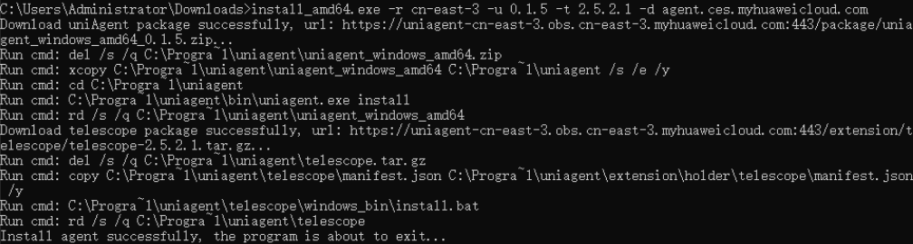

# 异构类实例安装支持对应监控的CES Agent（Windows）

## 操作场景

通过在异构类（GPU加速型）的Windows实例上安装支持对应监控的CES Agent，可以为用户提供系统级、主动式、细颗粒度的监控，包含指标收集和系统事件上报。

当前支持的异构加速卡及对应的监控指标种类为GPU监控指标，请参见[操作系统监控指标：GPU](弹性云服务器支持的操作系统监控指标（安装Agent）.md#section282013415343)。

本章节介绍如何通过安装脚本为GPU加速型实例安装新版支持GPU监控的CES Agent。

## 约束与限制

-   仅支持Windows操作系统，且仅部分Windows镜像版本支持GPU监控。

    **表 1**  支持GPU监控的Windows版本

    
    <table><thead align="left"><tr id="row062860204715"><th class="cellrowborder" valign="top" width="50%" id="mcps1.2.3.1.1">
类型

    </th>
    <th class="cellrowborder" valign="top" width="50%" id="mcps1.2.3.1.2">
版本

    </th>
    </tr>
    </thead>
    <tbody><tr id="row26281103475"><td class="cellrowborder" valign="top" width="50%" headers="mcps1.2.3.1.1 ">
Windows（64bit）

    </td>
    <td class="cellrowborder" valign="top" width="50%" headers="mcps1.2.3.1.2 ">
Windows Server 2016 标准版 64位

    
Windows Server 2016 数据中心版 64位

    
Windows Server 2019 标准版 64位

    
Windows Server 2019 数据中心版 64位

    </td>
    </tr>
    </tbody>
    </table>

-   支持的规格：G6v、G6、P2s、P2v、P2vs、Pi2、Pi1、P1。
-   不支持监听Windows类型GPU加速型实例的Xid事件。

## 前提条件

-   已配置DNS和安全组，配置方法参考[如何配置DNS和安全组？](https://support.huaweicloud.com/ces_faq/ces_faq_2501.html)。
-   已配置委托，配置方法参考[如何配置委托？](https://support.huaweicloud.com/ces_faq/ces_faq_2502.html)。
-   已安装GPU驱动，未安装GPU驱动的云服务器不支持采集GPU指标数据及上报事件。

    如果您的弹性云服务器未安装GPU驱动，可参见[（推荐）GPU加速型实例自动安装GPU驱动（Windows）](（推荐）GPU加速型实例自动安装GPU驱动（Windows）.md)。

    > **说明：** 
    >-   安装GPU驱动需使用默认路径。
    >    GPU驱动安装完后，需重启GPU加速型实例，否则可能导致采集GPU指标及上报GPU事件失败。
    >-   GPU驱动正常安装后，最多10分钟将在控制台看到采集到的GPU指标数据。

-   需使用具有Administrator权限的账户进行安装，例如Administrator用户。
-   确保云服务器的安装目录都有读写权限，并且安装成功后的Telescope进程不会被其他软件关闭。

## 操作步骤

本操作以Windows Server 2019 标准版 64位操作系统、Pi2规格的GPU加速型实例为例，介绍单台ECS安装新版支持GPU监控的CES Agent的操作指导。

1.  使用Administrator用户，[远程登录](Windows弹性云服务器登录方式概述.md)弹性云服务器。
2.  在浏览器地址栏输入地址，下载安装脚本。

    以“华东-上海一”为例，安装脚本地址为：

    [https://uniagent-cn-east-3.obs.cn-east-3.myhuaweicloud.com/package/install\_amd64.exe](https://uniagent-cn-east-3.obs.cn-east-3.myhuaweicloud.com/package/install_amd64.exe)

    其余区域的安装脚本，请参见[获取安装脚本](#section13111946101)。

3.  （可选）在以下路径，卸载旧版本支持GPU监控的CES Agent。

    **C:\\Program Files\\uniagent\\script\\uninstall.bat**

4.  以管理员身份打开cmd命令窗口，在“install\_amd64.exe”下载目录下，执行以下命令安装支持GPU监控的CES Agent安装脚本。

    **install\_amd64.exe \[-r RegionID\] \[-u UniagentVersion\] \[-t TelescopeVersion\] \[-d AgentApiDomain\]**

    命令示例：

    **install\_amd64.exe -r cn-east-3 -u 0.1.5 -t 2.6.7.1 -d agent.ces.myhuaweicloud.com**

    其中，

    -   RegoinID：cn-east-3
    -   UniagentVersion：0.1.5
    -   TelescopeVersion：2.6.7.1
    -   AgentApiDomain：agent.ces.myhuaweicloud.com

    > **说明：** 
    >如果命令执行后出现“Access is denied”，可能是由于未以管理员身份打开cmd命令窗口导致，请切换为管理员身份重新执行命令。

    当界面显示“Install service success”或“Install agent successfully”时，说明支持GPU监控的CES Agent安装成功并启动。

    **图 1**  支持GPU监控的CES Agent安装成功  
    

## 获取安装脚本

您可以通过以下地址，下载获取新版支持CES监控Agent的安装脚本。

**表 2**  安装脚本的支持区域及获取地址

<table><thead align="left"><tr id="row9938153912416"><th class="cellrowborder" valign="top" width="14.69%" id="mcps1.2.3.1.1">
区域

</th>
<th class="cellrowborder" valign="top" width="85.31%" id="mcps1.2.3.1.2">
安装脚本

</th>
</tr>
</thead>
<tbody><tr id="row16971157145"><td class="cellrowborder" valign="top" width="14.69%" headers="mcps1.2.3.1.1 ">
华北-北京一

</td>
<td class="cellrowborder" valign="top" width="85.31%" headers="mcps1.2.3.1.2 ">
<a href="https://uniagent-cn-north-1.obs.cn-north-1.myhuaweicloud.com/package/install_amd64.exe" target="_blank" rel="noopener noreferrer">https://uniagent-cn-north-1.obs.cn-north-1.myhuaweicloud.com/package/install_amd64.exe</a>

</td>
</tr>
<tr id="row16971205717412"><td class="cellrowborder" valign="top" width="14.69%" headers="mcps1.2.3.1.1 ">
华北-北京四

</td>
<td class="cellrowborder" valign="top" width="85.31%" headers="mcps1.2.3.1.2 ">
<a href="https://uniagent-cn-north-4.obs.cn-north-4.myhuaweicloud.com/package/install_amd64.exe" target="_blank" rel="noopener noreferrer">https://uniagent-cn-north-4.obs.cn-north-4.myhuaweicloud.com/package/install_amd64.exe</a>

</td>
</tr>
<tr id="row1997117571414"><td class="cellrowborder" valign="top" width="14.69%" headers="mcps1.2.3.1.1 ">
华北-乌兰察布一

</td>
<td class="cellrowborder" valign="top" width="85.31%" headers="mcps1.2.3.1.2 ">
<a href="http://obs.cn-north-9.myhuaweicloud.com/uniagent-cn-north-9/package/install_amd64.exe" target="_blank" rel="noopener noreferrer">http://obs.cn-north-9.myhuaweicloud.com/uniagent-cn-north-9/package/install_amd64.exe</a>

</td>
</tr>
<tr id="row11971125715416"><td class="cellrowborder" valign="top" width="14.69%" headers="mcps1.2.3.1.1 ">
华南-广州

</td>
<td class="cellrowborder" valign="top" width="85.31%" headers="mcps1.2.3.1.2 ">
<a href="https://uniagent-cn-south-1.obs.cn-south-1.myhuaweicloud.com/package/install_amd64.exe" target="_blank" rel="noopener noreferrer">https://uniagent-cn-south-1.obs.cn-south-1.myhuaweicloud.com/package/install_amd64.exe</a>

</td>
</tr>
<tr id="row20972195710410"><td class="cellrowborder" valign="top" width="14.69%" headers="mcps1.2.3.1.1 ">
华东-上海一

</td>
<td class="cellrowborder" valign="top" width="85.31%" headers="mcps1.2.3.1.2 ">
<a href="https://uniagent-cn-east-3.obs.cn-east-3.myhuaweicloud.com/package/install_amd64.exe" target="_blank" rel="noopener noreferrer">https://uniagent-cn-east-3.obs.cn-east-3.myhuaweicloud.com/package/install_amd64.exe</a>

</td>
</tr>
<tr id="row39723571346"><td class="cellrowborder" valign="top" width="14.69%" headers="mcps1.2.3.1.1 ">
华东-上海二

</td>
<td class="cellrowborder" valign="top" width="85.31%" headers="mcps1.2.3.1.2 ">
<a href="https://uniagent-cn-east-2.obs.cn-east-2.myhuaweicloud.com/package/install_amd64.exe" target="_blank" rel="noopener noreferrer">https://uniagent-cn-east-2.obs.cn-east-2.myhuaweicloud.com/package/install_amd64.exe</a>

</td>
</tr>
<tr id="row13467953240"><td class="cellrowborder" valign="top" width="14.69%" headers="mcps1.2.3.1.1 ">
西南-贵阳一

</td>
<td class="cellrowborder" valign="top" width="85.31%" headers="mcps1.2.3.1.2 ">
<a href="https://uniagent-cn-southwest-2.obs.cn-southwest-2.myhuaweicloud.com/package/install_amd64.exe" target="_blank" rel="noopener noreferrer">https://uniagent-cn-southwest-2.obs.cn-southwest-2.myhuaweicloud.com/package/install_amd64.exe</a>

</td>
</tr>
<tr id="row24691353540"><td class="cellrowborder" valign="top" width="14.69%" headers="mcps1.2.3.1.1 ">
中国-香港

</td>
<td class="cellrowborder" valign="top" width="85.31%" headers="mcps1.2.3.1.2 ">
<a href="https://uniagent-ap-southeast-1.obs.ap-southeast-1.myhuaweicloud.com/package/install_amd64.exe" target="_blank" rel="noopener noreferrer">https://uniagent-ap-southeast-1.obs.ap-southeast-1.myhuaweicloud.com/package/install_amd64.exe</a>

</td>
</tr>
<tr id="row14469145316418"><td class="cellrowborder" valign="top" width="14.69%" headers="mcps1.2.3.1.1 ">
亚太-曼谷

</td>
<td class="cellrowborder" valign="top" width="85.31%" headers="mcps1.2.3.1.2 ">
<a href="https://uniagent-ap-southeast-2.obs.ap-southeast-2.myhuaweicloud.com/package/install_amd64.exe" target="_blank" rel="noopener noreferrer">https://uniagent-ap-southeast-2.obs.ap-southeast-2.myhuaweicloud.com/package/install_amd64.exe</a>

</td>
</tr>
<tr id="row1293817393417"><td class="cellrowborder" valign="top" width="14.69%" headers="mcps1.2.3.1.1 ">
亚太-新加坡

</td>
<td class="cellrowborder" valign="top" width="85.31%" headers="mcps1.2.3.1.2 ">
<a href="https://uniagent-ap-southeast-3.obs.ap-southeast-3.myhuaweicloud.com/package/install_amd64.exe" target="_blank" rel="noopener noreferrer">https://uniagent-ap-southeast-3.obs.ap-southeast-3.myhuaweicloud.com/package/install_amd64.exe</a>

</td>
</tr>
<tr id="row0502195614196"><td class="cellrowborder" valign="top" width="14.69%" headers="mcps1.2.3.1.1 ">
亚太-雅加达

</td>
<td class="cellrowborder" valign="top" width="85.31%" headers="mcps1.2.3.1.2 ">
<a href="https://obs.ap-southeast-4.myhuaweicloud.com/uniagent-ap-southeast-4/package/install_amd64.exe" target="_blank" rel="noopener noreferrer">https://obs.ap-southeast-4.myhuaweicloud.com/uniagent-ap-southeast-4/package/install_amd64.exe</a>

</td>
</tr>
<tr id="row169391539943"><td class="cellrowborder" valign="top" width="14.69%" headers="mcps1.2.3.1.1 ">
非洲-约翰内斯堡

</td>
<td class="cellrowborder" valign="top" width="85.31%" headers="mcps1.2.3.1.2 ">
<a href="https://uniagent-af-south-1.obs.af-south-1.myhuaweicloud.com/package/install_amd64.exe" target="_blank" rel="noopener noreferrer">https://uniagent-af-south-1.obs.af-south-1.myhuaweicloud.com/package/install_amd64.exe</a>

</td>
</tr>
<tr id="row48374742118"><td class="cellrowborder" valign="top" width="14.69%" headers="mcps1.2.3.1.1 ">
拉美-墨西哥城二

</td>
<td class="cellrowborder" valign="top" width="85.31%" headers="mcps1.2.3.1.2 ">
<a href="https://uniagent-la-south-2.obs.la-south-2.myhuaweicloud.com/package/install_amd64.exe" target="_blank" rel="noopener noreferrer">https://uniagent-la-south-2.obs.la-south-2.myhuaweicloud.com/package/install_amd64.exe</a>

</td>
</tr>
<tr id="row1933831232110"><td class="cellrowborder" valign="top" width="14.69%" headers="mcps1.2.3.1.1 ">
拉美-圣地亚哥

</td>
<td class="cellrowborder" valign="top" width="85.31%" headers="mcps1.2.3.1.2 ">
<a href="https://uniagent-la-north-2.obs.la-north-2.myhuaweicloud.com/package/install_amd64.exe" target="_blank" rel="noopener noreferrer">https://uniagent-la-north-2.obs.la-north-2.myhuaweicloud.com/package/install_amd64.exe</a>

</td>
</tr>
</tbody>
</table>

