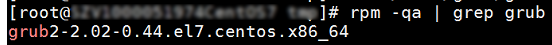

# 弹性云服务器启动缓慢

如果弹性云服务器启动时间较长，可以通过修改默认等待时间，提高启动速度。

1.  登录弹性云服务器。
2.  执行以下命令，切换至root用户。

    **sudo su**

3.  执行以下命令，查询grub文件的版本。

    **rpm -qa | grep grub**

    **图 1**  查询grub版本  
    

4.  将grub文件中timeout时间修改为0s。

    -   grub版本小于2的：

        打开文件“/boot/grub/grub.cfg“或“/boot/grub/menu.lst“，并修改等待时间“timeout=0”。

    -   grub版本为2的：

        打开文件/boot/grub2/grub.cfg，并修改等待时间“timeout=0”。

    **图 2**  修改timeout  
    

