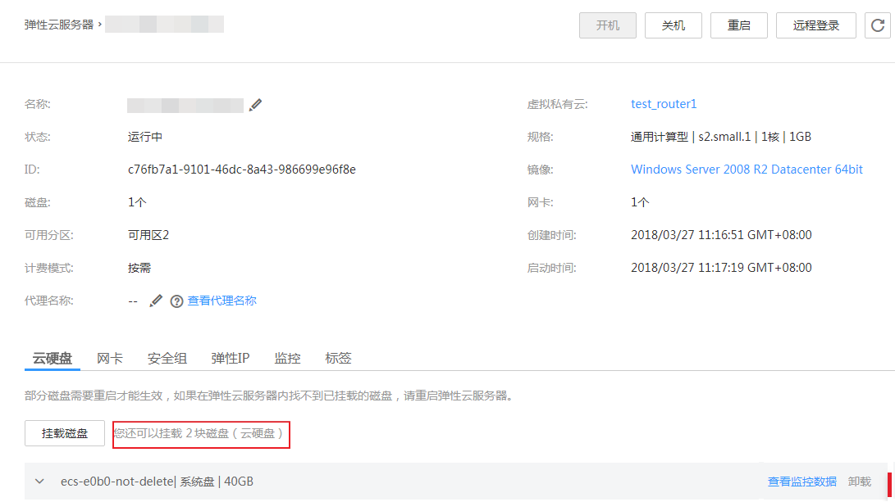

# 弹性云服务器详情页显示还有挂载点，但是挂载磁盘失败

## 问题描述

查看Windows弹性云服务器的详情页，系统显示您的弹性云服务器还可以挂载3个或3个以内的磁盘，如[图1](#fig141513348195)所示。但是单击“挂载磁盘”后，执行挂载操作一直失败。

**图 1**  弹性云服务器详情页  

## 可能原因

云硬盘欠费后，如果超期不续费，系统会强制卸载该磁盘，该动作可能会在Windows弹性云服务器内产生盘符残留，导致云服务器内部实际可用的磁盘挂载点减少。

## 处理方法

请尝试重启弹性云服务器后，再次执行磁盘挂载操作。

如果仍然挂载失败，请联系客服获取技术支持。

