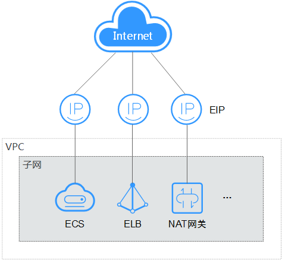

# 弹性公网IP概述

## 弹性公网IP

弹性公网IP（Elastic IP，简称EIP）提供独立的公网IP资源，包括公网IP地址与公网出口带宽服务。可以与弹性云服务器、裸金属服务器、虚拟IP、弹性负载均衡、NAT网关等资源灵活地绑定及解绑。拥有多种灵活的计费方式，可以满足各种业务场景的需要。

一个弹性公网IP只能绑定一个云资源使用。

**图 1**  通过EIP访问公网  

## 相关链接

-   [绑定弹性公网IP](绑定弹性公网IP.md)
-   [更换弹性公网IP](更换弹性公网IP.md)
-   [修改弹性公网IP的带宽](修改弹性公网IP的带宽.md)
-   [弹性公网IP类常见问题](https://support.huaweicloud.com/ecs_faq/ecs_faq_1301.html)
-   [访问网站或应用故障类常见问题](https://support.huaweicloud.com/ecs_faq/ecs_faq_1305.html)

