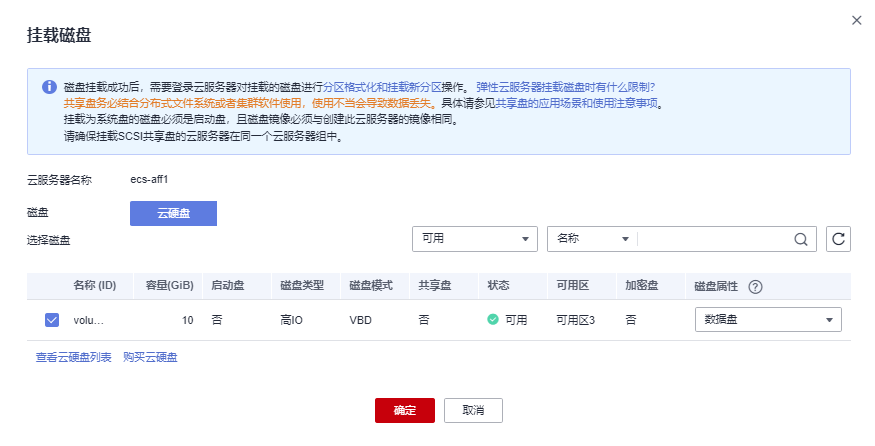
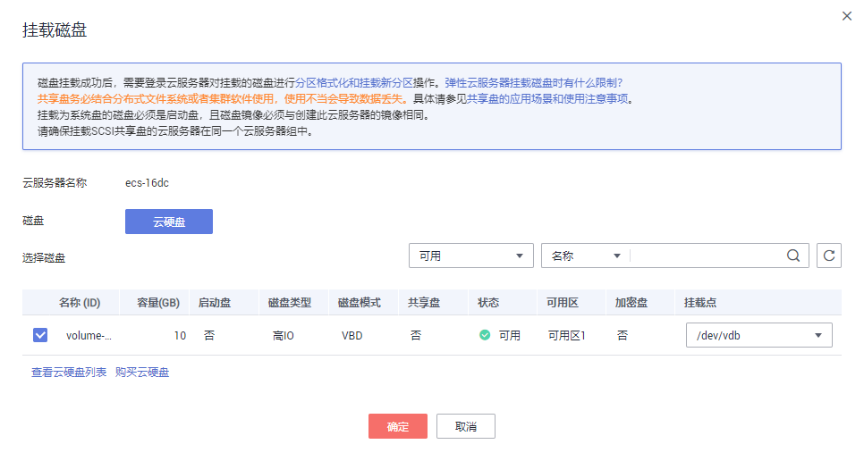

# 挂载磁盘

## 操作场景

弹性云服务器创建成功后，如果发现磁盘不够用或当前磁盘不满足要求，可以将已有云硬盘挂载给弹性云服务器，或在“存储 \> 云硬盘”页面购买新的磁盘，然后再挂载至弹性云服务器。

## 约束与限制

-   仅支持为“运行中”或“关机”状态的弹性云服务器挂载磁盘。
-   ISO镜像创建的弹性云服务器只建议用来装机，部分功能受限，不支持挂载磁盘操作。
-   弹性云服务器创建成功后，最多支持挂载60块磁盘。

    不同规格类型和磁盘类型支持挂载的数量不同，详细信息，请参见[一台弹性云服务器可以挂载多块磁盘吗？](https://support.huaweicloud.com/ecs_faq/ecs_faq_1114.html)

-   磁盘仅支持挂载至同一区域、同一可用区的弹性云服务器上。
-   随包年/包月弹性云服务器购买的系统盘，卸载后，如果继续作为系统盘使用，则只能挂载给原弹性云服务器.。
-   随按需计费弹性云服务器购买的系统盘，卸载后，如果继续作为系统盘使用，则只能挂载给与该系统盘镜像相同的弹性云服务器；如果作为数据盘使用，则可以挂载给任意弹性云服务器。
-   处于冻结状态的云硬盘，不支持挂载给弹性云服务器。
-   共享云硬盘只能用作数据盘，不能用作系统盘。
-   共享云硬盘挂载的多台弹性云服务器只能为Windows或Linux操作系统中的一种。比如：

    共享云硬盘首次挂载至多台Windows弹性云服务器，则卸载后，也不能挂载至Linux弹性云服务器。因为Windows和Linux支持的文件系统不同，无法识别云硬盘原有文件系统，如果操作不当会导致原有文件系统被破坏。

更多关于挂载磁盘的信息，请参见[挂载非共享云硬盘](https://support.huaweicloud.com/qs-evs/evs_01_0036.html)和[挂载共享云硬盘](https://support.huaweicloud.com/qs-evs/evs_01_0037.html)。

## 前提条件

-   已创建可用的云硬盘。

    创建云硬盘的操作请参考[“购买云硬盘”](https://support.huaweicloud.com/qs-evs/zh-cn_topic_0021738346.html)。

-   磁盘未被锁定。

    磁盘加锁时，表示被锁定，此时不能执行磁盘的挂载操作。

## 操作步骤

1.  登录管理控制台。
2.  单击管理控制台左上角的，选择区域和项目。
3.  单击“”，选择“计算 \> 弹性云服务器”。
4.  在弹性云服务器列表中的右上角，输入弹性云服务器名、IP地址或ID，并进行搜索。
5.  单击待挂载云硬盘的弹性云服务器的名称。

    系统跳转至该弹性云服务器详情页面。

6.  选择“云硬盘”页签，并单击“挂载磁盘”。

    系统跳转至“挂载磁盘”页面。

    **图 1**  挂载磁盘（KVM）  
    

    **图 2**  挂载磁盘（XEN）  
    

7.  根据界面提示，勾选目标磁盘，并指定该磁盘作为系统盘或数据盘。

    -   对于采用KVM虚拟化类型的弹性云服务器，您可以指定该磁盘作为系统盘或数据盘，但不能指定具体的磁盘挂载点。
    -   对于采用XEN虚拟化类型的弹性云服务器，系统支持指定具体的磁盘挂载点，如/dev/vdb。

    > **说明：** 
    >-   如果无可用的云硬盘，请单击列表下方的“购买云硬盘”进行购买。
    >-   挂载磁盘时的约束限制，请参见[弹性云服务器挂载磁盘时有什么限制](https://support.huaweicloud.com/ecs_faq/zh-cn_topic_0040863659.html)。
    >-   对于磁盘增强型、超高I/O型中的Ir3型弹性云服务器，本地盘与云硬盘的磁盘挂载点占用规则如下：
    >    -   系统盘：占用sda（或vda）。
    >    -   本地盘：顺序占用sda（或vda）之后的磁盘挂载点。
    >    -   云硬盘：在本地盘之后顺序挂载，挂载点按字母顺序依次增加。
    >    示例：
    >    假设D1型弹性云服务器有2块本地盘，则这2块本地盘的磁盘挂载点分别为sdb、sdc（或vdb、vdc），云硬盘的磁盘挂载点为sdd、sde......（或vdd、vde......）

8.  单击“确定”。

    挂载成功后，在弹性云服务器详情页的“云硬盘”页签，即可看到新挂载的磁盘信息。

## 后续处理

如果挂载的磁盘是新创建的，则云硬盘挂载至云服务器后，需要登录云服务器初始化云硬盘，即格式化云硬盘，之后云硬盘才可以正常使用。

初始化数据盘的具体操作，请参见[初始化数据盘](https://support.huaweicloud.com/qs-evs/evs_01_0038.html)。

