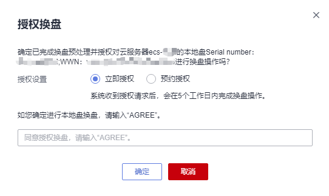

# 授权换盘

## 操作场景

当系统检测到ECS实例（含裸金属类型实例）的本地盘出现软硬件故障时，会对受影响的ECS实例自动生成“本地盘换盘”事件。

本文介绍如何响应“待授权”状态的“本地盘换盘”事件，指导您完成本地盘换盘的授权操作。

授权换盘包括两种模式：

-   立即授权：即系统收到授权请求后，会在5个工作日内完成换盘操作。
-   预约授权：即系统收到授权请求后，会在预约时间后5个工作日内完成换盘操作。

    设置预约授权时间后，您还可以修改预约时间，详细内容，请参见[修改预约时间](#section45741729181914)。

对于非裸金属类型的ECS实例，您还可以通过“实例重部署”操作响应“本地盘换盘”事件，详细内容，请参见[立即重部署](立即重部署.md)。

> **说明：** 
>-   本地盘换盘时，实例的系统盘、云硬盘类型的数据盘以及正常的本地盘不受影响，故障本地盘会被卸载并清空所有数据。
>    如果需要保留本地盘上的数据，请勿授权，并联系技术支持进行处理。
>-   对于裸金属类型实例，本地盘换盘操作可能伴随宿主机的下电与重启，在授权前，请确保云服务器中部署的业务离线，或云服务器停止对业务无影响。如果云服务器上的业务不可停止，请勿授权，并联系技术支持进行处理。

## 前提条件

如果您通过IAM用户进行本操作，则需要在操作前对IAM用户进行授权。

查询及响应事件操作依赖以下策略：

-   查询事件：ecs:instanceScheduledEvents:list
-   接受并授权执行事件：ecs:instanceScheduledEvents:accept
-   修改预约时间：ecs:instanceScheduledEvents:update

为IAM用户授权的操作，请参见[ECS自定义策略](ECS自定义策略.md)。

## 授权换盘

1.  登录管理控制台。
2.  单击管理控制台左上角的，选择区域和项目。
3.  单击“”，选择“计算 \> 弹性云服务器”。
4.  在左侧导航树中，选择“事件”。

1.  在“事件”页面，单击“”，通过以下条件过滤出待授权的“本地盘换盘”事件。
    1.  选择“事件状态 \> 待授权”。
    2.  选择“事件类型 \> 本地盘换盘”。

2.  在待授权的事件“操作”列，单击“授权换盘”。

    **图 1**  授权换盘  
    

    > **说明：** 
    >在进行“授权换盘”操作之前，请先了解风险须知，并完成换盘预处理操作：
    >-   如需保留本地盘上的数据，请先备份故障本地盘的数据。
    >-   在云服务器的/etc/fstab中，注释掉故障本地盘对应的挂载点，防止换盘后启动云服务器时进入维护模式。
    >-   在云服务器操作系统内部，使用umount命令，卸载故障本地盘对应的设备或者文件系统。
    >详细操作，请参见[换盘预处理](换盘预处理.md)。

3.  勾选“已知晓换盘风险并完成换盘预处理操作，继续下一步”，并单击“下一步”。
4.  进行“授权设置”。
    -   选择“立即授权”。

        即系统收到授权请求后，会在5个工作日内完成换盘操作。

        **图 2**  立即授权  
        

    -   选择“预约授权”，并设置预约授权时间。

        即系统收到授权请求后，会在预约时间后5个工作日内完成换盘操作。

        **图 3**  预约授权  
        

        设置预约授权时间后，您还可以修改预约时间，详细内容，请参见[修改预约时间](授权换盘.md#section45741729181914)。

5.  输入“AGREE”确定授权本地盘换盘。
6.  单击“确定”，完成授权换盘。

    授权换盘后，“本地盘换盘”事件更新为“待执行”状态。系统收到授权请求后，会根据授权设置将事件更新为执行中，开始进行换盘。

    待“本地盘换盘”事件更新为“完成”状态，本地盘换盘完成，请检查云服务器业务运行情况。

## 修改预约时间

完成“预约授权”方式的授权换盘操作后，“本地盘换盘”事件状态变为“待执行”，此时，您可以修改预约授权时间。

1.  登录管理控制台。
2.  单击管理控制台左上角的，选择区域和项目。
3.  单击“”，选择“计算 \> 弹性云服务器”。
4.  在左侧导航树中，选择“事件”。

1.  在“事件”页面，单击“”，通过以下条件过滤出待执行的“本地盘换盘”事件。
    1.  选择“事件状态 \> 待执行”。
    2.  选择“事件类型 \> 本地盘换盘”。

1.  在待执行的事件“操作”列，单击“修改预约时间”。

    **图 4**  修改预约时间  
    

2.  设置“修改预约执行时间”，并单击“是”，完成预约授权时间的修改。

    > **说明：** 
    >“修改预约执行时间”需要比“可预约最晚时间”早至少30分钟，否则无法设置。

