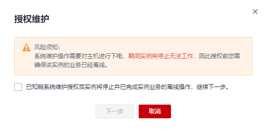
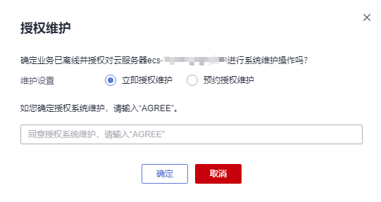
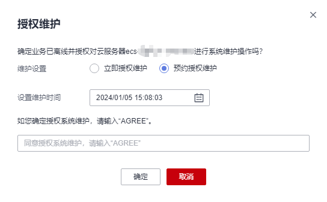
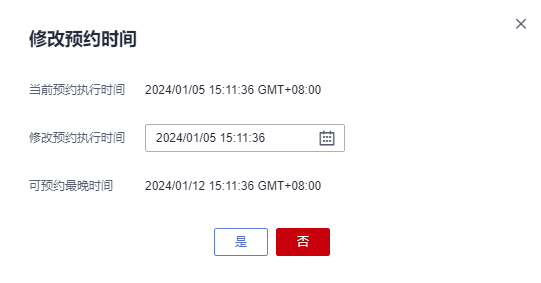

# 授权维护

## 操作场景

当系统上报“系统维护”事件时，您需要对ECS实例（含裸金属类型实例）进行“授权维护”操作。

本文介绍如何响应“待授权”状态的“系统维护”事件，指导您完成系统维护的授权操作。

授权维护包括两种模式：

-   立即授权维护：即系统收到请求后，会在5个工作日内完成实例宿主机的系统维护。
-   预约授权维护：即系统收到请求后，会在设置的预约维护时间后5个工作日内完成实例宿主机的系统维护。

    设置预约维护时间后，您还可以修改预约时间，详细内容，请参见[修改预约时间](#section17271841579)。

> **说明：** 
>系统维护操作通常伴随宿主机的下电与重启，届时云服务器将停止或重启。在授权维护前，请确保云服务器中部署的业务离线或云服务器停止对业务无影响。
>如果云服务器上的业务不可停止，请勿授权，并联系技术支持进行处理。

## 前提条件

如果您通过IAM用户进行本操作，则需要在操作前对IAM用户进行授权。

查询及响应事件操作依赖以下策略：

-   查询事件：ecs:instanceScheduledEvents:list
-   接受并授权执行事件：ecs:instanceScheduledEvents:accept
-   修改预约时间：ecs:instanceScheduledEvents:update

为IAM用户授权的操作，请参见[ECS自定义策略](ECS自定义策略.md)。

## 授权维护

1.  登录管理控制台。
2.  单击管理控制台左上角的，选择区域和项目。
3.  单击“”，选择“计算 \> 弹性云服务器”。
4.  在左侧导航树中，选择“事件”。

1.  在“事件”页面，单击“”，通过以下条件过滤出待授权的“系统维护”事件。
    1.  选择“事件状态 \> 待授权”。
    2.  选择“事件类型 \> 系统维护"。

2.  在待授权的事件“操作”列，单击“授权维护”。

    **图 1**  授权维护  
    

3.  了解风险须知后，勾选“已知晓系统维护授权后实例将停止并已完成实例业务的离线操作，继续下一步”，并单击“下一步”。
4.  进行“维护设置”。
    -   选择“立即授权维护”。

        即系统收到请求后，会在5个工作日内完成实例宿主机的系统维护。

        **图 2**  立即授权维护  
        

    -   选择“预约授权维护”，并设置维护时间。

        即系统在收到请求后，会在设置的预约维护时间后5个工作日内完成系统维护操作。

        **图 3**  预约授权维护  
        

        设置预约维护时间后，您还可以修改预约时间，详细内容，请参见[修改预约时间](授权维护.md#section17271841579)。

5.  输入“AGREE”确定授权系统维护。
6.  单击“确定”，完成授权维护。

    授权维护后，“系统维护”事件更新为“待执行”状态。系统收到授权请求后，会根据授权设置将事件更新为执行中，开始进行系统维护。

    待“系统维护”事件更新为“完成”状态，系统维护完成，请检查云服务器业务运行情况。

## 修改预约时间

完成“预约授权维护”方式的授权维护操作后，“系统维护”事件状态变为“待执行”，此时，您可以修改预约时间。

1.  登录管理控制台。
2.  单击管理控制台左上角的，选择区域和项目。
3.  单击“”，选择“计算 \> 弹性云服务器”。
4.  在左侧导航树中，选择“事件”。

1.  在“事件”页面，单击“”，通过以下条件过滤出待执行的“系统维护”事件。
    1.  选择“事件状态 \> 待执行”。
    2.  选择“事件类型 \> 系统维护”。

1.  在待执行的事件“操作”列，单击“修改预约时间”。

    **图 4**  修改预约时间  
    

2.  设置“修改预约执行时间”，并单击“确定”，完成预约时间的修改。

    > **说明：** 
    >“修改预约执行时间”需要比“可预约最晚时间”早至少30分钟，否则无法设置。

