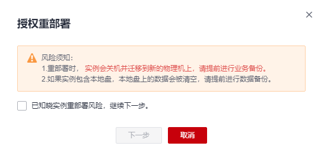
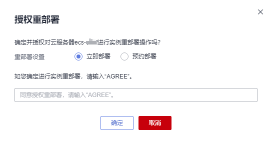
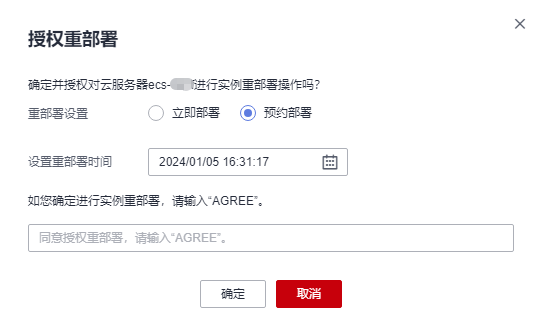
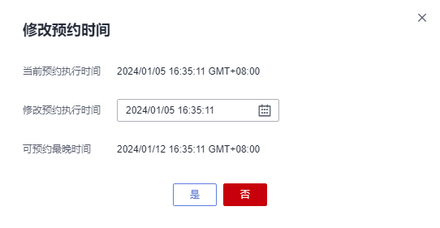

# 授权重部署

## 操作场景

当系统上报“实例重部署”事件时，您需要对ECS实例进行“授权重部署”操作。

本文介绍如何响应“待授权”状态的“实例重部署”事件，指导您完成实例重部署的授权操作。

授权重部署包括两种模式：

-   立即部署：即系统收到请求后，会立即进行实例重部署。
-   预约部署：即系统收到请求后，会在设置的预约部署时间进行实例重部署。

    设置预约的重部署时间后，您还可以修改预约时间，详细内容，请参见[修改预约时间](#section17271841579)。

> **说明：** 
>-   实例重部署时，会重启实例，请提前进行业务备份。
>-   实例重部署后，实例的系统盘和云硬盘类型的数据盘不受影响。
>-   对于包含本地盘的实例，实例重部署后，实例的本地盘会被初始化并清空所有数据。为了保障数据安全，请提前进行本地盘数据备份。

## 前提条件

如果您通过IAM用户进行本操作，则需要在操作前对IAM用户进行授权。

查询及响应事件操作依赖以下策略：

-   查询事件：ecs:instanceScheduledEvents:list
-   接受并授权执行事件：ecs:instanceScheduledEvents:accept
-   修改预约时间：ecs:instanceScheduledEvents:update

为IAM用户授权的操作，请参见[ECS自定义策略](ECS自定义策略.md)。

## 授权重部署

1.  登录管理控制台。
2.  单击管理控制台左上角的，选择区域和项目。
3.  单击“”，选择“计算 \> 弹性云服务器”。
4.  在左侧导航树中，选择“事件”。

1.  在“事件”页面，单击“”，通过以下条件过滤出待授权的“实例重部署”事件。
    1.  选择“事件状态 \> 待授权”。
    2.  选择“事件类型 \> 实例重部署"。

2.  在待授权的事件“操作”列，单击“授权重部署”。

    **图 1**  授权重部署  
    

    > **说明：** 
    >在进行“实例重部署”操作之前，请先了解本地盘数据丢失风险，完成实例重部署预处理操作，为所有数据盘增加nofail参数。
    >详细内容，请参见[实例重部署预处理](实例重部署预处理.md)。

3.  了解风险须知后，勾选“已知晓实例重部署风险，继续下一步”，并单击“下一步”。
4.  进行“重部署设置”。
    -   选择“立即部署”。

        即系统收到请求后，会立即进行实例重部署。

        **图 2**  立即部署  
        

    -   选择“预约部署”，并设置重部署时间。

        即系统在收到请求后，会在设置的预约部署时间进行实例重部署。

        **图 3**  预约部署  
        

        设置预约的重部署时间后，您还可以修改预约时间，详细内容，请参见[修改预约时间](授权重部署.md#section17271841579)。

5.  输入“AGREE”确定授权实例重部署。
6.  单击“确定”，完成授权重部署。

    授权重部署后，“实例重部署”事件更新为“待执行”状态。系统收到授权请求后，会根据授权设置将事件更新为执行中，开始进行实例重部署。

    待“实例重部署”事件更新为“完成”状态，实例重部署完成，请检查云服务器业务运行情况。

## 修改预约时间

完成“预约部署”方式的授权重部署操作后，“实例重部署”事件状态变为“待执行”，此时，您可以修改预约时间。

1.  登录管理控制台。
2.  单击管理控制台左上角的，选择区域和项目。
3.  单击“”，选择“计算 \> 弹性云服务器”。
4.  在左侧导航树中，选择“事件”。

1.  在“事件”页面，单击“”，通过以下条件过滤出待执行的“实例重部署”事件。
    1.  选择“事件状态 \> 待执行”。
    2.  选择“事件类型 \> 实例重部署”。

1.  在待执行的事件“操作”列，单击“修改预约时间”。

    **图 4**  修改预约时间  
    

2.  设置“修改预约执行时间”，并单击“是”，完成预约时间的修改。

    > **说明：** 
    >“修改预约执行时间”需要比“可预约最晚时间”早至少30分钟，否则无法设置。

