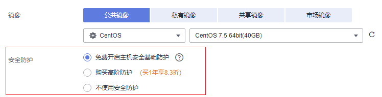

# 提升云服务器安全性方法概述

## 操作场景

如果云服务器没有设置相关的安全防护，可能受到病毒入侵或外部攻击，导致数据泄露或丢失，影响业务的正常运行。

怎样保护云服务器免受攻击或病毒入侵？本节操作介绍常见的提升云服务器安全的措施。

## 防护类型简介

提升云服务器的安全性，分为云服务器“外部安全防护”和“内部安全防护”两方面。

**表 1**  提升云服务器安全的方法

<table><thead align="left"><tr id="row1898710115204"><th class="cellrowborder" valign="top" width="15.260000000000002%" id="mcps1.2.4.1.1">
类型

</th>
<th class="cellrowborder" valign="top" width="45.96%" id="mcps1.2.4.1.2">
说明

</th>
<th class="cellrowborder" valign="top" width="38.78%" id="mcps1.2.4.1.3">
防护方法

</th>
</tr>
</thead>
<tbody><tr id="row4987516201"><td class="cellrowborder" valign="top" width="15.260000000000002%" headers="mcps1.2.4.1.1 ">
外部安全防护

</td>
<td class="cellrowborder" valign="top" width="45.96%" headers="mcps1.2.4.1.2 ">
常见的DDoS攻击、木马或病毒的入侵都是常见的尾部安全问题。针对这类问题有多种常见的防护方案，例如开启主机安全防护、DDoS原生基础防护您可以根据您的实际业务选择合适的防护方案。

</td>
<td class="cellrowborder" valign="top" width="38.78%" headers="mcps1.2.4.1.3 "><ul id="ul1642783442110"><li><a href="#section47861136153218">开启主机安全防护</a></li><li><a href="#section980811496326">监控云服务器</a></li><li><a href="#section1289312471910">开启防DDoS攻击</a></li><li><a href="#section10102957143212">定期备份数据</a></li></ul>
</td>
</tr>
<tr id="row798713162010"><td class="cellrowborder" valign="top" width="15.260000000000002%" headers="mcps1.2.4.1.1 ">
内部安全防护

</td>
<td class="cellrowborder" valign="top" width="45.96%" headers="mcps1.2.4.1.2 ">
弱密码、开放错误的端口都可能引起内部安全防护问题，不提升云服务器的内部安全防护，外部安全防护方案就无法有效的拦截和阻断各种外部攻击。

</td>
<td class="cellrowborder" valign="top" width="38.78%" headers="mcps1.2.4.1.3 "><ul id="ul145173613218"><li><a href="#section10416410163316">增加登录密码的强度</a></li><li><a href="#section136273234411">提升云服务器的端口安全</a></li><li><a href="#section235552519912">定期升级操作系统</a></li></ul>
</td>
</tr>
</tbody>
</table>

## 开启主机安全防护

企业主机安全（Host Security Service，HSS）是提升服务器整体安全性的服务，通过主机管理、风险防御、入侵检测、安全运营、网页防篡改功能，可全面识别并管理云服务器中的信息资产，实时监测云服务器中的风险，降低服务器被入侵的风险。

使用主机安全需要在云服务器中安装Agent。安装Agent后，您的云服务器将受到HSS云端防护中心全方位的安全保障，在安全控制台可视化界面上，您可以统一查看并管理同一区域内所有主机的防护状态和主机安全风险。

您在使用企业主机安全服务前，需要先在弹性云服务器上安装Agent。针对新创建的云服务器和已有的云服务器，我们提供了不同的安装方式：

-   **场景一：新创建云服务器**

    购买弹性云服务器，选择部分操作系统的公共镜像时，系统推荐您配套使用公有云提供的企业主机安全服务（Host Security Service, HSS）。

    开启方法：勾选“开通主机安全”，勾选后，选择主机安全的版本，HSS会自动为该云服务器安装Agent并开启基础版防护。

    -   基础版：基础版免费使用，支持入侵检测，应对账户暴力破解、账户登录异常，支持安全配置，通过双因子认证，密码+短信/邮件认证的方式，彻底防范帐号暴力破解行为。
    -   企业版：企业版本付费使用，支持资产管理、漏洞管理、基线检查、入侵检测、安全运营、安全配置。

    选择主机安全后系统自动安装主机安全Agent，开启帐号防御，启用主机安全服务的功能。

    企业主机安全支持基础版、企业版、旗舰版和网页防篡改版 ，请参考[企业主机安全服务版本差异](https://support.huaweicloud.com/productdesc-hss/hss_01_0136.html)。

    若基础版或企业版不满足要求，您可以[购买其他版本配额](https://support.huaweicloud.com/usermanual-hss/hss_01_0229.html)，在企业主机安全控制台切换不同版本，获取更高级的防护，且不需要重新安装Agent。

    **图 1**  开通主机安全  
    

-   **场景二：未配置主机安全的云服务器**

    对于已经创建完成的弹性云服务器，可能由于创建时尚未支持主机安全服务、或未勾选“主机安全基础版”，如需使用主机安全，您需要手动安装Agent。

    具体操作请参见[手动安装Agent](https://support.huaweicloud.com/usermanual-hss/hss_01_0234.html)、[手动开启防护](https://support.huaweicloud.com/usermanual-hss/hss_01_0230.html)。

## 监控云服务器

监控是保持弹性云服务器可靠性、可用性和性能的重要部分，通过监控，用户可以观察弹性云服务器资源。为使用户更好地掌握自己的弹性云服务器运行状态，公有云平台提供了云监控。您可以使用该服务监控您的弹性云服务器，执行自动实时监控、告警和通知操作，帮助您更好地了解弹性云服务器的各项性能指标。

主机监控分为基础监控和操作系统监控。

-   基础监控

    基础监控无需安装Agent，是ECS自动上报的监控指标。基础监控指标的监控周期为5分钟（KVM实例）。

-   操作系统监控

    操作系统监控需要在弹性云服务器中安装Agent插件，为用户提供服务器的系统级、主动式、细颗粒度监控服务。操作系统监控的监控周期为1分钟（KVM实例）。

    **购买云服务器时的开启操作系统监控的方法：**

    您可以在购买时勾选“开启详细监控”，勾选后云平台将自动安装操作系统监控所需的Agent插件。

    > **说明：** 
    >当前仅部分操作系统支持在购买时开启详细监控。

    **图 2**  购买云服务器时开启操作系统监控  
    

    **为已创建完成的云服务器开启操作系统监控的方法：**

    如果创建时未勾选“开启详细监控”，如需使用操作系统监控，您需要手动安装Agent。

    安装配置Agent相关操作请参考云监控服务[“Agent安装配置方式说明”](https://support.huaweicloud.com/usermanual-ces/ces_01_0027.html)。

开启主机监控后您可以通过设置弹性云服务器告警规则，自定义监控目标与通知策略，及时了解弹性云服务器运行状况，从而起到预警作用。

在ECS的控制台单击即可查看监控指标。

**图 3**  查看云服务器监控指标  

## 开启防DDoS攻击

针对DDoS攻击，华为云提供多种安全防护方案，您可以根据您的实际业务选择合适的防护方案。华为云DDoS防护服务（Anti-DDoS Service，简称ADS）提供了DDoS原生基础防护（Anti-DDoS流量清洗）、DDoS原生专业防护和DDoS高防三个子服务。

其中，DDoS原生基础防护为免费服务，DDoS原生专业防护和DDoS高防为收费服务。

关于DDoS原生专业防护和DDoS高防请单击[DDoS防护](https://support.huaweicloud.com/productdesc-ads/ads_01_0001.html)了解更多。

购买弹性云服务器时，如果选择了购买弹性公网IP，那么控制台会提示您已免费开启DDoS基础防护。

**图 4**  免费开启DDoS基础防护  

DDoS原生基础防护（Anti-DDoS流量清洗）服务（以下简称Anti-DDoS）为云服务器提供DDoS攻击防护和攻击实时告警通知。同时，Anti-DDoS可以提升用户带宽利用率，确保用户业务稳定运行。

Anti-DDoS通过对互联网访问公网IP的业务流量进行实时监测，及时发现异常DDoS攻击流量。在不影响正常业务的前提下，根据用户配置的防护策略，清洗掉攻击流量。同时，Anti-DDoS为用户生成监控报表，清晰展示网络流量的安全状况。

## 定期备份数据

数据备份是防止系统出现数据丢失，将全部或部分数据以其他方式保留的过程。本节以云备份方法为例，了解更多备份方法请参考[云备份概述](云备份概述.md)。

云备份可以为云服务器、云硬盘提供简单易用的备份服务，当发生病毒入侵、人为误删除、软硬件故障等事件时，可将数据恢复到任意备份点。保障用户数据的安全性和正确性，确保业务安全。

**购买云服务器时启用云备份的方法：**

购买云服务器时，设置开启云备份完成后，系统会将云服务器绑定至云备份存储库并绑定所选备份策略，定期备份弹性云服务器。

-   现在购买：
    1.  输入云备份存储库的名称：只能由中文字符、英文字母、数字、下划线、中划线组成，且长度小于等于64个字符。例如：vault-f61e。默认的命名规则为“vault\_xxxx”。
    2.  输入存储库的容量：此容量为备份云服务器所需的容量。存储库的空间不能小于云服务器的空间。取值范围为\[云服务器总容量，10485760\]GB。
    3.  设置备份策略：在下拉列表中选择备份策略，或进入云备份控制台查看或编辑备份策略。

-   使用已有：
    1.  选择云备份存储库的名称：在下拉列表中选择已有的云备份存储库。
    2.  设置备份策略：在下拉列表中选择备份策略，或进入云备份控制台查看或编辑备份策略。

-   暂不购买：跳过云备份的配置步骤。如云服务器购买成功后仍需设置备份保护，请进入云备份控制台找到目标存储库，绑定服务器。

    **图 5**  设置云备份  
    

**已创建完成的云服务器创建云备份的方法：**

[备份云服务器](云备份概述.md)可以通过“云服务器备份”和“云硬盘备份”功能实现：

-   云服务器备份（推荐）：如果是对弹性云服务器中的所有云硬盘（系统盘和数据盘）进行备份，推荐使用云服务器备份功能，同时对所有云硬盘进行备份，避免因备份创建时间差带来的数据不一致问题。
-   云硬盘备份：如果对指定的单个或多个云硬盘（系统盘或数据盘）进行备份，推荐使用云硬盘备份功能，在保证数据安全的同时降低备份成本。

## 增加登录密码的强度

“密钥对”方式创建的弹性云服务器安全性更高，建议选择“密钥对”方式。如果您习惯使用“密码”方式，请增强密码的复杂度，如[表1](#zh-cn_topic_0144542112_table73048136615)所示，保证密码符合要求，防止恶意攻击。

系统不会定期自动修改弹性云服务器密码。为安全起见，建议您定期修改密码。

密码设置建议：

-   密码应该长度不少于10位。
-   建议不要使用有一定特征和规律容易被破解的常用口令的密码（如：在常用彩虹表中的密码、滚键盘密码等），且密码复杂度至少包含大写字母、小写字符、数字、特殊字符四类中的三种。
-   密码尽量不要包含账户名如：adminstrator/administrator，test/test，root/root，oracle/oracle，mysql/mysql。
-   建议至少每90天更改一次密码。
-   建议不要重复使用最近5次（含5次）内已使用的密码。
-   建议根据不同应用设置不同的帐号密码，不建议多个应用使用同一密码。

**表 2**  创建云服务器时密码的设置规则

<table><thead align="left"><tr id="zh-cn_topic_0144542112_zh-cn_topic_0035643949_zh-cn_topic_0021426802_row925712618958"><th class="cellrowborder" valign="top" width="18.000000000000004%" id="mcps1.2.4.1.1">
参数

</th>
<th class="cellrowborder" valign="top" width="59.49000000000001%" id="mcps1.2.4.1.2">
规则

</th>
<th class="cellrowborder" valign="top" width="22.51%" id="mcps1.2.4.1.3">
样例

</th>
</tr>
</thead>
<tbody><tr id="zh-cn_topic_0144542112_zh-cn_topic_0035643949_zh-cn_topic_0021426802_row4260571318958"><td class="cellrowborder" valign="top" width="18.000000000000004%" headers="mcps1.2.4.1.1 ">
密码

</td>
<td class="cellrowborder" valign="top" width="59.49000000000001%" headers="mcps1.2.4.1.2 "><ul id="zh-cn_topic_0144542112_zh-cn_topic_0035643949_zh-cn_topic_0021426802_ul5961106018958"><li>密码长度范围为8到26位。</li><li>密码至少包含以下4种字符中的3种：<ul id="zh-cn_topic_0144542112_zh-cn_topic_0035643949_zh-cn_topic_0021426802_ul24583583181022"><li>大写字母</li><li>小写字母</li><li>数字</li><li>特殊字符，包括“$”、“!”、“@”、“%”、“-”、“_”、“=”、“+”、“[”、“]”、“:”、“.”、“/”、“^”、“,”、“{”、“}”和“?”</li></ul>
</li><li>密码不能包含用户名或用户名的逆序。</li><li>Windows系统的云服务器，不能包含用户名中超过两个连续字符的部分。</li></ul>
</td>
<td class="cellrowborder" valign="top" width="22.51%" headers="mcps1.2.4.1.3 ">
YNbUwp!dUc9MClnv

 说明： 

样例密码随机生成，请勿复制使用样例。

</td>
</tr>
</tbody>
</table>

## 提升云服务器的端口安全

安全组是云服务器的守卫，是重要的网络安全隔离手段，可以保护云服务器的网络安全。安全组可以控制进出云服务器的网络流量。网络流量分为出方向和入方向，出方向是指您想访问别人，入方向就是别人想访问你。如果把云服务器比作一个宫殿，那安全组就像是一个守卫者，谁能进出，都由安全组规则控制。

通过配置安全组规则，限定云服务器出方向和入方向的访问端口，通常我们建议您关闭高危端口，仅开启必要的云服务器端口。

常见的高危端口如[表3](#table34831117171)所示，建议您修改敏感端口为其它非高危端口来承载业务。请参考[云服务器常用端口](https://support.huaweicloud.com/usermanual-vpc/SecurityGroup_0002.html)。

**表 3**  常见的高危端口

<table><thead align="left"><tr id="row174831117977"><th class="cellrowborder" valign="top" width="19.220000000000002%" id="mcps1.2.3.1.1">
协议

</th>
<th class="cellrowborder" valign="top" width="80.78%" id="mcps1.2.3.1.2">
端口

</th>
</tr>
</thead>
<tbody><tr id="row184831217874"><td class="cellrowborder" valign="top" width="19.220000000000002%" headers="mcps1.2.3.1.1 ">
TCP

</td>
<td class="cellrowborder" valign="top" width="80.78%" headers="mcps1.2.3.1.2 ">
42 135 137 138 139 444 445 593 1025 1068 1434 3127 3128 3129 3130 4444 4789 5554 5800 5900 9996

</td>
</tr>
<tr id="row4483817371"><td class="cellrowborder" valign="top" width="19.220000000000002%" headers="mcps1.2.3.1.1 ">
UDP

</td>
<td class="cellrowborder" valign="top" width="80.78%" headers="mcps1.2.3.1.2 ">
135~139 1026 1027 1028 1068 1433 1434 4789 5554 9996

</td>
</tr>
</tbody>
</table>

## 定期升级操作系统

云服务器申请完成后，系统内的所有配置都是需要您自行维护，云平台不负责客户系统补丁的升级，对于官方发布的一些漏洞预警，我们会有[安全公告](https://www.huaweicloud.com/notice.securecenter.html)，需要您自行升级维护。

