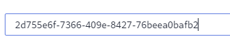
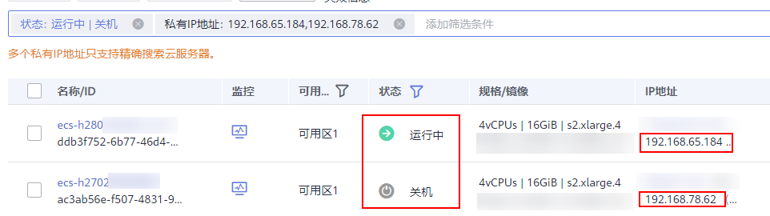

# 搜索云服务器（旧版）

## 操作场景

购买弹性云服务器后，可以通过管理控制台提供的搜索功能快速检索当前区域的云服务器资源。本节操作介绍搜索云服务器的操作步骤。当前支持使用名称、云服务器ID、可用区、状态、规格名称、镜像ID、弹性公网IP地址、私有IP地址、创建时间、计费模式、VPC ID、企业项目、标签以上属性进行搜索。单击搜索框右侧的可以设置系统的默认搜索属性。

## 搜索语法

弹性云服务器支持多种类型的搜索，详细的说明和示例请参考[表1](#table145381755194911)。

> **说明：** 
>-   部分属性支持系统自动匹配属性搜索，但必须输入完整的属性值。
>-   选择属性搜索时，以下属性仅支持精确搜索，需输入完整的属性值：云服务器ID、镜像ID、弹性公网IP地址、VPC ID。
>-   多值搜索时私有IP地址也必须使用精确搜索，需输入完整的属性值。
>-   私有IP地址的网段需在以下范围内：10.0.0.0/8-24 ，172.16.0.0/12-24，192.168.0.0/16-24 。
>-   按标签过滤时可选择键或键值对搜索。支持设置多个标签，如果键不同，则标签按“与”的关系搜索。如果键相同，值不同，则标签按“与”的关系搜索。
>-   未选择属性的时候标签不支持多值搜索。
>-   私有IP和弹性公网IP不能同时搜索。

**表 1**  搜索语法

<table><thead align="left"><tr id="row1153820554493"><th class="cellrowborder" valign="top" width="14.598540145985398%" id="mcps1.2.6.1.1">
搜索类型

</th>
<th class="cellrowborder" valign="top" width="19.34806519348065%" id="mcps1.2.6.1.2">
支持的属性

</th>
<th class="cellrowborder" valign="top" width="17.108289171082887%" id="mcps1.2.6.1.3">
输入格式

</th>
<th class="cellrowborder" valign="top" width="14.978502149785017%" id="mcps1.2.6.1.4">
示例

</th>
<th class="cellrowborder" valign="top" width="33.96660333966602%" id="mcps1.2.6.1.5">
说明

</th>
</tr>
</thead>
<tbody><tr id="row6538105534919"><td class="cellrowborder" valign="top" width="14.598540145985398%" headers="mcps1.2.6.1.1 ">
属性值

自动匹配属性

</td>
<td class="cellrowborder" valign="top" width="19.34806519348065%" headers="mcps1.2.6.1.2 ">
云服务器ID、规格名称、私有IP地址、弹性公网IP地址、标签（标签不支持输入多值。）

</td>
<td class="cellrowborder" valign="top" width="17.108289171082887%" headers="mcps1.2.6.1.3 ">
完整的属性值

</td>
<td class="cellrowborder" valign="top" width="14.978502149785017%" headers="mcps1.2.6.1.4 ">
云服务器ID：4a79dfec-f0d8-4181-9bef-495b8b7220e1,

规格名称：s2.xlarge.4

私有IP地址：192.168.99.231

标签：a=b

</td>
<td class="cellrowborder" valign="top" width="33.96660333966602%" headers="mcps1.2.6.1.5 ">
使用关键字搜索时，不需要选择属性，仅输入完整的属性值，系统自动匹配属性类型进行搜索。

多个取值使用“,”分隔。否则后输入的取值会替换之前输入的取值。多个属性值之间为“或”的关系。

</td>
</tr>
<tr id="row8538455154915"><td class="cellrowborder" valign="top" width="14.598540145985398%" headers="mcps1.2.6.1.1 ">
单属性

</td>
<td class="cellrowborder" valign="top" width="19.34806519348065%" headers="mcps1.2.6.1.2 ">
控制台支持的所有属性

</td>
<td class="cellrowborder" valign="top" width="17.108289171082887%" headers="mcps1.2.6.1.3 ">
属性：属性值

</td>
<td class="cellrowborder" valign="top" width="14.978502149785017%" headers="mcps1.2.6.1.4 ">
状态：运行中

</td>
<td class="cellrowborder" valign="top" width="33.96660333966602%" headers="mcps1.2.6.1.5 ">
选择属性后，输入/选择对应的属性信息。

以下属性仅支持精确搜索，需输入完整的属性值：云服务器ID、弹性公网IP地址、镜像ID、VPC ID。

</td>
</tr>
<tr id="row1053975524910"><td class="cellrowborder" valign="top" width="14.598540145985398%" headers="mcps1.2.6.1.1 ">
多属性

</td>
<td class="cellrowborder" valign="top" width="19.34806519348065%" headers="mcps1.2.6.1.2 ">
控制台支持的所有属性

</td>
<td class="cellrowborder" valign="top" width="17.108289171082887%" headers="mcps1.2.6.1.3 ">
属性：取值&amp;属性：取值

</td>
<td class="cellrowborder" valign="top" width="14.978502149785017%" headers="mcps1.2.6.1.4 ">
状态：运行中 名称：ecs-c

</td>
<td class="cellrowborder" valign="top" width="33.96660333966602%" headers="mcps1.2.6.1.5 ">
支持选择多个不同的属性，搜索时多个属性为“与”的关系。

以下属性仅支持精确搜索，需输入完整的属性值：云服务器ID、弹性公网IP地址、镜像ID、VPC ID。

</td>
</tr>
<tr id="row353914558497"><td class="cellrowborder" valign="top" width="14.598540145985398%" headers="mcps1.2.6.1.1 ">
单属性、多值

</td>
<td class="cellrowborder" valign="top" width="19.34806519348065%" headers="mcps1.2.6.1.2 ">
状态、云服务器ID、规格名称、私有IP地址、弹性公网IP地址、计费模式、标签

（标签不支持输入多值。）

</td>
<td class="cellrowborder" valign="top" width="17.108289171082887%" headers="mcps1.2.6.1.3 ">
属性：取值1|取值2

</td>
<td class="cellrowborder" valign="top" width="14.978502149785017%" headers="mcps1.2.6.1.4 ">
规格名称：s2,s3

私有IP地址：

192.168.0.19,192.168.111.111

</td>
<td class="cellrowborder" valign="top" width="33.96660333966602%" headers="mcps1.2.6.1.5 ">
选择一个属性后，输入多个取值，多个取值之间为“或”的关系。

以下属性仅支持精确搜索，需输入完整的属性值：云服务器ID、私有IP地址、弹性公网IP地址。

</td>
</tr>
<tr id="row14539115554915"><td class="cellrowborder" valign="top" width="14.598540145985398%" headers="mcps1.2.6.1.1 ">
多属性、多值

</td>
<td class="cellrowborder" valign="top" width="19.34806519348065%" headers="mcps1.2.6.1.2 ">
状态、云服务器ID、规格名称、私有IP地址、弹性公网IP地址、计费模式、标签

（标签不支持输入多值。）

</td>
<td class="cellrowborder" valign="top" width="17.108289171082887%" headers="mcps1.2.6.1.3 ">
属性：取值&amp;属性：取值1|取值2

</td>
<td class="cellrowborder" valign="top" width="14.978502149785017%" headers="mcps1.2.6.1.4 ">
状态：运行中&amp;规格名称：s2,s3

</td>
<td class="cellrowborder" valign="top" width="33.96660333966602%" headers="mcps1.2.6.1.5 ">
选择多个“属性：取值,取值”的搜索方式，属性之间为“与”的关系。同一属性的多个取值之间为“或”的关系。

以下属性仅支持精确搜索，需输入完整的属性值：云服务器ID、私有IP地址、弹性公网IP地址。

</td>
</tr>
</tbody>
</table>

## 操作步骤

1.  登录管理控制台。
2.  单击“”，选择“计算 \> 弹性云服务器”。

    系统进入弹性云服务器列表页。

3.  在搜索的输入框中，设置搜索条件。

    **图 1**  搜索弹性云服务器  
    

    您可以根据需要，选择并设置合适的搜索条件。

    -   在搜索框直接输入属性值，系统自动识别属性并搜索。
    -   设置默认搜索项进行搜索。
        1.  在搜索框右侧，单击，在搜索项列表中选择要设置的默认搜索项。

            > **说明：** 
            >切换区域后，搜索栏中设置的默认搜索项信息会保留。

            **图 2**  切换默认搜索项  
            

        2.  根据提示输入搜索关键字，并单击进行搜索。

    -   设置搜索属性类型进行搜索。
        1.  单击搜索框，在列表中选择搜索的属性类型。

            **图 3**  设置搜索属性类型  
            

        2.  根据提示信息，在搜索栏中输入或选择搜索条件，例如云服务器ID、云服务器状态、规格名称等，并单击进行搜索。

## 示例1：使用属性值搜索，系统自动匹配属性

输入完整的属性值后，系统自动识别属性并搜索。多个取值使用“,”分隔，否则后输入的取值会替换之前输入的取值。多个属性值之间为“或”的关系。

-   单值搜索：

    在云服务器列表页搜索的输入框中输入完整云服务器ID，单击进行搜索。

    **图 4**  输入完整的云服务器ID  
    

    **图 5**  系统自动匹配属性  
    

-   多值搜索：

    在云服务器列表页搜索的输入框中输入完整的规格名称，单击进行搜索。

    **图 6**  输入多个完整的规格名称  
    

    **图 7**  系统自动匹配属性并搜  
    

## 示例2：单属性搜索

选择属性后，输入/选择对应的属性信息。

以下属性仅支持精确搜索，需输入完整的属性值：云服务器ID、镜像ID、弹性公网IP地址、VPC ID。

-   模糊搜索：使用私有IP地址搜索
    1.  在云服务器列表页搜索的输入框中选择“私有IP地址”。
    2.  根据提示，输入私有IP地址，单击进行搜索。“私有IP地址”支持模糊搜索，例如输入“192.168.0”，可以搜索到所有使用192.168.0网段的云服务器。

        **图 8**  按私有IP地址搜索云服务器  
        

-   精确搜索：使用弹性公网IP地址搜索
    1.  在云服务器列表页搜索的输入框中选择“弹性公网IP地址”。
    2.  根据提示，输入完整弹性公网IP地址，单击进行搜索。

        **图 9**  按弹性公网IP地址搜索云服务器  
        

## 示例3：多属性搜索

支持选择多个不同的属性，搜索时多个属性为“与”的关系。

以下属性仅支持精确搜索，需输入完整的属性值：云服务器ID、弹性公网IP地址、镜像ID、VPC ID。

本例同时使用“云服务器名称”和“私有IP地址”进行搜索。

1.  在云服务器列表页搜索的输入框中选择“云服务器名称”并输入取值。单击进行搜索。本例云服务器名称使用模糊搜索。
2.  添加筛选属性条件，选择“私有IP地址”，根据提示输入私有IP地址，单击进行搜索。本例私有IP地址使用模糊搜索。

    **图 10**  按私有IP地址搜索云服务器  
    

## 示例4：单属性、多值搜索

仅以下属性支持单属性、多值搜索：状态、云服务器ID、规格名称、私有IP地址、弹性公网IP地址、计费模式、标签。

其中以下属性仅支持精确搜索，需输入完整的属性值：云服务器ID、私有IP地址、弹性公网IP地址。

选择一个属性后，输入多个取值，多个取值之间为“或”的关系。

-   模糊搜索
    1.  在云服务器列表页搜索的输入框中选择“规格名称”。
    2.  根据提示输入多个规格名称，使用“,”分隔，单击进行搜索。

        **图 11**  按规格名称搜索云服务器  
        

-   精确搜索
    1.  在云服务器列表页搜索的输入框中选择“私有IP地址”。
    2.  根据提示输入多个完整的私有IP地址，使用“,”分隔，单击进行搜索。

        **图 12**  按私有IP地址搜索云服务器  
        

## 示例5：多属性、多值搜索

仅以下属性支持多属性、多值搜索：状态、云服务器ID、规格名称、私有IP地址、弹性公网IP地址、计费模式、标签。

其中以下属性仅支持精确搜索，需输入完整的属性值：云服务器ID、私有IP地址、弹性公网IP地址。

选择多个“属性：取值,取值”的搜索方式，属性之间为“与”的关系。同一属性的多个取值之间为“或”的关系。

-   模糊搜索
    1.  在云服务器列表页搜索的输入框中选择“状态”，并选择“运行中”、“关机”，单击进行搜索。
    2.  添加筛选属条件，选择“规格名称”，输入多个规格名称，使用“,”分隔，单击进行搜索。

        **图 13**  按状态和规格名称搜索云服务器  
        

-   精确搜索
    1.  在云服务器列表页搜索的输入框中选择“状态”，并选择“运行中”、“关机”，单击进行搜索。
    2.  添加筛选属条件，选择“私有IP地址”，根据提示输入多个完整的私有IP地址，使用“,”分隔，单击进行搜索。

        **图 14**  按状态和私有IP地址搜索云服务器  
        

## 示例6 ：按标签搜索

按标签过滤时可选择键或键值对搜索。

支持设置多个标签，如果键不同，则标签按“与”的关系搜索。

如果键相同，值不同，则标签按“与”的关系搜索。

-   单个标签搜索

    在云服务器列表页搜索的输入框中选择“标签”，选择标签键值对，单击“确认”进行搜索。

    **图 15**  按标签搜索云服务器  
    

-   多个标签搜索

    在云服务器列表页搜索的输入框中选择“标签”，选择多个标签键值对，单击“确认”进行搜索。

    按“与”的关系搜索，搜索同时具备这两个标签的云服务器。

    **图 16**  按标签搜索云服务器  
    

