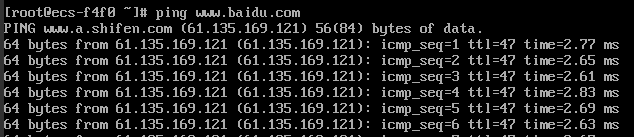
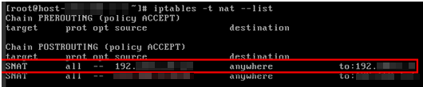

# 无公网IP的弹性云服务器访问Internet

## 操作场景

为保证安全和节省公网IP资源，通常只为特定的弹性云服务器配置公网IP，可直接访问Internet，其他弹性云服务器只配置私网IP，无法直接访问Internet。因此，当只配置了私网IP的弹性云服务器需要访问Internet，执行软件升级、给系统打补丁或者其它需求时，可选择一台绑定了公网IP的弹性云服务器作为代理弹性云服务器，为其他无公网IP的云服务器提供访问通道，正常访问Internet。

## 前提条件

-   已拥有一台绑定了公网IP的弹性云服务器作为代理弹性云服务器。

    本节操作中，以代理弹性云服务器的操作系统是CentOS 6.5为例。

-   代理弹性云服务器和其他需要访问Internet的弹性云服务器均处于同一网段，并且在同一安全组内。

## 操作步骤

1.  登录管理控制台。
2.  选择“计算 \> 弹性云服务器”。
3.  在弹性云服务器列表中的右上角，输入代理云服务器名称进行搜索。
4.  单击代理弹性云服务器的名称，查看详情。
5.  在代理弹性云服务器详情页面，选择“网卡”页签，并展开，将“源/目的检查”选项设置为“OFF”。

    默认情况下，“源/目的检查”状态为“启用”，系统会检查弹性云服务器发送的报文中源IP地址是否正确，否则不允许弹性云服务器发送该报文。这有助于防止伪装报文攻击，提升安全性。但在该场景中，这种保护机制会导致报文的发送者无法接收到返回的报文。因此，需设置“源/目的检查”状态为禁用。

6.  登录代理弹性云服务器。

    详细操作方法请参见[Linux云服务器登录方式概述](Linux云服务器登录方式概述.md)。

7.  执行以下命令，检测代理弹性云服务器是否可以正常连接Internet。

    **ping www.baidu.com**

    回显包含类似如下信息时，表示代理弹性云服务器可正常连接Internet。

    **图 1**  检测是否可以正常连接Internet  
    

8.  执行以下命令，查看代理弹性云服务器的IP转发功能是否开启。

    **cat /proc/sys/net/ipv4/ip\_forward**

    -   回显为“0”表示关闭，请执行[9](#li51820417113959)。
    -   回显为“1”表示开启，请执行[15](#li49419571113959)。

9.  执行以下命令，打开IP转发功能配置文件。

    **vi /etc/sysctl.conf**

10. 按“i”，进入编辑模式。
11. 修改如下参数的值。

    将参数“net.ipv4.ip\_forward ”的值修改为“1”。

    > **说明：**   
    >如果“sysctl.conf”文件中不存在参数“net.ipv4.ip\_forward ”，执行以下命令进行添加：  
    >**echo net.ipv4.ip\_forward=1 \>\> /etc/sysctl.conf**  

12. 按“Esc”，输入**:wq**，按“Enter”。

    保存设置并退出vi编辑器。

13. 执行以下命令，使配置文件修改生效。

    **sysctl -p /etc/sysctl.conf**

14. 执行以下命令，清除原有iptables规则。

    **iptables -F**

15. 执行以下命令，配置SNAT，使代理弹性云服务器所在的网段内其他弹性云服务器可通过代理弹性云服务器访问Internet。

    **iptables -t nat -A POSTROUTING -o eth0 -s** _**subnet/netmask-bits**_ **-j SNAT --to** _**nat-instance-ip**_

    假设代理弹性云服务器所在的网段为192.168.125.0，子网掩码为24位，私网IP地址为192.168.125.4，则执行如下命令。

    **iptables -t nat -A POSTROUTING -o eth0 -s** _**192.168.125.0/24**_ **-j SNAT --to 192.168.125.4**

16. 执行以下命令，查看SNAT配置是否成功。

    **iptables -t nat --list**

    回显类似如[图2](#fig27598108113959)所示时，表示SNAT配置成功。

    **图 2**  SNAT配置成功  
    

17. 添加自定义路由。
    1.  登录控制台。
    2.  选择“网络 \> 虚拟私有云”。
    3.  选择需要添加路由表的虚拟私有云，在“路由表”页面，单击“添加路由信息”。
    4.  根据界面提示，填写路由信息。
        -   目的地址：是目的网段，默认是0.0.0.0/0。
        -   下一跳地址：是SNAT弹性云服务器的私有IP地址。

            您可以在弹性云服务器页面，查看该弹性云服务器的私有IP地址。

## 后续处理

如需删除添加的iptables规则，需执行以下命令：

**iptables -t nat -D POSTROUTING -o eth0 -s** _**subnet/netmask-bits**_ **-j SNAT --to** _**nat-instance-ip**_

假设代理弹性云服务器所在的网段为192.168.125.0，子网掩码为24位，私网IP地址为192.168.125.4，则执行如下命令。

**iptables -t nat -D POSTROUTING -o eth0 -s 192.168.125.0/24 -j SNAT --to 192.168.125.4**

