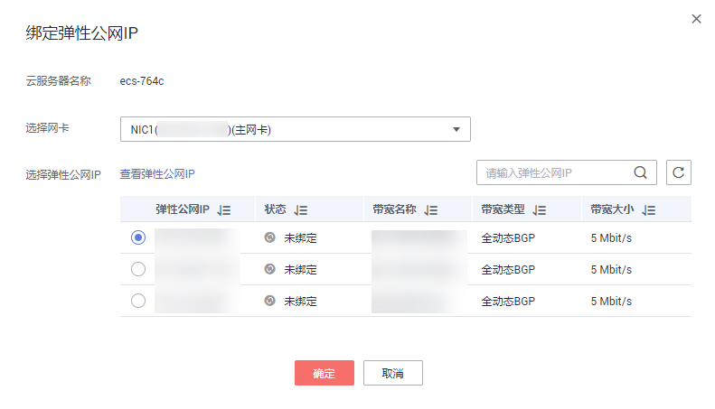

# 更换弹性公网IP

## 操作场景

如果您的弹性云服务器绑定了弹性公网IP，您可以参考本节操作更换弹性公网IP。

由于管理控制台暂不支持直接更换云服务器弹性公网IP。请先解绑当前的弹性公网IP后，再重新绑定新的弹性IP。

## 约束限制

为防止误删除操作，弹性公网IP存在24小时缓存机制，对于已释放过弹性公网IP的用户，24小时内会优先分配之前使用过的弹性公网IP。

如需申请新的弹性公网IP地址，建议您先购买新的弹性公网IP后再释放旧的弹性公网IP。

详细内容请参考[弹性公网IP的分配策略](https://support.huaweicloud.com/eip_faq/faq_eip_0016.html)。

## 解绑弹性公网IP

1.  登录管理控制台。
2.  单击管理控制台左上角的，选择区域和项目。
3.  选择指定云服务器，单击“操作”列下的“更多 \> 网络设置 \> 解绑弹性公网IP”。
4.  确认弹性公网IP信息，解绑EIP。

    > **说明：** 
    >未绑定弹性云服务器的弹性公网IP会继续计费，如果不再使用请根据控制台的引导释放弹性公网IP。

## 绑定新的弹性公网IP

1.  登录管理控制台。
2.  单击管理控制台左上角的，选择区域和项目。
3.  选择指定云服务器，单击“操作”列下的“更多 \> 网络设置 \> 绑定弹性公网IP”。
4.  选择弹性公网IP，单击“确定”完成新的弹性公网IP的绑定。

    > **说明：** 
    >如果当前区域没有可用的弹性公网IP，则弹性公网IP列表为空，请购买弹性公网IP后重新执行绑定操作。

    **图 1**  绑定新的弹性公网IP  
    

## 相关操作

-   [Windows云服务器访问公网不通应如何处理？](https://support.huaweicloud.com/ecs_faq/zh-cn_topic_0167429327.html)

