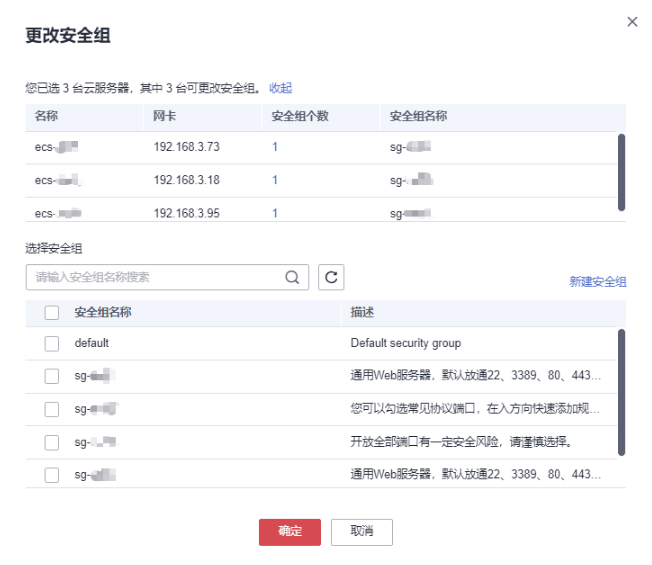

# 更改安全组

## 操作场景

本节操作介绍当弹性云服务器的网卡需要变更所属安全组时的操作步骤。

支持对一台或多台弹性云服务器进行更改安全组的操作：

-   [更改安全组（单台云服务器）](#section148110439474)：适用于对弹性云服务器指定网卡的安全组进行操作。
-   [更改安全组（多台云服务器）](#section4214198113518)：适用于对弹性云服务器主网卡的安全组进行操作。

## 约束约束

-   更改安全组操作会覆盖弹性云服务器原有的安全组设置。
-   使用多个安全组可能会影响弹性云服务器的网络性能，建议您选择安全组的数量不多于5个。
-   批量更改安全组仅支持对弹性云服务器主网卡的安全组进行操作。

## 更改安全组（单台云服务器）

1.  登录管理控制台。
2.  单击“”，选择“计算 \> 弹性云服务器”。
3.  在弹性云服务器列表中，单击“操作”列下的“更多 \> 网络设置 \> 更改安全组”。

    系统弹窗显示“更改安全组”页面。

    **图 1**  更改安全组  
    

4.  根据界面提示，在下拉列表中选择待更改安全组的网卡，并重新选择安全组。

    您可以同时勾选多个安全组，弹性云服务器的访问规则先根据绑定安全组的顺序，再根据组内规则的优先级生效。

    如需创建新的安全组，请单击“新建安全组”。

    > **说明：** 
    >使用多个安全组可能会影响弹性云服务器的网络性能，建议您选择安全组的数量不多于5个。

5.  单击“确定”。

## 更改安全组（多台云服务器）

1.  登录管理控制台。
2.  单击“”，选择“计算 \> 弹性云服务器”。
3.  在弹性云服务器列表中，勾选待更改安全组的云服务器。
4.  单击列表上方的“更多 \> 更改安全组”。

    系统弹窗显示“更改安全组”页面。

    **图 2**  更改安全组  
    

5.  根据界面提示，在下拉列表中选择待更改的安全组，为所选云服务器变更主网卡所属的安全组。

    您可以同时勾选多个安全组，弹性云服务器的访问规则先根据绑定安全组的顺序，再根据组内规则的优先级生效。

    如需创建新的安全组，请单击“新建安全组”。

    > **说明：** 
    >使用多个安全组可能会影响弹性云服务器的网络性能，建议您选择安全组的数量不多于5个。

6.  单击“确定”。

