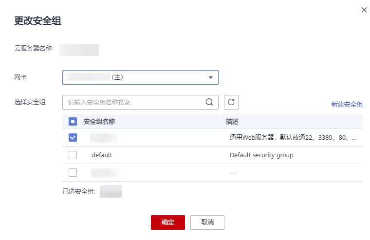

# 更改安全组

## 操作场景

本节操作介绍当弹性云服务器的网卡需要变更所属安全组时的操作步骤。

## 操作步骤

1.  登录管理控制台。
2.  选择“计算 \> 弹性云服务器”。
3.  在弹性云服务器列表中，单击“操作”列下的“更多 \> 网络设置 \> 更改安全组”。

    系统弹窗显示“更改安全组”页面。

    **图 1**  更改安全组  
    

4.  根据界面提示，在下拉列表中选择待更改安全组的网卡，并重新选择安全组。

    您可以同时勾选多个安全组，弹性云服务器的访问规则先根据绑定安全组的顺序，再根据组内规则的优先级生效（安全组规则优先级目前仅在“华东-上海一”支持）。

    如需创建新的安全组，请单击“新建安全组”。

    > **说明：** 
    >使用多个安全组可能会影响弹性云服务器的网络性能，建议您选择安全组的数量不多于5个。

5.  单击“确定”。

