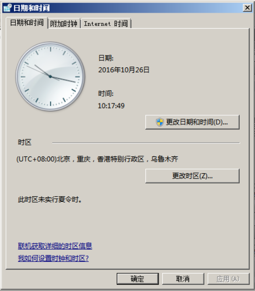

# 更改时区<a name="ZH-CN_TOPIC_0040630518"></a>

## 操作场景<a name="section2750020410549"></a>

弹性云服务器默认设置的时区，是您制作镜像时选择的时区。如需修改，请参见本节内容，将其更改为所需的本地时间或网络中的其他时区。

弹性云服务器登录成功后，如果发现弹性云服务器系统时间与本地时间不一致，建议更改时区，将弹性云服务器系统时间与本地时间进行同步。

所有区域的弹性云服务器默认时区为东八区。您可以参考本节操作，将其更改为所需的本地时间或网络中的其他时区。

## 更改Linux弹性云服务器的时区<a name="section1860378410555"></a>

针对不同的Linux操作系统，更改时区的操作略有不同。本节以CentOS 6.x 64bit为例，介绍更改Linux弹性云服务器时区的操作方法。

1.  登录弹性云服务器。
2.  执行以下命令，切换至root帐号。

    **su - root**

3.  执行以下命令，查询支持使用的时区。

    **ls /usr/share/zoneinfo/**

    其中，“/user/share/zoneinfo“目录显示了时区数据文件的目录结构。您可以通过该目录结构，查找您所需时区的文件。

    “/user/share/zoneinfo“目录中显示的信息，部分为时区，部分为目录。其中，目录包含了针对特定城市的时区文件，您可以在此目录查找要用于弹性云服务器的所在城市时区。

    示例如下：

    -   假设您需要使用中国上海所在的时区，则需先执行命令**ls /usr/share/zoneinfo/Asia**打开目录。

        其时区文件目录为“/usr/share/zoneinfo/Asia/Shanghai“

    -   假设您需要使用法国巴黎所在的时区，则需先执行命令**ls /usr/share/zoneinfo/Europe**打开目录，其时区文件目录为“/usr/share/zoneinfo/Europe/Paris“。

4.  设置新时区。
    1.  执行以命令，打开“/etc/sysconfig/clock“文件。

        **vim /etc/sysconfig/clock**

    2.  查找ZONE条目，将其更改为所需的时区文件名称。

        示例如下：

        -   假设更改为中国上海所在时区，需将ZONE条目更改为：

            ZONE="Asia/Shanghai"

        -   假设更改为法国巴黎所在时区，需将ZONE条目更改为：

            ZONE="Europe/Paris"


5.  按“ESC”，执行以下命令，保存并退出文件。

    **:wq**

6.  执行以下命令，查询弹性云服务器中是否已经存在“/etc/localtime“文件。

    **ls /etc/localtime**

    -   是，执行[7](#li35115782151653)。
    -   否，跳转[8](#li564938451108)。

7.  <a name="li35115782151653"></a>执行以下命令，删除已有的“/etc/localtime“文件。

    **rm /etc/localtime**

8.  <a name="li564938451108"></a>执行以下命令，在“/etc/localtime“与时区文件之间创建一个符号链接，使得弹性云服务器在引用本地时间信息时找到此时区文件。

    **ln -sf /usr/share/zoneinfo/_A__sia/Shanghai_  /etc/localtime**

9.  执行以下命令，重启系统，使得所有服务和应用程序接受新时区信息。

    **reboot**

10. 重新登录弹性云服务器，使用root帐号执行以下命令，查询弹性云服务器的时区，确认是否更改成功。

    **ls -lh /etc/localtime**

    回显信息如下所示：

    ```
    # ls -lh /etc/localtime
    lrwxrwxrwx 1 root root 33 Nov 27 11:01 /etc/localtime -> /usr/share/zoneinfo/Asia/Shanghai
    ```


## 更改Windows弹性云服务器的时区<a name="section77183612015"></a>

1.  登录弹性云服务器。
2.  左键单击任务栏右下方的时间，选择“更改日期和时间设置”。

    系统进入“日期和时间”页面

    **图 1**  日期和时间<a name="fig3371712915"></a>  
    

3.  单击“更改时区”。

    系统进入“时区设置”页面。

4.  在“设置时区”栏的下拉框中选择待更换的时区。
5.  单击“确定”，完成Windows弹性云服务器的时区更换。

