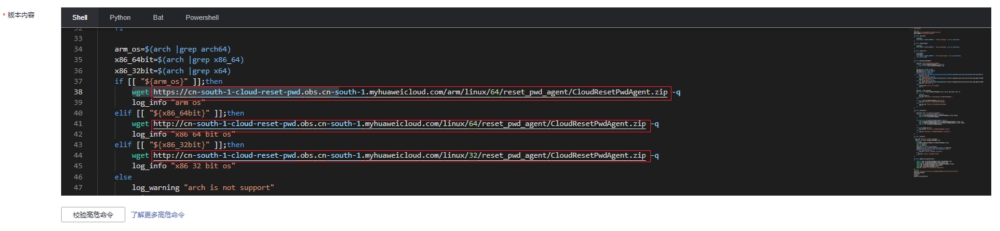

# 更新一键式重置密码插件（AOM方式）

弹性云服务器提供一键式重置密码功能。当弹性云服务器的密码丢失或过期时，如果提前安装了一键式重置密码插件，则可以应用一键式重置密码功能，给弹性云服务器设置新密码。

应用运维管理（Application Operations Management，简称AOM）是云上应用的一站式立体化运维管理平台，AOM 2.0的统一数据采集Agent（简称UniAgent）支持更新一键式重置密码插件。

本章节介绍使用AOM 2.0 UniAgent方式更新一键式重置密码插件的操作指导。

## 约束与限制

AOM 2.0目前仅在“华北-北京四”、“华东-上海一”、“华东-上海二”以及“华南-广州”区域上线公测。

## 前提条件

需要完成AOM 2.0公测申请，详细操作，请参考[开通AOM 2.0](https://support.huaweicloud.com/usermanual-aom2/aom_01_0003.html)。

## Linux弹性云服务器插件更新方法

**安装UniAgent**

1.  登录[AOM华为云官网](https://www.huaweicloud.com/product/aom.html)。
2.  在AOM产品简介下方单击“AOM 2.0公测中”，进入应用运维管理控制台。

    **图 1**  AOM 2.0入口  
    

3.  在应用运维管理控制台上方的菜单栏，单击“采集管理”，进入采集管理控制台。

    **图 2**  采集管理控制台  
    

4.  在左侧导航栏选择“UniAgent管理 \> 虚机接入”。

1.  单击“安装UniAgent”，在待更新重置密码插件的虚拟机中选择一台作为UniAgent的安装机。

    > **说明：** 
    >-   安装机是远程安装方式下命令的执行机。
    >-   首次安装UniAgent时，仅支持手动安装的方式。

    请确保安装机与其余待安装机间网络互通，并且可通过SSH远程连接。

    -   如果远程连接失败，请确认安全组规则入方向规则已添加安装机的IP网段，并且该网段允许SSH远程连接Linux弹性云服务器。
    -   如果您的待更新机器在同一VPC下，继续执行后续步骤。
    -   如果您的待更新机器属于不同VPC，建议您对每个VPC重复执行步骤[5](#li1410102083011)\~步骤[11](#li638720137370)，分VPC进行安装。
    -   如果您想通过打通VPC的方式进行更新，请先完成“[如何实现跨VPC的网络互通？](https://support.huaweicloud.com/ecs_faq/ecs_faq_1339.html)”的相关配置，然后继续执行以下步骤。

2.  在安装UniAgent页面中，复制以下Linux安装命令。

    **图 3**  安装UniAgent（手动安装）  
    

1.  登录待安装UniAgent的弹性云服务器，执行复制的Linux安装命令。

    若出现如下显示说明安装成功。

    **图 4**  UniAgent安装成功  
    

    安装完成后，在虚机接入界面可以看到已经安装成功的虚拟机。

    **图 5**  安装成功的虚拟机  
    

2.  在虚机接入界面，单击“安装UniAgent”为其余虚拟机安装UniAgent。
3.  在UniAgent安装界面的上方，单击“远程安装”。

    **图 6**  安装UniAgent（远程安装）  
    

4.  设置参数。
    1.  选择步骤[7](#li13325133618215)装好的虚拟机作为安装机。
    2.  添加需安装UniAgent的主机。

        单击“添加主机信息”可添加多个主机，最多支持添加100个主机。

        添加主机的方式有手动添加和批量导入两种方式，推荐使用手动添加方式。详细的参数设置，请参考[安装UniAgent](https://support.huaweicloud.com/usermanual-aom2/agent_01_0005.html)。

        -   手动添加
            -   主机IP：主机的IP。
            -   操作系统：主机的操作系统，例如Linux。

            -   登录帐号：登录主机的帐号。建议使用root帐号，可保证有足够的读写权限。

            -   登陆端口：访问主机的端口。

            -   认证方式：认证方式为密码。

            -   密码：登录主机的密码。

            -   连接测试结果：测试安装机和需安装主机间的网络连通性以及密码正确性。

            -   操作：删除、复制和连接测试。

5.  单击“立即安装”。

**创建脚本**

1.  在本地浏览器通过以下链接获取脚本，并复制内容。

    请根据云服务器所在区域选择脚本的下载地址：

    -   华北-北京一：[https://cn-north-1-cloud-reset-pwd.obs.cn-north-1.myhuaweicloud.com/linux/batch\_update\_resetpwd/update\_log4j\_version\_for\_resetpwdagent.sh](https://cn-north-1-cloud-reset-pwd.obs.cn-north-1.myhuaweicloud.com/linux/batch_update_resetpwd/update_log4j_version_for_resetpwdagent.sh)
    -   华北-北京四：[https://cn-north-4-cloud-reset-pwd.obs.cn-north-4.myhuaweicloud.com/linux/batch\_update\_resetpwd/update\_log4j\_version\_for\_resetpwdagent.sh](https://cn-north-4-cloud-reset-pwd.obs.cn-north-4.myhuaweicloud.com/linux/batch_update_resetpwd/update_log4j_version_for_resetpwdagent.sh)
    -   华东-上海二：[https://cn-east-2-cloud-reset-pwd.obs.cn-east-2.myhuaweicloud.com/linux/batch\_update\_resetpwd/update\_log4j\_version\_for\_resetpwdagent.sh](https://cn-east-2-cloud-reset-pwd.obs.cn-east-2.myhuaweicloud.com/linux/batch_update_resetpwd/update_log4j_version_for_resetpwdagent.sh)
    -   华南-广州：[https://cn-south-1-cloud-reset-pwd.obs.cn-south-1.myhuaweicloud.com/linux/batch\_update\_resetpwd/update\_log4j\_version\_for\_resetpwdagent.sh](https://cn-south-1-cloud-reset-pwd.obs.cn-south-1.myhuaweicloud.com/linux/batch_update_resetpwd/update_log4j_version_for_resetpwdagent.sh)
    -   中国-香港：[https://ap-southeast-1-cloud-reset-pwd.obs.ap-southeast-1.myhuaweicloud.com/linux/batch\_update\_resetpwd/update\_log4j\_version\_for\_resetpwdagent.sh](https://ap-southeast-1-cloud-reset-pwd.obs.ap-southeast-1.myhuaweicloud.com/linux/batch_update_resetpwd/update_log4j_version_for_resetpwdagent.sh)

2.  在采集管理页面上方，选择“变更管理”，并单击左侧导航栏的“脚本管理”。

    **图 7**  脚本管理  
    

3.  在脚本管理页面，单击“创建脚本”。

    **图 8**  创建脚本  
    

4.  输入“脚本名称”，并将步骤[1](#li751051565718)下载的脚本文件复制到“版本内容”区域。

    > **说明：** 
    >请确认脚本内容wget URL之后带有参数-q，没有则需要手动添加，否则会导致下载软件包日志过多，影响性能。

5.  手动替换脚本中下载地址，下载对应操作系统架构的一键重置密码插件包。

    仅未绑定弹性公网IP的弹性云服务器需要执行本步骤。若待更新的弹性云服务器均已绑定弹性公网IP，则跳过本步骤，无需操作。

    **图 9**  脚本内容  
    

    脚本下载地址为：http://\{region-id\} -cloud-reset-pwd.obs.\{region-id\}.myhuaweicloud.com

    以“华南-广州”区域为例：

    -   32位操作系统，x86架构：

        **wget **[http://cn-south-1-cloud-reset-pwd.obs.cn-south-1.myhuaweicloud.com/linux/32/reset\_pwd\_agent/CloudResetPwdAgent.zip](http://cn-south-1-cloud-reset-pwd.obs.cn-south-1.myhuaweicloud.com/linux/32/reset_pwd_agent/CloudResetPwdAgent.zip)** -q**

    -   64位操作系统，x86架构：

        **wget **[http://cn-south-1-cloud-reset-pwd.obs.cn-south-1.myhuaweicloud.com/linux/64/reset\_pwd\_agent/CloudResetPwdAgent.zip](http://cn-south-1-cloud-reset-pwd.obs.cn-south-1.myhuaweicloud.com/linux/64/reset_pwd_agent/CloudResetPwdAgent.zip)** -q**

    -   64位操作系统，ARM架构：

        **wget **[https://cn-south-1-cloud-reset-pwd.obs.cn-south-1.myhuaweicloud.com/arm/linux/64/reset\_pwd\_agent/CloudResetPwdAgent.zip](https://cn-south-1-cloud-reset-pwd.obs.cn-south-1.myhuaweicloud.com/arm/linux/64/reset_pwd_agent/CloudResetPwdAgent.zip)** -q**

    > **说明：** 
    >已上传一键式重置密码插件至OBS桶的区域包括：华北-北京一、华北-北京四、华东-上海二、华南-广州、中国-香港。

1.  单击“保存”。
2.  单击“上线”。

**执行脚本**

1.  上线完成后，单击“执行”。

    执行账号为root，目标服务器选择已经安装好uniagent的机器。

    > **说明：** 
    >执行脚本时目标服务器数量建议不要超过100台，否则会影响性能。

    **图 10**  执行脚本  
    

2.  查看脚本是否执行成功，有如下显示说明执行成功。

    **图 11**  执行成功  
    

**检查插件是否更新成功**

1.  参考步骤[3](#li447521285418)\~步骤[4](#li416619551215)，创建检查服务状态的脚本，脚本内容为：

    **service cloudResetPwdAgent status**

    **service cloudResetPwdUpdateAgent status**

    **ls -lh /Cloud\***

2.  保存脚本并上线。
3.  单击“执行”。

    如果服务CloudResetPwdAgent和CloudResetPwdUpdateAgent的状态均不是“unrecognized service”，表示插件安装成功，否则安装失败。

    **图 12**  插件安装成功  
    

## Windows弹性云服务器插件更新方法

**安装UniAgent**

1.  登录[AOM华为云官网](https://www.huaweicloud.com/product/aom.html)。
2.  在AOM产品简介下方单击“AOM 2.0公测中”，进入应用运维管理控制台。

    **图 13**  AOM 2.0入口  
    

3.  在应用运维管理控制台上方的菜单栏，单击“采集管理”，进入采集管理控制台。

    **图 14**  采集管理控制台  
    

4.  在左侧导航栏选择“UniAgent管理 \> 虚机接入”。

1.  单击“安装UniAgent”。

    > **说明：** 
    >Windows操作系统的弹性云服务器只能选择手动安装的方式，暂不支持Windows操作系统的远程安装。

2.  在安装UniAgent页面中，复制Windows操作系统的安装包下载地址。

    **图 15**  安装UniAgent（手动安装）  
    

1.  登录待安装UniAgent的弹性云服务器，打开PowerShell、命令行工具或者在浏览器中复制链接下载UniAgent安装包。

    命令示例：

    **wget  [https://aom-uniagent-cn-north-4.obs.cn-north-4.myhuaweicloud.com/uniagentd-1.0.2-win32.zip](https://aom-uniagent-cn-north-4.obs.cn-north-4.myhuaweicloud.com/uniagentd-1.0.2-win32.zip)  -o c:\\uniagent.zip**

2.  下载完成后继续按照步骤[6](#li62303201275)中的指导进行安装。

    安装完成后，在虚机接入界面可以看到已经安装成功的虚拟机。

    **图 16**  安装成功的虚拟机  
    

1.  重复步骤[5](#li12170151173011)\~步骤[8](#li1338711293519)，为其余虚拟机安装UniAgent。

**创建脚本**

1.  在本地浏览器通过以下链接获取脚本，并复制内容。

    请根据云服务器所在区域选择脚本的下载地址：

    -   华北-北京一：[https://cn-north-1-cloud-reset-pwd.obs.cn-north-1.myhuaweicloud.com/windows/uniagent/update\_log4j\_version\_for\_resetpwdagent\_windows\_for\_uniagent.bat](https://cn-north-1-cloud-reset-pwd.obs.cn-north-1.myhuaweicloud.com/windows/uniagent/update_log4j_version_for_resetpwdagent_windows_for_uniagent.bat)
    -   华北-北京四：[https://cn-north-4-cloud-reset-pwd.obs.cn-north-4.myhuaweicloud.com/windows/uniagent/update\_log4j\_version\_for\_resetpwdagent\_windows\_for\_uniagent.bat](https://cn-north-4-cloud-reset-pwd.obs.cn-north-4.myhuaweicloud.com/windows/uniagent/update_log4j_version_for_resetpwdagent_windows_for_uniagent.bat)
    -   华东-上海二：[https://cn-east-2-cloud-reset-pwd.obs.cn-east-2.myhuaweicloud.com/windows/uniagent/update\_log4j\_version\_for\_resetpwdagent\_windows\_for\_uniagent.bat](https://cn-east-2-cloud-reset-pwd.obs.cn-east-2.myhuaweicloud.com/windows/uniagent/update_log4j_version_for_resetpwdagent_windows_for_uniagent.bat)
    -   华南-广州：[https://cn-south-1-cloud-reset-pwd.obs.cn-south-1.myhuaweicloud.com/windows/uniagent/update\_log4j\_version\_for\_resetpwdagent\_windows\_for\_uniagent.bat](https://cn-south-1-cloud-reset-pwd.obs.cn-south-1.myhuaweicloud.com/windows/uniagent/update_log4j_version_for_resetpwdagent_windows_for_uniagent.bat)
    -   中国-香港：[https://ap-southeast-1-cloud-reset-pwd.obs.ap-southeast-1.myhuaweicloud.com/windows/uniagent/update\_log4j\_version\_for\_resetpwdagent\_windows\_for\_uniagent.bat](https://ap-southeast-1-cloud-reset-pwd.obs.ap-southeast-1.myhuaweicloud.com/windows/uniagent/update_log4j_version_for_resetpwdagent_windows_for_uniagent.bat)

2.  在采集管理页面上方，选择“变更管理”，并单击左侧导航栏的“脚本管理”。

    **图 17**  脚本管理  
    

3.  在脚本管理页面，单击“创建脚本”。

    **图 18**  创建脚本  
    

4.  输入“脚本名称”，并将步骤[1](#li225264584118)下载的脚本文件复制到“版本内容”区域。
5.  手动替换脚本中下载地址，下载对应操作系统架构的一键重置密码插件包。

    仅未绑定弹性公网IP的弹性云服务器需要执行本步骤。若待更新的弹性云服务器均已绑定弹性公网IP，则跳过本步骤，无需操作。

    **图 19**  脚本内容  
    

    脚本下载地址为：http://\{region-id\} -cloud-reset-pwd.obs.\{region-id\}.myhuaweicloud.com

    以“华南-广州”区域为例：

    **wget **-Uri** https://cn-south-1-cloud-reset-pwd.obs.cn-south-1.myhuaweicloud.com/windows/reset\_pwd\_agent/CloudResetPwdAgent.zip**

    > **说明：** 
    >已上传一键式重置密码插件至OBS桶的区域包括：华北-北京一、华北-北京四、华东-上海二、华南-广州、中国-香港。

6.  单击“保存”。
7.  单击“上线”。

**执行脚本**

1.  上线完成后，单击“执行”。

    执行账号为Administrator，目标服务器选择已经安装好uniagent的机器。

    **图 20**  执行脚本  
    

2.  查看脚本是否执行成功，有如下显示说明执行成功。

    **图 21**  执行成功  
    

    如果脚本执行有如下报错，请检查脚本下载地址是否正确。如果地址正确，请重试或者绑定弹性公网IP后更换其他区域的下载地址。

    **图 22**  执行失败  
    

**检查插件是否更新成功**

登录windows云服务器，有如下显示说明更新成功。

**图 23**  插件更新成功  

