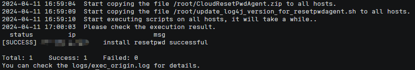
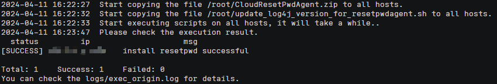
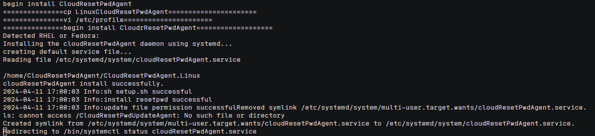

# 更新一键式重置密码插件（批量操作-Linux系统root用户）<a name="ecs_03_1008"></a>

## 操作场景<a name="zh-cn_topic_0000001238762193_ecs_03_0187_section18362920155819"></a>

当您需要对多台Linux系统的云服务器批量更新一键式重置密码插件时，可参考本文档操作。

## 前提条件<a name="zh-cn_topic_0000001238762193_section148505353295"></a>

-   准备好执行机，执行机需满足的条件请参见[约束与限制](#zh-cn_topic_0000001238762193_ecs_03_0187_section19369162055818)。
-   需要提前准备待批量安装插件的云服务器的IP地址、root用户的密码信息或者私钥文件。
-   执行机应该与待更新机器在同一VPC下。
-   在执行完步骤[7](#zh-cn_topic_0000001238762193_li1740314273362)之后可以解绑eip。

## 约束与限制<a name="zh-cn_topic_0000001238762193_ecs_03_0187_section19369162055818"></a>

-   需要选取一台操作系统为CentOS 7（公共镜像）且已绑定弹性公网IP的云服务器作为执行机，且与待批量安装插件的弹性云服务器之间网络需要互通。

    > **说明：** 
    >若已配置yum内部源，可不需要绑定弹性公网IP。

-   仅支持对使用同一密钥对的云服务器执行批量安装插件的操作。

## 操作步骤<a name="zh-cn_topic_0000001238762193_ecs_03_0187_section1837542012588"></a>

1.  以root用户登录执行机。
2.  执行以下命令，安装批量脚本运行所需要的依赖。

    **yum install ansible -y**

3.  请参考[获取并校验一键式重置密码插件完整性（Linux）](获取一键式重置密码插件.md#section15564103103311)，下载对应的一键式重置密码插件CloudResetPwdAgent.zip并完成完整性校验。

    安装一键式重置密码插件对插件的具体放置目录无特殊要求，请您自定义。

4.  执行以下命令，将批量操作脚本下载到root目录下。

    **curl  _URL_  \> \~/batch\_update\_log4j\_version.py**

    其中，_URL_为批量操作的执行脚本。

    请根据云服务器所在区域选择脚本的下载地址：

    -   华北-北京一：[https://cn-north-1-cloud-reset-pwd.obs.cn-north-1.myhuaweicloud.com/linux/batch\_update\_resetpwd/batch\_update\_log4j\_version.py](https://cn-north-1-cloud-reset-pwd.obs.cn-north-1.myhuaweicloud.com/linux/batch_update_resetpwd/batch_update_log4j_version.py)
    -   华北-北京四：[https://cn-north-4-cloud-reset-pwd.obs.cn-north-4.myhuaweicloud.com/linux/batch\_update\_resetpwd/batch\_update\_log4j\_version.py](https://cn-north-4-cloud-reset-pwd.obs.cn-north-4.myhuaweicloud.com/linux/batch_update_resetpwd/batch_update_log4j_version.py)
    -   华东-上海二：[https://cn-east-2-cloud-reset-pwd.obs.cn-east-2.myhuaweicloud.com/linux/batch\_update\_resetpwd/batch\_update\_log4j\_version.py](https://cn-east-2-cloud-reset-pwd.obs.cn-east-2.myhuaweicloud.com/linux/batch_update_resetpwd/batch_update_log4j_version.py)
    -   华南-广州：[https://cn-south-1-cloud-reset-pwd.obs.cn-south-1.myhuaweicloud.com/linux/batch\_update\_resetpwd/batch\_update\_log4j\_version.py](https://cn-south-1-cloud-reset-pwd.obs.cn-south-1.myhuaweicloud.com/linux/batch_update_resetpwd/batch_update_log4j_version.py)
    -   中国-香港：[https://ap-southeast-1-cloud-reset-pwd.obs.ap-southeast-1.myhuaweicloud.com/linux/batch\_update\_resetpwd/batch\_update\_log4j\_version.py](https://ap-southeast-1-cloud-reset-pwd.obs.ap-southeast-1.myhuaweicloud.com/linux/batch_update_resetpwd/batch_update_log4j_version.py)
    -   亚太-曼谷：[https://ap-southeast-2-cloud-reset-pwd.obs.ap-southeast-2.myhuaweicloud.com/linux/batch\_update\_resetpwd/batch\_update\_log4j\_version.py](https://ap-southeast-2-cloud-reset-pwd.obs.ap-southeast-2.myhuaweicloud.com/linux/batch_update_resetpwd/batch_update_log4j_version.py)

5.  执行以下命令，将更新插件脚本下载到root目录下。

    **curl  _URL_  \> \~/update\_log4j\_version\_for\_resetpwdagent.sh**

    其中，_URL_为更新插件脚本的下载地址。

    请根据云服务器所在区域选择脚本的下载地址：

    -   华北-北京一：[https://cn-north-1-cloud-reset-pwd.obs.cn-north-1.myhuaweicloud.com/linux/batch\_update\_resetpwd/update\_log4j\_version\_for\_resetpwdagent.sh](https://cn-north-1-cloud-reset-pwd.obs.cn-north-1.myhuaweicloud.com/linux/batch_update_resetpwd/update_log4j_version_for_resetpwdagent.sh)
    -   华北-北京四：[https://cn-north-4-cloud-reset-pwd.obs.cn-north-4.myhuaweicloud.com/linux/batch\_update\_resetpwd/update\_log4j\_version\_for\_resetpwdagent.sh](https://cn-north-4-cloud-reset-pwd.obs.cn-north-4.myhuaweicloud.com/linux/batch_update_resetpwd/update_log4j_version_for_resetpwdagent.sh)
    -   华东-上海二：[https://cn-east-2-cloud-reset-pwd.obs.cn-east-2.myhuaweicloud.com/linux/batch\_update\_resetpwd/update\_log4j\_version\_for\_resetpwdagent.sh](https://cn-east-2-cloud-reset-pwd.obs.cn-east-2.myhuaweicloud.com/linux/batch_update_resetpwd/update_log4j_version_for_resetpwdagent.sh)
    -   华南-广州：[https://cn-south-1-cloud-reset-pwd.obs.cn-south-1.myhuaweicloud.com/linux/batch\_update\_resetpwd/update\_log4j\_version\_for\_resetpwdagent.sh](https://cn-south-1-cloud-reset-pwd.obs.cn-south-1.myhuaweicloud.com/linux/batch_update_resetpwd/update_log4j_version_for_resetpwdagent.sh)
    -   中国-香港：[https://ap-southeast-1-cloud-reset-pwd.obs.ap-southeast-1.myhuaweicloud.com/linux/batch\_update\_resetpwd/update\_log4j\_version\_for\_resetpwdagent.sh](https://ap-southeast-1-cloud-reset-pwd.obs.ap-southeast-1.myhuaweicloud.com/linux/batch_update_resetpwd/update_log4j_version_for_resetpwdagent.sh)
    -   亚太-曼谷：[https://ap-southeast-2-cloud-reset-pwd.obs.ap-southeast-2.myhuaweicloud.com/linux/batch\_update\_resetpwd/update\_log4j\_version\_for\_resetpwdagent.sh](https://ap-southeast-2-cloud-reset-pwd.obs.ap-southeast-2.myhuaweicloud.com/linux/batch_update_resetpwd/update_log4j_version_for_resetpwdagent.sh)

6.  <a name="zh-cn_topic_0000001238762193_li1740314273362"></a>检查如下脚本是否在root目录下：
    -   batch\_update\_log4j\_version.py
    -   update\_log4j\_version\_for\_resetpwdagent.sh
    -   CloudResetPwdAgent.zip

7.  执行以下命令，新建并编辑host\_list.txt，按i进入编辑模式。

    **vi host\_list.txt**

    将需要自动安装驱动的云服务器的相关信息填写到host\_list.txt文件中。

    文件填写格式与登录待切换弹性云服务器的方式需要匹配。

    -   使用密钥对方式鉴权的云服务器，填写方式如下：

        > **注意：** 
        >-   使用密钥对方式鉴权的云服务器，请将创建弹性云服务器时保存的私钥文件，上传至与host\_list.txt同一个文件夹下。
        >-   使用密钥对方式鉴权的云服务器，请确保私钥文件的权限为400。
        >    **chmod 400 **_**私钥文件**_

        每行仅需填写云服务器IP地址。

        示例：

        ```
        192.168.1.10
        192.168.1.11
        ```

    -   使用密码方式登录的云服务器，填写方式如下：

        请严格按照每行**ip,root用户密码**，中间以英文逗号隔开的格式填写。

        示例：

        ```
        192.168.1.10,'**********'
        192.168.1.11,'**********'
        ```

8.  运行批量执行操作脚本“batch\_update\_log4j\_version.py”。
    -   密钥对鉴权方式的服务器

        如果私钥文件与批量操作执行脚本在一个目录下，则直接指定私钥文件名称即可。

        **python batch\_update\_log4j\_version.py  _\{私钥文件路径/私钥文件名称\}_**

        **图 1**  运行成功<a name="zh-cn_topic_0000001238762193_fig1828395334018"></a>  
        

        若如[图1](#zh-cn_topic_0000001238762193_fig1828395334018)所示，则表示脚本运行成功。

    -   密码方式鉴权的服务器。

        **python batch\_update\_log4j\_version.py**

        **图 2**  运行成功<a name="zh-cn_topic_0000001238762193_fig2583720175813"></a>  
        

        若如[图2](#zh-cn_topic_0000001238762193_fig2583720175813)所示，则表示脚本运行成功。

9.  执行如下命令，在“/root/logs/exec\_origin.log”的最后一行查看运行结果日志。

    **vim /root/logs/exec\_origin.log**

    若如[图3](#zh-cn_topic_0000001238762193_fig11117142718453)所示，则表示批量更新一键式重置密码插件成功。

    **图 3**  运行结果日志<a name="zh-cn_topic_0000001238762193_fig11117142718453"></a>  
    

