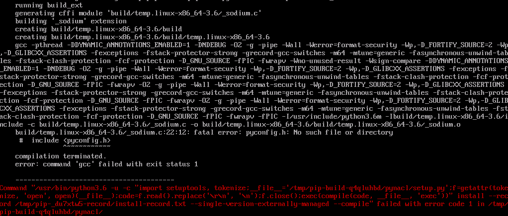
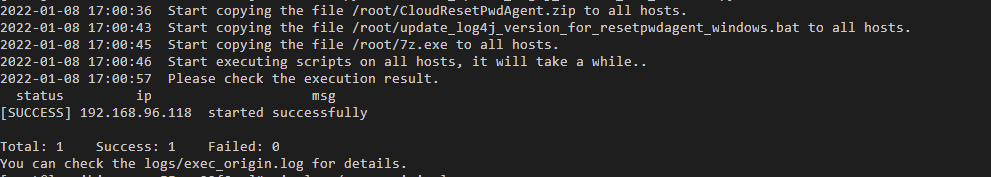
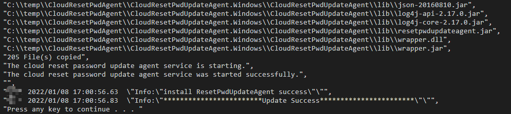

# 更新一键式重置密码插件（批量操作-Windows系统）<a name="ecs_03_1009"></a>

## 操作场景<a name="zh-cn_topic_0000001238762193_ecs_03_0187_section18362920155819"></a>

当您需要对多台Windows系统的云服务器批量更新一键式重置密码插件时，可参考本文档操作。

## 前提条件<a name="zh-cn_topic_0000001238762193_section148505353295"></a>

-   登录已准备好的执行机，执行机需满足的条件请参见[约束与限制](#zh-cn_topic_0000001238762193_ecs_03_0187_section19369162055818)。
-   需要提前准备待批量安装插件的云服务器的IP地址、Administrator用户的密码信息。
-   执行机应该与待更新机器在同一VPC下。
-   在执行完步骤[7](#zh-cn_topic_0000001238762193_li1740314273362)之后可以解绑eip。

## 约束与限制<a name="zh-cn_topic_0000001238762193_ecs_03_0187_section19369162055818"></a>

需要选取一台操作系统为CentOS 8.2 \(公共镜像\)且已绑定弹性公网IP的云服务器作为执行机，且与待批量安装插件的弹性云服务器之间网络需要互通。

> **说明：** 
>若已配置yum内部源，可不需要绑定弹性公网IP。

## 操作步骤<a name="zh-cn_topic_0000001238762193_ecs_03_0187_section1837542012588"></a>

1.  执行以下命令，安装批量脚本运行所需要的依赖。

    **yum install epel-release -y**

    **yum install ansible -y**

    **python3.6 -m pip install pywinrm paramiko PyYAML Jinja2 httplib2 six**

    > **说明：** 
    >如果因为yum源配置问题导致无法安装ansible，可以使用如下命令安装ansible：
    >**yum install python3 python3-pip**
    >**pip3 install --upgrade pip**
    >**pip3 install ansible**

    若出现如[图1](#fig8705171319118)所示报错信息，请执行以下操作。

    1.  执行以下命令，安装依赖：

        **dnf  install python3-devel**

    2.  然后再次执行以下命令：

        **python3.6 -m pip install pywinrm paramiko PyYAML Jinja2 httplib2 six**

    **图 1**  报错信息<a name="fig8705171319118"></a>  
    

2.  请参考[获取并校验一键式重置密码插件完整性（Windows）](获取一键式重置密码插件.md#section22263382517)，下载对应的一键式重置密码插件CloudResetPwdAgent.zip并完成完整性校验。

    安装一键式重置密码插件对插件的具体放置目录无特殊要求，请您自定义。

3.  执行以下命令，将对应OS架构的Windows版本的安装包下载到root目录下：
    -   32位操作系统，x86架构：

        **wget https://www.7-zip.org/a/7z2107.exe '--no-check-certificate'**

    -   64位操作系统，x86架构：

        **wget https://www.7-zip.org/a/7z2107-x64.exe '--no-check-certificate'**

    -   64位操作系统，ARM架构：

        **wget https://www.7-zip.org/a/7z2107-x64.exe '--no-check-certificate'**

4.  执行以下命令，将批量操作脚本下载到root目录下。

    **curl  _URL_  \> \~/batch\_update\_log4j\_version\_for\_windows.py**

    其中，_URL_为批量操作的执行脚本。

    请根据云服务器所在区域选择脚本的下载地址：

    -   华北-北京一：[https://cn-north-1-cloud-reset-pwd.obs.cn-north-1.myhuaweicloud.com/windows/batch\_update\_resetpwd/batch\_update\_log4j\_version\_for\_windows.py](https://cn-north-1-cloud-reset-pwd.obs.cn-north-1.myhuaweicloud.com/windows/batch_update_resetpwd/batch_update_log4j_version_for_windows.py)
    -   华北-北京四：[https://cn-north-4-cloud-reset-pwd.obs.cn-north-4.myhuaweicloud.com/windows/batch\_update\_resetpwd/batch\_update\_log4j\_version\_for\_windows.py](https://cn-north-4-cloud-reset-pwd.obs.cn-north-4.myhuaweicloud.com/windows/batch_update_resetpwd/batch_update_log4j_version_for_windows.py)
    -   华东-上海二：[https://cn-east-2-cloud-reset-pwd.obs.cn-east-2.myhuaweicloud.com/windows/batch\_update\_resetpwd/batch\_update\_log4j\_version\_for\_windows.py](https://cn-east-2-cloud-reset-pwd.obs.cn-east-2.myhuaweicloud.com/windows/batch_update_resetpwd/batch_update_log4j_version_for_windows.py)
    -   华南-广州：[https://cn-south-1-cloud-reset-pwd.obs.cn-south-1.myhuaweicloud.com/windows/batch\_update\_resetpwd/batch\_update\_log4j\_version\_for\_windows.py](https://cn-south-1-cloud-reset-pwd.obs.cn-south-1.myhuaweicloud.com/windows/batch_update_resetpwd/batch_update_log4j_version_for_windows.py)
    -   中国-香港：[https://ap-southeast-1-cloud-reset-pwd.obs.ap-southeast-1.myhuaweicloud.com/windows/batch\_update\_resetpwd/batch\_update\_log4j\_version\_for\_windows.py](https://ap-southeast-1-cloud-reset-pwd.obs.ap-southeast-1.myhuaweicloud.com/windows/batch_update_resetpwd/batch_update_log4j_version_for_windows.py)
    -   亚太-曼谷：[https://ap-southeast-2-cloud-reset-pwd.obs.ap-southeast-2.myhuaweicloud.com/windows/batch\_update\_resetpwd/batch\_update\_log4j\_version\_for\_windows.py](https://ap-southeast-2-cloud-reset-pwd.obs.ap-southeast-2.myhuaweicloud.com/windows/batch_update_resetpwd/batch_update_log4j_version_for_windows.py)

5.  执行以下命令，将更新插件脚本下载到root目录下。

    **curl  _URL_  \> \~/update\_log4j\_version\_for\_resetpwdagent\_windows.bat**

    其中，_URL_为更新插件脚本的下载地址。

    请根据云服务器所在区域选择脚本的下载地址：

    -   华北-北京一：[https://cn-south-1-cloud-reset-pwd.obs.cn-south-1.myhuaweicloud.com/windows/batch\_update\_resetpwd/update\_log4j\_version\_for\_resetpwdagent\_windows.bat](https://cn-south-1-cloud-reset-pwd.obs.cn-south-1.myhuaweicloud.com/windows/batch_update_resetpwd/update_log4j_version_for_resetpwdagent_windows.bat)
    -   华北-北京四：[https://cn-north-4-cloud-reset-pwd.obs.cn-north-4.myhuaweicloud.com/windows/batch\_update\_resetpwd/update\_log4j\_version\_for\_resetpwdagent\_windows.bat](https://cn-north-4-cloud-reset-pwd.obs.cn-north-4.myhuaweicloud.com/windows/batch_update_resetpwd/update_log4j_version_for_resetpwdagent_windows.bat)
    -   华东-上海二：[https://cn-east-2-cloud-reset-pwd.obs.cn-east-2.myhuaweicloud.com/windows/batch\_update\_resetpwd/update\_log4j\_version\_for\_resetpwdagent\_windows.bat](https://cn-east-2-cloud-reset-pwd.obs.cn-east-2.myhuaweicloud.com/windows/batch_update_resetpwd/update_log4j_version_for_resetpwdagent_windows.bat)
    -   华南-广州：[https://cn-south-1-cloud-reset-pwd.obs.cn-south-1.myhuaweicloud.com/windows/batch\_update\_resetpwd/update\_log4j\_version\_for\_resetpwdagent\_windows.bat](https://cn-south-1-cloud-reset-pwd.obs.cn-south-1.myhuaweicloud.com/windows/batch_update_resetpwd/update_log4j_version_for_resetpwdagent_windows.bat)
    -   中国-香港：[https://ap-southeast-1-cloud-reset-pwd.obs.ap-southeast-1.myhuaweicloud.com/windows/batch\_update\_resetpwd/update\_log4j\_version\_for\_resetpwdagent\_windows.bat](https://ap-southeast-1-cloud-reset-pwd.obs.ap-southeast-1.myhuaweicloud.com/windows/batch_update_resetpwd/update_log4j_version_for_resetpwdagent_windows.bat)
    -   亚太-曼谷：[https://ap-southeast-2-cloud-reset-pwd.obs.ap-southeast-2.myhuaweicloud.com/windows/batch\_update\_resetpwd/update\_log4j\_version\_for\_resetpwdagent\_windows.bat](https://ap-southeast-2-cloud-reset-pwd.obs.ap-southeast-2.myhuaweicloud.com/windows/batch_update_resetpwd/update_log4j_version_for_resetpwdagent_windows.bat)

6.  <a name="zh-cn_topic_0000001238762193_li1740314273362"></a>检查如下文件是否在root目录下。
    -   batch\_update\_log4j\_version\_for\_windows.py
    -   update\_log4j\_version\_for\_resetpwdagent\_windows.bat
    -   CloudResetPwdAgent.zip
    -   7z\*.exe

7.  执行以下命令，新建并编辑host\_list.txt，按i进入编辑模式。

    **vi host\_list.txt**

    将需要自动安装驱动的云服务器的相关信息填写到host\_list.txt文件中。

    填写Administrator用户的IP和密码，请严格按照每行“**IP,用户密码**”的格式填写，中间以英文逗号隔开。

    示例：

    ```
    192.168.1.10,'**********'
    192.168.1.11,'**********'
    ```

8.  运行批量执行操作脚本“batch\_update\_log4j\_version\_for\_windows.py”。

    **python3.6 batch\_update\_log4j\_version\_for\_windows.py**

    **图 2**  运行脚本<a name="zh-cn_topic_0000001238762193_fig2583720175813"></a>  
    

9.  执行如下命令，在“/root/logs/exec\_origin.log”的最后一行查看运行结果日志。

    **vim /root/logs/exec\_origin.log**

    若如下图所示，则表示运行成功。

    **图 3**  运行成功<a name="fig12071336131414"></a>  
    


