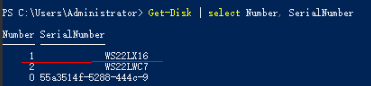

# 本地盘换盘预处理（磁盘增强型实例）<a name="ecs_03_2306"></a>

## 操作场景<a name="section117378514391"></a>

当进行“本地盘换盘”事件的“授权换盘”操作时，需要先对本地盘进行换盘预处理。

本文介绍如何对磁盘增强型（D系列）的ECS实例进行本地盘的换盘预处理操作。

> **须知：** 
>本地盘换盘操作需要在预约时间后的6个工作日内完成，在此期间业务不可用，请谨慎操作。
>磁盘增强型实例的本地盘换盘操作无需关机。
>本地盘换盘操作会丢失故障本地盘上的数据，如果无需保留本地盘上的数据，可通过本操作换盘预处理。
>如果需要保留本地盘上的数据，请勿授权，结束操作并联系技术支持进行处理。

## 操作步骤（Linux实例）<a name="section1465616285569"></a>

**获取故障本地盘信息**

1.  登录管理控制台。
2.  单击管理控制台左上角的，选择区域和项目。
3.  单击“”，选择“计算 \> 弹性云服务器”。
4.  在左侧导航树中，选择“事件”。
5.  在事件列表中，查看“本地盘换盘”事件的“事件描述”列。

    通过“事件描述”信息获取故障本地盘的WWN号，本文以“wwn-0x5000c500e01a4930”为例进行介绍。

**获取故障盘挂载点**

1.  [远程登录](远程登录Linux弹性云服务器（VNC方式）.md)待换盘预处理的弹性云服务器。
2.  执行以下命令，查看故障本地盘的WWN号对应的盘符信息。

    **ll /dev/disk/by-id/ | grep **_**WWN号**_

    以WWN号“wwn-0x5000c500e01a4930”为例，命令如下：

    **ll /dev/disk/by-id/ | grep wwn-0x5000c500e01a4930**

    回显信息如下：

    ```
    lrwxrwxrwx 1 root root  9 May 13 14:05 wwn-0x5000c500e01a4930 -> ../../sdb
    ```

3.  执行以下命令，查询故障本地盘的挂载点。

    **df -Th | grep  _盘符信息_**

    以盘符信息“/dev/sdb”为例，命令如下：

    **df -Th| grep /dev/sdb**

    回显信息如下：

    ```
    /dev/sdb   ext4   3.6T 28K 3.4T 1%  /data
    ```

    > **须知：** 
    >本地盘换盘操作会导致本地盘数据丢失。如需保留本地盘数据，请勿授权，结束操作并联系技术支持进行处理。

**卸载故障的本地磁盘**

1.  执行以下命令，卸载故障本地盘。

    **umount   _挂载点_**

    以挂载点“/data”为例，命令如下：

    **umount  /data**

**检查报障云服务器的/etc/fstab中是否配置了故障盘对应的自动挂载信息**

> **说明：** 
>如果报障云服务器的/etc/fstab中配置了故障盘对应的自动挂载信息，则需要注释掉，防止本地盘换盘后启动云服务器进入维护模式。

1.  <a name="li527181014133"></a>执行以下命令，查询磁盘分区的UUID。

    **blkid  _磁盘分区_**

    以查询磁盘分区“/dev/sdb”的UUID为例，命令如下：

    **blkid /dev/sdb**

    回显信息如下：

    ```
    /dev/sdb: UUID="626c4774-e60e-4d86-bbe6-031bac126e4c" TYPE="ext4"
    ```

2.  <a name="li172719107136"></a>执行以下命令，查询/etc/fstab中是否存在磁盘分区的自动挂载信息。

    **cat /etc/fstab | grep **_**磁盘分区的UUID**_

    以查询磁盘分区的UUID“626c4774-e60e-4d86-bbe6-031bac126e4c”为例，命令如下：

    **cat /etc/fstab | grep 626c4774-e60e-4d86-bbe6-031bac126e4c**

    回显信息如下，表示/etc/fstab中存在磁盘分区的自动挂载信息：

    ```
    UUID=626c4774-e60e-4d86-bbe6-031bac126e4c    /mnt   ext4    defaults        0 0
    ```

3.  如果存在自动挂载信息，执行以下命令，删除磁盘分区的自动挂载信息，避免在更换本地盘后，云服务器开机时进入维护模式。
    1.  执行以下命令，编辑/etc/fstab文件。

        **vi /etc/fstab**

    2.  单击“i”进入编辑模式。
    3.  删除或注释掉步骤[2](#li172719107136)中查询的磁盘分区的自动挂载信息。

        根据步骤[1](#li527181014133)中查询的UUID，注释该条信息。

        在自动挂载信息前面添加\#，表示注释掉自动挂载信息，示例如下：

        ```
        # UUID=626c4774-e60e-4d86-bbe6-031bac126e4c    /mnt   ext4    defaults        0 0
        ```

    4.  单击Esc键并输入**:wq**后回车，保存并退出编辑模式。

## 操作步骤（Windows实例）<a name="section4516103191312"></a>

**获取故障盘标识符**

1.  登录管理控制台。
2.  单击管理控制台左上角的，选择区域和项目。
3.  单击“”，选择“计算 \> 弹性云服务器”。
4.  在左侧导航树中，选择“事件”。
5.  在事件列表中，查看“本地盘换盘”事件的“事件描述”列。

    通过“事件描述”信息获取故障本地盘的SN号，本文以“WS22LX16”为例进行介绍。

**获取磁盘编号，确认影响范围**

1.  [远程登录](远程登录Windows弹性云服务器（VNC方式）.md)待换盘预处理的弹性云服务器。
2.  以管理员身份打开“Windows PowerShell”，查询磁盘编号和SN号的对应关系，获取磁盘编号。

    **Get-Disk | select Number, SerialNumber**

    **图 1**  查询磁盘编号和SN号的对应关系<a name="fig443115493412"></a>  
    

    > **须知：** 
    >本地盘换盘操作会导致本地盘数据丢失。如需保留本地盘数据，请勿授权，结束操作并联系技术支持进行处理。

