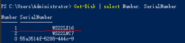

# 本地盘换盘预处理（裸金属类型实例）<a name="ecs_03_2314"></a>

## 操作场景<a name="section117378514391"></a>

当进行“本地盘换盘”事件的“授权换盘”操作时，需要先对本地盘进行换盘预处理。

本文介绍如何对裸金属类型的ECS实例进行本地盘的换盘预处理操作。

> **须知：** 
>本地盘换盘操作会丢失故障本地盘上的数据，如果无需保留本地盘上的数据，可通过本操作授权换盘。
>本地盘换盘操作可能伴随宿主机的下电与重启，在授权前，请确保云服务器中部署的业务离线，或云服务器停止对业务无影响。
>如果需要保留本地盘上的数据或如果云服务器上的业务不可停止，请勿授权，结束操作并联系技术支持进行处理。

## 操作步骤（Linux实例）<a name="section15293423191212"></a>

**获取故障本地盘标识符**

1.  登录管理控制台。
2.  单击管理控制台左上角的，选择区域和项目。
3.  单击“”，选择“计算 \> 弹性云服务器”。
4.  在左侧导航树中，选择“事件”。
5.  在事件列表中，查看“本地盘换盘”事件的“事件描述”列。

    通过“事件描述”信息获取故障本地盘的SN号，本文以“99K0A046FL3G”为例进行介绍。

**获取故障本地盘挂载点**

1.  [远程登录](远程登录Linux弹性云服务器（VNC方式）.md)待换盘预处理的裸金属类型实例。
2.  执行以下命令，查看故障盘的SN号对应的盘符信息。

    **ll /dev/disk/by-id/ | grep  _SN号_**

    以SN号“99K0A046FL3G”为例，命令如下：

    **ll /dev/disk/by-id/ | grep 99K0A046FL3G**

    回显信息如下：

    ```
    /lrxxrxxrxx 1 root root 9 Sep 18 19: 20 ata-MG06ACA10TE_99K0A046FL3G ->./../sda
    lrwxrwxrwx 1 root root 10 Sep 18 19: 20 ata-MG06ACA10TE_99K0A046FL3G-part1->./../sda1
    ```

3.  执行以下命令，查询故障盘的挂载点。

    **df -Th | grep **_**盘符信息**_

    以盘符信息“/dev/sda1”为例，命令如下：

    **df -Th| grep /dev/sda**

    回显信息如下：

    ```
    /dev/sdal ext4 9.1T 7.5T 1.6T 83% /srv/data
    ```

    > **须知：** 
    >本地盘换盘操作会导致本地盘数据丢失。如需保留本地盘数据，请勿授权，结束操作并联系技术支持进行处理。

**卸载故障的本地磁盘**

1.  执行以下命令，卸载故障的本地磁盘。

    **umount   _挂载点_**

    以挂载点“/data”为例，命令如下：

    **umount  /data**

**检查报障云服务器的/etc/fstab中是否配置了故障盘对应的自动挂载信息**

> **说明：** 
>如果报障云服务器的/etc/fstab中配置了故障盘对应的自动挂载信息，则需要注释掉，防止本地盘换盘后启动云服务器进入维护模式。

1.  <a name="li42132496545"></a>执行以下命令，查询磁盘分区的UUID。

    **blkid **_**磁盘分区**_

    以查询磁盘分区“/dev/sda1”的UUID为例：

    **blkid /dev/sda1**

    回显信息如下：

    ```
    /dev/sdal: UUID="e7100f3e-af65-49da-a013-c4ace8e5aba7" TYPE ="ext4"RTLABEL="logical"PARTUUID="cd358d32-e02b-4b23-bbd9–8a8bdae0e070"
    ```

1.  <a name="li19468752185416"></a>执行以下命令，查询/etc/fstab中是否存在磁盘分区的自动挂载信息。

    **cat /etc/fstab | grep  _磁盘分区的UUID_**

    以查询磁盘分区的UUID“e7100f3e-af65-49da-a013-c4ace8e5aba7”为例，命令如下：

    **cat /etc/fstab | grep e7100f3e-af65-49da-a013-c4ace8e5aba7**

    回显信息如下，表示/etc/fstab中存在磁盘分区的自动挂载信息：

    ```
    UUID=e7100f3e-af65-49da-a01 3-c4ace8e5aba7 /srv/data ext4 defaults,noatime, nodiratime 1 0
    ```

2.  如果存在挂载信息，执行以下命令，删除磁盘分区的自动挂载信息，避免在更换本地盘后，云服务器开机时进入维护模式。
    1.  执行以下命令，编辑/etc/fstab文件。

        **vi /etc/fstab**

    2.  单击“i”进入编辑模式。
    3.  删除或注释掉步骤[2](#li19468752185416)中查询的磁盘分区的自动挂载信息。

        根据步骤[1](#li42132496545)中查询的UUID，注释该条信息。

        在自动挂载信息前面添加\#，表示注释掉自动挂载信息，示例如下：

        ```
        # UUID=e7100f3e-af65-49da-a01 3-c4ace8e5aba7/srv/data ext4 defaults,noatime, nodiratime 1 0
        ```

    4.  单击Esc键并输入**:wq**后回车，保存并退出编辑模式。

**云服务器关机**

1.  在事件列表中，查看“本地盘换盘”事件对应的实例ID。

1.  在左侧导航选择“弹性云服务器”，在报障的云服务器“操作”列，单击“更多 \> 关机”。

    > **说明：** 
    >本地盘换盘需要通过将云服务器关机再开机的过程，将新的本地盘信息同步至虚拟化层。

## 操作步骤（Windows实例）<a name="section1867718221417"></a>

**获取故障本地盘标识符**

1.  登录管理控制台。
2.  单击管理控制台左上角的，选择区域和项目。
3.  单击“”，选择“计算 \> 弹性云服务器”。
4.  在左侧导航树中，选择“事件”。
5.  在事件列表中，查看“本地盘换盘”事件的“事件描述”列。

    通过“事件描述”信息获取故障本地盘的SN号，本文以“WS22LX16”为例进行介绍。

**获取磁盘编号，确认影响范围**

1.  [远程登录](远程登录Windows弹性云服务器（VNC方式）.md)待换盘预处理的裸金属类型实例。
2.  以管理员身份打开“Windows PowerShell”，查询磁盘编号和SN号的对应关系，获取磁盘编号。

    Get-Disk | select Number, SerialNumber

    **图 1**  查询磁盘编号和SN号的对应关系<a name="fig443115493412"></a>  
    

    > **须知：** 
    >本地盘换盘操作会导致本地盘数据丢失。如需保留本地盘数据，请勿授权，结束操作并联系技术支持进行处理。

**云服务器关机**

1.  在事件列表中，查看“本地盘换盘”事件对应的实例ID。

1.  在左侧导航选择“弹性云服务器”，在报障的云服务器“操作”列，单击“更多 \> 关机”。

    > **说明：** 
    >本地盘换盘需要通过将云服务器关机再开机的过程，将新的本地盘信息同步至虚拟化层。

