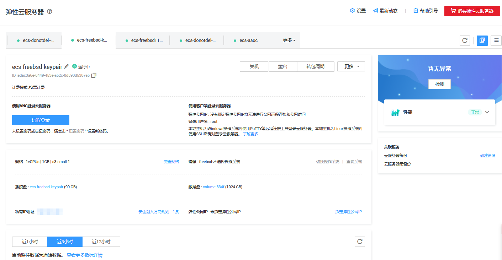

# 查看云服务器详细信息（精简视图）

## 操作场景

精简视图提供了云服务器资源概况和状态的可视化统计结果，帮助您直观的了解云服务器资源。在精简视图中，您可以快速获取弹性云服务器基本信息、登录信息、配置信息、监控信息。

## 怎样切换至精简视图？

精简视图提供了云服务器资源概况和状态的可视化统计结果，直观的了解云服务器资源。

请按以下步骤切换至精简视图：

1.  登录管理控制台。
2.  单击管理控制台左上角的，选择区域和项目。
3.  选择“计算 \> 弹性云服务器”。

    系统进入弹性云服务器列表页。

4.  在列表页的右侧单击精简视图图标，如[图1](#fig2047366114179)所示。

    **图 1**  切换精简视图  
    

    在精简视图下用户可查看弹性云服务器的详细配置，包括弹性云服务器名称、登录信息指引、云服务器详情、云服务器监控数据。如[图2](#fig1125105615315)所示。

    **图 2**  精简视图  
    

## 在精简视图查看云服务器资源信息

在精简视图中，您可以快速获取弹性云服务器基本信息、登录信息、配置信息、监控信息。

**表 1**  云服务器资源信息

<table><thead align="left"><tr id="row117691425161417"><th class="cellrowborder" valign="top" width="20.080000000000002%" id="mcps1.2.3.1.1">
信息分类

</th>
<th class="cellrowborder" valign="top" width="79.92%" id="mcps1.2.3.1.2">
描述

</th>
</tr>
</thead>
<tbody><tr id="row57705259141"><td class="cellrowborder" valign="top" width="20.080000000000002%" headers="mcps1.2.3.1.1 ">
基本信息

</td>
<td class="cellrowborder" valign="top" width="79.92%" headers="mcps1.2.3.1.2 ">
基本信息包括云服务器名称、云服务器ID、计费模式。

<ul id="ul86652020454"><li>按需资源：按需资源费用较高，需要长期使用可以选择对按需资源进行转包周期。</li><li>包周期资源：控制台会提示您资源到期时间，并提供续费链接。</li></ul>
</td>
</tr>
<tr id="row117700256149"><td class="cellrowborder" valign="top" width="20.080000000000002%" headers="mcps1.2.3.1.1 ">
登录信息

</td>
<td class="cellrowborder" valign="top" width="79.92%" headers="mcps1.2.3.1.2 "><ul id="ul1062834415388"><li>远程登录：通过管理控制台远程</li><li>客户端登录：提供客户端登录云服务器的必要信息，包括弹性公网IP、登录用户名、登录操作指引。</li></ul>
</td>
</tr>
<tr id="row43709350146"><td class="cellrowborder" valign="top" width="20.080000000000002%" headers="mcps1.2.3.1.1 ">
配置信息

</td>
<td class="cellrowborder" valign="top" width="79.92%" headers="mcps1.2.3.1.2 ">
云服务器的配置信息包括云服务器规格、镜像、系统盘信息、数据盘信息，私有IP地址、弹性公网IP地址。

</td>
</tr>
<tr id="row737113355148"><td class="cellrowborder" valign="top" width="20.080000000000002%" headers="mcps1.2.3.1.1 ">
监控信息

</td>
<td class="cellrowborder" valign="top" width="79.92%" headers="mcps1.2.3.1.2 ">
云服务器运行相关的信息，包括CPU和网络使用情况。您可以选择页面左上方的时间范围按钮，查看该云服务资源“近1小时”、“近3小时”和“近12小时”的监控原始数据曲线图。

</td>
</tr>
<tr id="row197781710437"><td class="cellrowborder" valign="top" width="20.080000000000002%" headers="mcps1.2.3.1.1 ">
监控信息总览

</td>
<td class="cellrowborder" valign="top" width="79.92%" headers="mcps1.2.3.1.2 ">
精简视图中监控视图总览从性能、安全、成本三方面帮助您监控云服务器健康程度。当监控指标异常时，提供异常信息及解决方案。

</td>
</tr>
</tbody>
</table>

