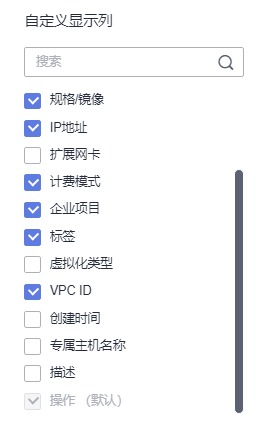

# 查看弹性云服务器详细信息（列表视图）

## 操作场景

在您申请了弹性云服务器后，可以通过管理控制台查看和管理您的弹性云服务器。本节介绍如何查看弹性云服务器的详细配置，包括弹性云服务器名称、镜像信息、系统盘、数据盘、虚拟私有云、网卡、安全组、弹性公网IP等信息。

如需查看弹性云服务器的私有IP地址，请直接在弹性云服务器列表页进行查看。

## 操作步骤

1.  登录管理控制台。
2.  单击管理控制台左上角的，选择区域和项目。
3.  单击“”，选择“计算 \> 弹性云服务器”。

    系统进入弹性云服务器列表页，您可以在本页面查看您已购买的弹性云服务器，以及弹性云服务器的规格、镜像、IP地址等基本信息。

    您可以设置列表可显示的弹性云服务器信息：

    1.  在列表搜索框右侧，单击，进入“设置”页面。
    2.  在“自定义显示列”勾选想要显示在弹性云服务器列表的信息。

        **图 1**  自定义列表显示项  
        

        > **说明：** 
        >切换区域后，弹性云服务器列表展示信息设置会保留。

4.  在弹性云服务器列表中的上方，输入弹性云服务器名称、云服务器ID、IP地址等属性类型，并按回车键进行搜索。

    搜索云服务器的更多内容，请参见或[搜索云服务器](搜索云服务器.md)。

    **图 2**  搜索弹性云服务器  
    

5.  单击待查询弹性云服务器的名称。

    系统跳转至该弹性云服务器详情页面。

6.  查看弹性云服务器的详细信息。

    您可以选择“云硬盘/弹性网卡/安全组/弹性公网IP/监控/标签”页签，为弹性云服务器进行[更改安全组](更改安全组.md)、[绑定弹性网卡](绑定弹性网卡.md)、[绑定弹性公网IP](绑定弹性公网IP.md)、[添加标签](添加标签.md)等操作。

