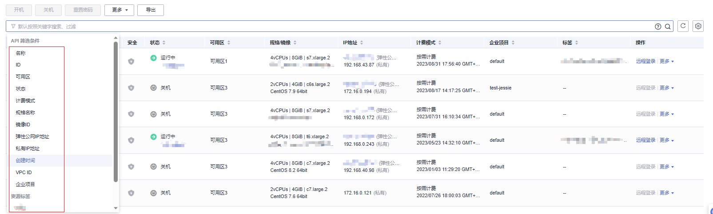

# 查看弹性云服务器详细信息（列表视图）

## 操作场景

在您申请了弹性云服务器后，可以通过管理控制台查看和管理您的弹性云服务器。本节介绍如何查看弹性云服务器的详细配置，包括弹性云服务器名称、镜像信息、系统盘、数据盘、虚拟私有云、网卡、安全组、弹性公网IP等信息。

如需查看弹性云服务器的私有IP地址，请直接在弹性云服务器列表页进行查看。

## 操作步骤

1.  登录管理控制台。
2.  单击管理控制台左上角的，选择区域和项目。
3.  选择“计算 \> 弹性云服务器”。

    系统进入弹性云服务器列表页，您可以在本页面查看您已购买的弹性云服务器，以及弹性云服务器的私有IP地址等基本信息。

4.  在弹性云服务器列表中的右上角，输入弹性云服务器名、IP地址或ID，并单击进行搜索。

    **图 1**  搜索弹性云服务器  
    

5.  单击待查询弹性云服务器的名称。

    系统跳转至该弹性云服务器详情页面。

6.  查看弹性云服务器的详细信息。

    您可以选择“云硬盘/网卡/安全组/弹性公网IP/监控”页签，更改弹性云服务器安全组、为弹性云服务器添加网卡、绑定弹性公网IP等。

