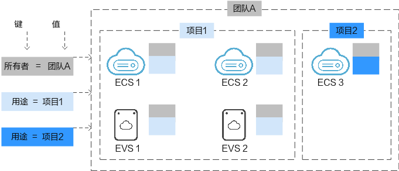

# 标签概述

## 操作场景

标签是弹性云服务器的标识。为弹性云服务器添加标签，可以方便用户识别和管理拥有的弹性云服务器资源。

您可以在创建弹性云服务器时添加标签，也可以在弹性云服务器创建完成后，在云服务器的详情页添加标签，您最多可以给弹性云服务器添加10个标签。

## 有关标签的基本知识

标签用于标识资源，当您拥有相同类型的许多云资源时，可以使用标签按各种维度（例如用途、所有者或环境）对云资源进行分类。

**图 1**  标签示例  

[图1](#zh-cn_topic_0157874334_fig81911042564)说明了标签的工作方式。在此示例中，您为每个云资源分配了两个标签，每个标签都包含您定义的一个“键”和一个“值”，一个标签使用键为“所有者”，另一个使用键为“用途”，每个标签都拥有相关的值。

您可以根据为云资源添加的标签快速搜索和筛选特定的云资源。例如，您可以为帐户中的资源定义一组标签，以跟踪每个云资源的所有者和用途，使资源管理变得更加轻松。

## 标签命名规则

-   每个标签由一对键值对（Key-Value）组成。
-   每个弹性云服务器最多可以添加10个标签。
-   对于每个资源，每个标签键（Key）都必须是唯一的，每个标签键（Key）只能有一个值（Value）。
-   标签共由两部分组成：“标签键”和“标签值”，其中，“标签键”和“标签值”的命名规则如[表1](#table197401426182516)所示。

    **表 1**  标签命名规则

    
    <table><thead align="left"><tr id="row374112610252"><th class="cellrowborder" valign="top" width="18.54%" id="mcps1.2.4.1.1">
参数

    </th>
    <th class="cellrowborder" valign="top" width="55.65%" id="mcps1.2.4.1.2">
规则

    </th>
    <th class="cellrowborder" valign="top" width="25.81%" id="mcps1.2.4.1.3">
样例

    </th>
    </tr>
    </thead>
    <tbody><tr id="row77477265250"><td class="cellrowborder" valign="top" width="18.54%" headers="mcps1.2.4.1.1 ">
标签键

    </td>
    <td class="cellrowborder" valign="top" width="55.65%" headers="mcps1.2.4.1.2 "><ul id="ul207505264257"><li>不能为空。</li><li>对于同一台云服务器，Key值唯一。</li><li>长度不超过36个字符。</li><li>不能包含“=”,“*”,“&lt;”,“&gt;”,“\”,“,”,“|”,“/”。</li><li>首尾字符不能为空格。</li></ul>
    </td>
    <td class="cellrowborder" valign="top" width="25.81%" headers="mcps1.2.4.1.3 ">
Organization

    </td>
    </tr>
    <tr id="row4754926182519"><td class="cellrowborder" valign="top" width="18.54%" headers="mcps1.2.4.1.1 ">
标签值

    </td>
    <td class="cellrowborder" valign="top" width="55.65%" headers="mcps1.2.4.1.2 "><ul id="ul107561326102518"><li>长度不超过43个字符。</li><li>不能包含“=”,“*”,“&lt;”,“&gt;”,“\”,“,”,“|”,“/”。</li><li>首尾字符不能为空格。</li></ul>
    </td>
    <td class="cellrowborder" valign="top" width="25.81%" headers="mcps1.2.4.1.3 ">
Apache

    </td>
    </tr>
    </tbody>
    </table>

