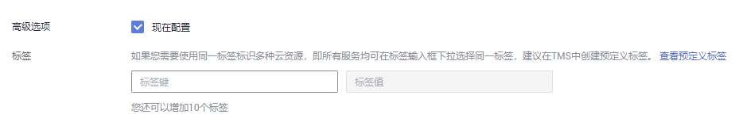
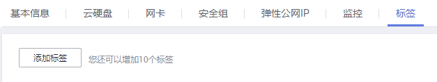
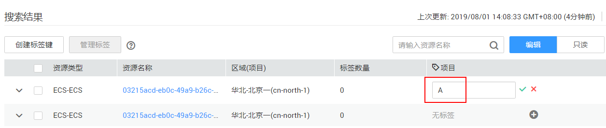

# 添加标签

标签用于标记云资源，如实例、镜像和磁盘等。如果您的帐户下有多种云资源，并且不同云资源之间有多种关联，您可以为云资源添加标签，实现云资源的分类和统一管理。更多信息，请参见[标签概述](标签概述.md)。

有三种途径为弹性云服务器添加标签：

-   [在创建弹性云服务器时添加标签](#section619816351650)
-   [在弹性云服务器详情页添加标签](#section15164103015253)
-   [在标签管理页面添加标签](#section115321623241)

预定义标签的使方法请参考[预定义标签的使用方法](#section648015120456)。

## 在创建弹性云服务器时添加标签

1.  登录管理控制台。
2.  单击管理控制台左上角的，选择区域和项目。
3.  选择“计算 \> 弹性云服务器”，进入弹性云服务器页面。
4.  单击“创建弹性云服务器”。
5.  配置弹性云服务器的规格参数。

    在“高级配置 \> 标签”中，添加标签键和标签值。标签命名规则如[表1](标签概述.md#table197401426182516)所示。

    > **说明：**   
    >-   其他参数说明请参考[创建弹性云服务器](https://support.huaweicloud.com/qs-ecs/zh-cn_topic_0021831611.html)。  

    **图 1**  添加标签  
    

## 在弹性云服务器详情页添加标签

1.  登录管理控制台。
2.  单击管理控制台左上角的，选择区域和项目。
3.  选择“计算 \> 弹性云服务器”，进入弹性云服务器页面。
4.  在弹性云服务器列表中，单击待管理标签的弹性云服务器名称。

    系统跳转至该弹性云服务器详情页面。

5.  选择“标签”页签，单击“添加标签”，在弹出的“添加标签”窗口，输入标签的键和值。标签命名规则如[表1](标签概述.md#table197401426182516)所示。

    您还可以在标签添加成功后，执行修改操作，只能修改标签值。

    **图 2**  在云服务器详情页添加标签  
    

## 在标签管理页面添加标签

> **说明：**   
>此方法适用于为多个资源统一添加拥有同样标签键的标签。  

1.  登录管理控制台。
2.  在右上角的用户名下选择“标签管理”，进入标签管理服务页面。

    **图 3**  标签管理  
    

3.  在“资源标签”页面，勾选资源所在的区域，“资源类型”请选择ECS，单击“搜索”。

    系统列出所选区域下的所有云服务器资源。

4.  在“搜索结果”区域，单击“创建标签键”，输入键（例如：项目），单击“确定”。

    创建完成后，该标签键会添加至资源标签列表（如[图4](#fig52631133192513)）。如果列表中没有显示该标签，单击，在下拉列表中勾选创建的标签键。

    默认该标签键的值为“无标签”，您还需要为每一个资源对应的标签值赋值，完成标签与资源的关联，继续下一步。

    **图 4**  资源列表  
    

5.  单击“编辑”，切换资源标签列表为可编辑状态。
6.  在云服务器资源所在行，单击，输入标签“值”（例如：A）。

    为标签键赋值后，“标签数量”将加1。按照同样方法依次为其他云服务器添加标签值。

    **图 5**  输入标签值  
    

## 预定义标签的使用方法

如果有多台云服务器或其他云资源需要添加同一标签，为了避免重复输入标签键和值，您可以在标签管理服务中预定义标签，然后在添加标签时直接选择键和值。具体步骤如下：

1.  登录管理控制台。
2.  在右上角的用户名下选择“标签管理”，进入标签管理服务页面。
3.  在左侧导航中选择“预定义标签”，单击“创建标签”，输入标签键和值（例如，项目-A）。
4.  选择“服务列表 \> 计算 \> 弹性云服务器”，按照上述添加标签的方法，在标签键和标签值输入框中下拉选择预定义的标签。

