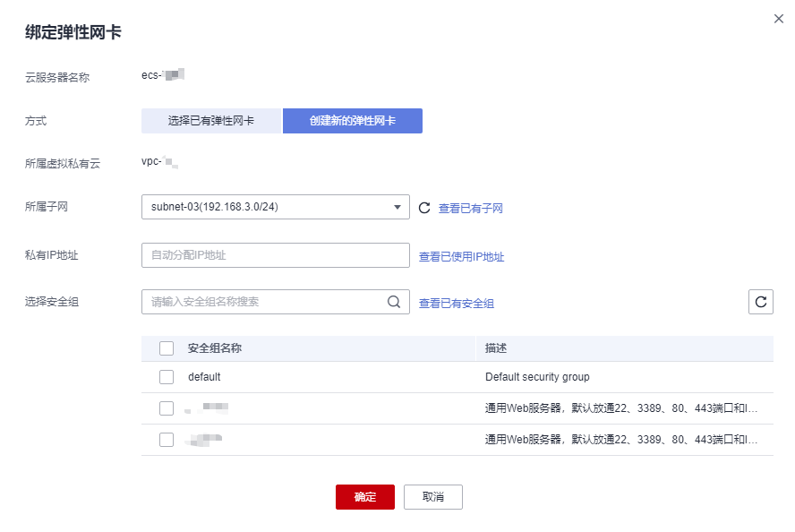

# 添加网卡

## 操作场景

当您的弹性云服务器需要多个网卡时，可以参考下面步骤为弹性云服务器添加网卡。

## 操作步骤

1.  登录管理控制台。
2.  单击管理控制台左上角的，选择区域和项目。
3.  单击“”，选择“计算 \> 弹性云服务器”。
4.  单击待添加网卡的弹性云服务器名称。

    系统跳转至该弹性云服务器详情页面。

5.  选择“网卡”页签，并单击“添加网卡”。
6.  选择待增加的子网和安全组，如[图1](#fig68079468188)所示。

    **图 1**  选择子网和安全组  
    

    -   安全组：您可以同时勾选多个安全组，此时，弹性云服务器的访问规则遵循几个安全组规则的并集。
    -   私有IP地址：如果需要给弹性云服务器添加一张指定IP地址的网卡，用户需填写“私有IP地址”。

7.  单击“确定”。

## 后续任务

部分操作系统无法识别新添加的网卡，需手动激活网卡。下面以Ubuntu系统为例介绍具体激活网卡的操作步骤，其他操作系统请自行完成相关操作，如有问题，请参见对应操作系统的官网指导或手册来完成操作。

1.  在弹性云服务器所在行的“操作”列下，单击“远程登录”。

    登录弹性云服务器。

2.  执行如下命令，查看网卡名称。

    **ifconfig -a**

    例如，查询到的网卡名为：eth2。

3.  执行如下命令，进入相应目录。

    **cd /etc/network**

4.  执行如下命令，打开interfaces文件。

    **vi interfaces**

5.  在interfaces文件中，增加类似如下信息。

    **auto** _**eth2**_

    **iface** _**eth2**_ **inet dhcp**

6.  执行如下命令，保存并退出interfaces文件。

    **:wq**

7.  执行命令**ifup eth**_**X**_或**/etc/init.d/networking restart**，使新增网卡生效。

    上述命令中的X为具体的网卡名称序号，例如，**ifup eth2**。

8.  执行如下命令，查看回显信息中是否包括[2](#li595089165210)查询到的网卡。

    **ifconfig**

    例如，回显信息中包含网卡eth2。

    -   是，表示新增网卡生效，结束。
    -   否，表示新增网卡未生效，执行[9](#li1695469165210)。

9.  登录管理控制台，在弹性云服务器所在行的“操作”列下，选择“更多”，并单击“重启”。
10. 再次执行命令**ifconfig**，查看回显信息中是否包括[2](#li595089165210)查询到的网卡。
    -   是，结束。
    -   否，请联系客服获取技术支持。

