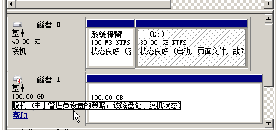

# 磁盘脱机

## 问题描述

Windows操作系统的弹性云服务器由于管理员设置的策略，该磁盘处于脱机状态，提示：由于管理员设置的策略，该磁盘处于脱机状态，如[图1](#fig1167510561578)所示。

**图 1**  磁盘脱机  

## 问题原因

Windows操作系统SAN策略分为三种类型：OnlineAll，OfflineShared，OfflineInternal

**表 1**  Windows操作系统SAN策略类型

<table><thead align="left"><tr id="row1581912410311"><th class="cellrowborder" valign="top" width="28.000000000000004%" id="mcps1.2.3.1.1">
类型

</th>
<th class="cellrowborder" valign="top" width="72%" id="mcps1.2.3.1.2">
说明

</th>
</tr>
</thead>
<tbody><tr id="row178191347320"><td class="cellrowborder" valign="top" width="28.000000000000004%" headers="mcps1.2.3.1.1 ">
OnlineAll

</td>
<td class="cellrowborder" valign="top" width="72%" headers="mcps1.2.3.1.2 ">
表示所有新发现磁盘都置于在线模式。

</td>
</tr>
<tr id="row581924937"><td class="cellrowborder" valign="top" width="28.000000000000004%" headers="mcps1.2.3.1.1 ">
OfflineShared

</td>
<td class="cellrowborder" valign="top" width="72%" headers="mcps1.2.3.1.2 ">
表示所有共享总线上（比如FC, ISCSI）的新发现磁盘都置于离线模式，非共享总线上的磁盘都置于在线模式。

</td>
</tr>
<tr id="row981914132"><td class="cellrowborder" valign="top" width="28.000000000000004%" headers="mcps1.2.3.1.1 ">
OfflineInternal

</td>
<td class="cellrowborder" valign="top" width="72%" headers="mcps1.2.3.1.2 ">
表示所有新发现磁盘都置于离线模式。

</td>
</tr>
</tbody>
</table>

对于部分版本的Windows操作系统（如Windows 2008/2012 企业版、数据中心版），默认是共享离线OfflineShared模式。

## 处理方法

使用DiskPart磁盘分区管理工具来查询、设置弹性云服务器的SAN策略，将其修改为OnlineAll类型。

1.  登录Windows弹性云服务器。
2.  按快捷键“Win+R”，运行cmd.exe。
3.  执行以下命令，进入DiskPart。

    **diskpart**

4.  执行以下命令，查看弹性云服务器当前的SAN策略。

    **san**

    -   如果SAN策略为OnlineAll，请执行**exit**命令退出DiskPart。

    -   否，请执行[5](#li5934113914122)。

5.  执行以下命令，修改弹性云服务器SAN策略为OnlineAll。

    **san policy=onlineall**

6.  （可选）如需永久生效，您可以将修改过SAN策略的弹性云服务器制作为私有镜像。由该私有镜像创建的弹性云服务器，添加的磁盘只需执行初始化操作，磁盘默认是联机状态。

