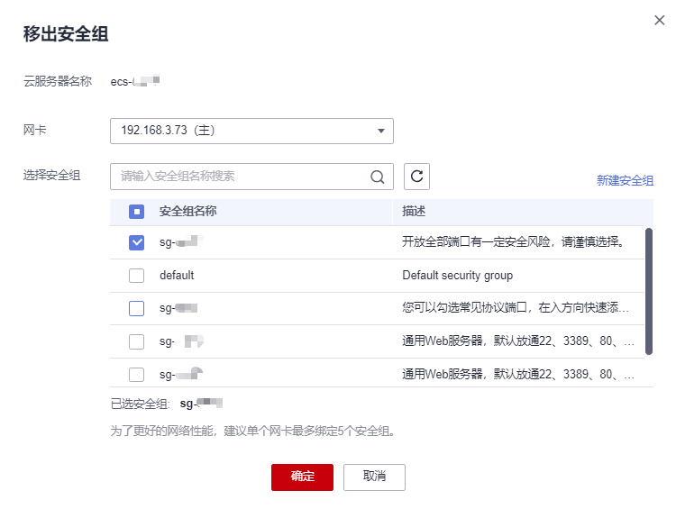
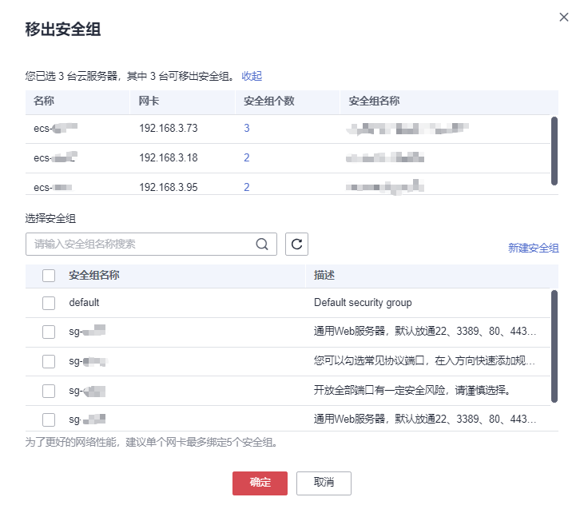

# 移出安全组

## 操作场景

本节操作介绍当弹性云服务器的网卡需要移出所属安全组时的操作步骤。

支持对一台或多台弹性云服务器进行移出所属安全组的操作：

-   [移出安全组（单台云服务器）](#section122441652828)：适用于对弹性云服务器指定网卡的安全组进行操作。
-   [移出安全组（多台云服务器）](#section4214198113518)：适用于对弹性云服务器主网卡的安全组进行操作。

## 约束约束

-   使用多个安全组可能会影响弹性云服务器的网络性能，建议您为弹性云服务器设置的安全组总数量不多于5个。
-   批量移出安全组仅支持对弹性云服务器主网卡的安全组进行操作。

## 移出安全组（单台云服务器）

1.  登录管理控制台。
2.  单击“”，选择“计算 \> 弹性云服务器”。
3.  在弹性云服务器列表中，单击“操作”列下的“更多 \> 网络设置 \> 移出安全组”。

    系统弹窗显示“移出安全组”页面。

    **图 1**  移出安全组  
    

4.  根据界面提示，在下拉列表中选择待移出安全组的网卡，并选择安全组。

    您可以同时勾选多个安全组，且安全组包含在弹性云服务器所属安全组内，否则移出操作无效。

5.  单击“确定”。

## 移出安全组（多台云服务器）

1.  登录管理控制台。
2.  单击“”，选择“计算 \> 弹性云服务器”。
3.  在弹性云服务器列表中，勾选待移出安全组的云服务器。
4.  单击列表上方的“更多 \> 移出安全组”。

    系统弹窗显示“移出安全组”页面。

    **图 2**  移出安全组  
    

5.  根据界面提示，在下拉列表中选择待移出的安全组，为所选云服务器移出主网卡所属的安全组。

    您可以同时勾选多个安全组，且安全组包含在弹性云服务器所属安全组内，否则移出操作无效。

6.  单击“确定”。

