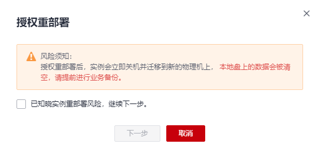
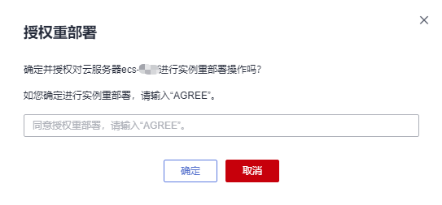

# 立即重部署

## 操作场景

当系统上报“本地盘换盘”事件时，您可以选择“授权重部署”操作，立即对该本地盘所属实例进行授权重部署操作。

本文介绍如何响应“待授权”状态的“本地盘换盘”事件，指导您完成实例的重部署操作。

> **说明：** 
>-   实例重部署时，会重启实例，请提前进行业务备份。
>-   实例重部署后，实例的系统盘和云硬盘类型的数据盘不受影响，但实例的本地盘会被初始化并清空所有数据。为了保障数据安全，请提前进行本地盘数据备份。

## 前提条件

如果您通过IAM用户进行本操作，则需要在操作前对IAM用户进行授权。

查询及响应事件操作依赖以下策略：

-   查询事件：ecs:instanceScheduledEvents:list
-   接受并授权执行事件：ecs:instanceScheduledEvents:accept
-   修改预约时间：ecs:instanceScheduledEvents:update

为IAM用户授权的操作，请参见[ECS自定义策略](ECS自定义策略.md)。

## 操作步骤

1.  登录管理控制台。
2.  单击管理控制台左上角的，选择区域和项目。
3.  单击“”，选择“计算 \> 弹性云服务器”。
4.  在左侧导航树中，选择“事件”。

1.  在“事件”页面，单击“”，通过以下条件过滤出待授权的“本地盘换盘”事件。
    1.  选择“事件状态 \> 待授权”。
    2.  选择“事件类型 \> 本地盘换盘”。

2.  在事件“操作”列，单击“授权重部署”。

    **图 1**  授权重部署  
    

    > **说明：** 
    >在进行“实例重部署”操作之前，请先了解本地盘数据丢失风险，完成实例重部署预处理操作，为所有数据盘增加nofail参数。
    >详细内容，请参见[实例重部署预处理](实例重部署预处理.md)。

3.  了解风险须知后，勾选“已知晓实例重部署风险，继续下一步”，并单击“下一步”。
4.  输入“AGREE”确定授权实例重部署。

    **图 2**  确定授权实例重部署  
    

5.  单击“确定”，完成授权重部署。

    授权重部署后，“本地盘换盘”事件更新为“待执行”状态。系统收到授权请求后，会将事件更新为执行中，开始进行实例重部署。

    待“本地盘换盘”事件更新为“完成”状态，实例重部署完成，请检查云服务器业务运行情况。

