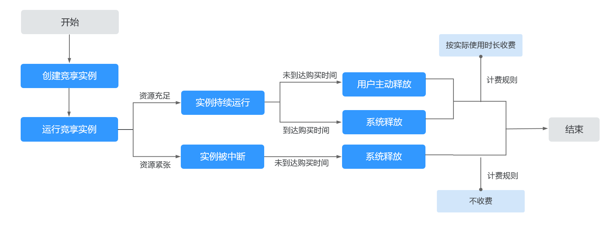

# 竞享计费型实例

## 什么是竞享计费型实例？

竞享实例是竞价计费的一种新型售卖模式，其最核心的特点是超低价格和系统抢占机制，即您可以以较低折扣购买实例，但同时在系统资源不足等极端情况下系统可能会自动回收这些实例。其适用于各种无状态、容错或者灵活的应用场景。

采用竞享模式购买的弹性云服务器，称之为“竞享计费型实例”，简称“竞享实例”。

竞享实例目前支持华为云[通用计算增强型](https://support.huaweicloud.com/productdesc-ecs/zh-cn_topic_0086381982.html)，目前已经上线C6机型的多个规格，C6s、C3机型会陆续上线。

在该计费模式下，您可以以折扣价购买并使用弹性云服务器，性能与常规云服务器无异。但是当库存资源不足，系统会自动释放您的云服务器资源，对这些折扣售卖的弹性云服务器进行中断回收。与“按需计费”和“包年/包月”方式购买的弹性云服务器相比，在提供同等性能的前提下，竞享实例可提供超低折扣，降低用云成本。

## 工作原理

**购买竞享实例时，**需要选择保障周期（1-6小时），保障周期不同价格不同。保障周期是购买竞享实例的最小单位时间。在保障周期内由云平台中断竞享实例，当前周期不计费。在保障周期内用户删除竞享实例，当前周期按使用时长计费。

**竞享实例购买成功后，**当达到用户购买时长或库存资源不足时，实例将会进入“**中断回收中”**状态，随后释放。用户可以根据业务需要随时[主动释放实例](https://support.huaweicloud.com/usermanual-ceci/ceci_02_0003.html)，实例释放后按用户实际使用时长收费。

华为云会尽可能保障竞享实例正常运行，但在极端情况下会中断释放该类实例，实例被中断时会**秒级释放**，请在使用竞享实例时做好备份策略。

在保障周期内由云平台中断竞享实例，当前周期不计费。在保障周期内用户主动释放实例，当前周期按使用时长计费。

一般情况下，竞享实例回收会优先选择使用时长较短的实例中断回收，尽可能降低对用户的业务损伤，但仍然建议您优化应用设计，保证在竞享实例被中断回收的情况下业务也可以正常工作。您可以尝试主动释放竞享实例，检测在竞享实例被中断回收的情况下应用工作是否正常。

**图 1**  竞享实例的生命周期  

> **说明：** 
>在保障周期内由云平台中断竞享实例，当前周期不计费。在保障周期内用户主动释放实例，当前周期按使用时长计费。

## 应用场景

-   适用场景

    如下业务场景适合使用竞享实例：图像渲染、无状态Web服务、基因测序、离线分析、函数计算、批量计算、样本分析、CI/CD与测试等。

    > **说明：** 
    >当达到用户购买时长或库存资源不足时，竞享实例会被中断回收，请务必做好数据备份工作。

-   不适用场景

    为避免中断回收机制对业务带来影响，对于需要长时间作业、或稳定性要求极高的服务，请勿使用竞享实例。

## 使用须知

-   竞享计费型实例目前支持通用计算增强型实例规格。
-   华为云尽可能保障竞享实例正常运行，但在系统资源不足等极端情况下会主动释放实例，请务必做好数据备份工作。
-   竞享计费型实例目前只支持部分区域及规格，请以购买页面显示的资源为准
-   竞享计费型实例保障周期不同价格不同。
-   竞享计费型实例不支持转换为按需和包年/包月实例。
-   竞享计费型实例不支持变更实例规格。
-   竞享计费型实例不支持变更操作系统。
-   竞享计费型实例不支持自动恢复功能。
-   竞享计费型实例不支持使用市场镜像。
-   竞享计费型实例在中断回收时：
    -   不允许使用竞享实例制作系统盘镜像和整机镜像，但允许使用该云服务器的数据盘制作数据盘镜像。
    -   不允许删除。

-   竞享计费型实例在中断回收时，数据盘和弹性公网IP默认不释放。请设置通知提醒，来决定是否释放关联的数据盘和弹性公网IP。具体方法，请参见“[购买竞价计费型实例](购买竞享计费型实例.md)”。

## 计费规则

请认真阅读竞价计费型实例的计费规则，详情请参见“[计费说明](https://support.huaweicloud.com/productdesc-ecs/ecs_01_0065.html)”。

-   **计费价格：**竞享实例根据购买时长实行分段收费，购买时长小于6小时与等于6小时情况下价格不一致，您可以参考[价格详情](https://www.huaweicloud.com/pricing.html?tab=detail#/ecs)。价格计算器上的金额如果遇小数点，则保留小数点后两位，第三位四舍五入。如遇四舍五入后不足￥0.01 元，则按￥0.01 元展示。
-   **计费周期：**实例创建成功后开始计费，精确到秒级计费，按用户使用时长计费，实例释放后出所有整点账单。**且使用期间进行关机等操作，仍然计费。**
-   **关联服务：**竞享实例模式仅适用于vCPU和内存价格，不适用于OS、系统盘、数据盘、网络带宽的价格。OS、系统盘、数据盘、网络带宽、IP按各自计费规则计费（与按需保持一致）。系统盘与实例一起创建，一起释放，但数据盘系统不会删除，需要用户自行删除。
-   **代金券**：除现金券、储值卡适用之外，其他折扣券、代金券等均不适用。

## 计费样例

竞享实例精确到秒级计费，购买界面显示小时单价，将小时单价除以3600即可得到每秒的价格。

-   **样例1：以C6.large.2规格为例，用户购买时长3小时，08:58:30开通实例**
    -   使用3小时后正常到期，11:58:30终止实例，终止实例后出整点话单

        **表 1**  话单样例1

        
        <table><thead align="left"><tr id="row449355316117"><th class="cellrowborder" valign="top" width="33.33333333333333%" id="mcps1.2.4.1.1">
账单周期

        </th>
        <th class="cellrowborder" valign="top" width="33.33333333333333%" id="mcps1.2.4.1.2">
周期内使用时长（秒）

        </th>
        <th class="cellrowborder" valign="top" width="33.33333333333333%" id="mcps1.2.4.1.3">
计费（元）

        </th>
        </tr>
        </thead>
        <tbody><tr id="row649335311113"><td class="cellrowborder" valign="top" width="33.33333333333333%" headers="mcps1.2.4.1.1 ">
08:58:30-09:00:00

        </td>
        <td class="cellrowborder" valign="top" width="33.33333333333333%" headers="mcps1.2.4.1.2 ">
90

        </td>
        <td class="cellrowborder" valign="top" width="33.33333333333333%" headers="mcps1.2.4.1.3 ">
90/3600*0.07

        </td>
        </tr>
        <tr id="row849319534116"><td class="cellrowborder" valign="top" width="33.33333333333333%" headers="mcps1.2.4.1.1 ">
09:00:00-10:00:00

        </td>
        <td class="cellrowborder" valign="top" width="33.33333333333333%" headers="mcps1.2.4.1.2 ">
3600

        </td>
        <td class="cellrowborder" valign="top" width="33.33333333333333%" headers="mcps1.2.4.1.3 ">
0.07

        </td>
        </tr>
        <tr id="row1494553191110"><td class="cellrowborder" valign="top" width="33.33333333333333%" headers="mcps1.2.4.1.1 ">
10:00:00-11:00:00

        </td>
        <td class="cellrowborder" valign="top" width="33.33333333333333%" headers="mcps1.2.4.1.2 ">
3600

        </td>
        <td class="cellrowborder" valign="top" width="33.33333333333333%" headers="mcps1.2.4.1.3 ">
0.07

        </td>
        </tr>
        <tr id="row1749413537115"><td class="cellrowborder" valign="top" width="33.33333333333333%" headers="mcps1.2.4.1.1 ">
11:00:00-11:58:30

        </td>
        <td class="cellrowborder" valign="top" width="33.33333333333333%" headers="mcps1.2.4.1.2 ">
3510

        </td>
        <td class="cellrowborder" valign="top" width="33.33333333333333%" headers="mcps1.2.4.1.3 ">
3510/3600*0.07

        </td>
        </tr>
        </tbody>
        </table>

    -   用户主动提前释放实例，10:28:30终止实例，终止实例后出整点话单

        **表 2**  话单样例2

        
        <table><thead align="left"><tr id="row11935175251219"><th class="cellrowborder" valign="top" width="33.33333333333333%" id="mcps1.2.4.1.1">
账单周期

        </th>
        <th class="cellrowborder" valign="top" width="33.33333333333333%" id="mcps1.2.4.1.2">
周期内使用时长（秒）

        </th>
        <th class="cellrowborder" valign="top" width="33.33333333333333%" id="mcps1.2.4.1.3">
计费（元）

        </th>
        </tr>
        </thead>
        <tbody><tr id="row1993517529121"><td class="cellrowborder" valign="top" width="33.33333333333333%" headers="mcps1.2.4.1.1 ">
08:58:30-09:00:00

        </td>
        <td class="cellrowborder" valign="top" width="33.33333333333333%" headers="mcps1.2.4.1.2 ">
90

        </td>
        <td class="cellrowborder" valign="top" width="33.33333333333333%" headers="mcps1.2.4.1.3 ">
90/3600*0.07

        </td>
        </tr>
        <tr id="row1593511521129"><td class="cellrowborder" valign="top" width="33.33333333333333%" headers="mcps1.2.4.1.1 ">
09:00:00-10:00:00

        </td>
        <td class="cellrowborder" valign="top" width="33.33333333333333%" headers="mcps1.2.4.1.2 ">
3600

        </td>
        <td class="cellrowborder" valign="top" width="33.33333333333333%" headers="mcps1.2.4.1.3 ">
0.07

        </td>
        </tr>
        <tr id="row1593517526122"><td class="cellrowborder" valign="top" width="33.33333333333333%" headers="mcps1.2.4.1.1 ">
10:00:00-10:28:30

        </td>
        <td class="cellrowborder" valign="top" width="33.33333333333333%" headers="mcps1.2.4.1.2 ">
1710

        </td>
        <td class="cellrowborder" valign="top" width="33.33333333333333%" headers="mcps1.2.4.1.3 ">
1710/3600*0.07

        </td>
        </tr>
        </tbody>
        </table>

    -   系统提前释放实例，10:28:30终止实例，终止实例后出整点话单（免除）

        **表 3**  话单样例3

        
        <table><thead align="left"><tr id="row17779192161312"><th class="cellrowborder" valign="top" width="33.33333333333333%" id="mcps1.2.4.1.1">
账单周期

        </th>
        <th class="cellrowborder" valign="top" width="33.33333333333333%" id="mcps1.2.4.1.2">
周期内使用时长（秒）

        </th>
        <th class="cellrowborder" valign="top" width="33.33333333333333%" id="mcps1.2.4.1.3">
计费（元）

        </th>
        </tr>
        </thead>
        <tbody><tr id="row6779122171310"><td class="cellrowborder" valign="top" width="33.33333333333333%" headers="mcps1.2.4.1.1 ">
08:58:30-09:00:00

        </td>
        <td class="cellrowborder" valign="top" width="33.33333333333333%" headers="mcps1.2.4.1.2 ">
90

        </td>
        <td class="cellrowborder" valign="top" width="33.33333333333333%" headers="mcps1.2.4.1.3 ">
0

        </td>
        </tr>
        <tr id="row3779162111139"><td class="cellrowborder" valign="top" width="33.33333333333333%" headers="mcps1.2.4.1.1 ">
09:00:00-10:00:00

        </td>
        <td class="cellrowborder" valign="top" width="33.33333333333333%" headers="mcps1.2.4.1.2 ">
3600

        </td>
        <td class="cellrowborder" valign="top" width="33.33333333333333%" headers="mcps1.2.4.1.3 ">
0

        </td>
        </tr>
        <tr id="row10779122131317"><td class="cellrowborder" valign="top" width="33.33333333333333%" headers="mcps1.2.4.1.1 ">
10:00:00-10:28:30

        </td>
        <td class="cellrowborder" valign="top" width="33.33333333333333%" headers="mcps1.2.4.1.2 ">
1710

        </td>
        <td class="cellrowborder" valign="top" width="33.33333333333333%" headers="mcps1.2.4.1.3 ">
0

        </td>
        </tr>
        </tbody>
        </table>

-   **样例2：以C6.large.2规格为例，用户购买时长6小时，08:58:30开通实例**
    -   使用6小时后正常到期，14:58:30终止实例，终止实例后出整点话单

        **表 4**  话单样例4

        
        <table><thead align="left"><tr id="row414612591136"><th class="cellrowborder" valign="top" width="33.33333333333333%" id="mcps1.2.4.1.1">
账单周期

        </th>
        <th class="cellrowborder" valign="top" width="33.33333333333333%" id="mcps1.2.4.1.2">
周期内使用时长（秒）

        </th>
        <th class="cellrowborder" valign="top" width="33.33333333333333%" id="mcps1.2.4.1.3">
计费（元）

        </th>
        </tr>
        </thead>
        <tbody><tr id="row12146259161312"><td class="cellrowborder" valign="top" width="33.33333333333333%" headers="mcps1.2.4.1.1 ">
08:58:30-09:00:00

        </td>
        <td class="cellrowborder" valign="top" width="33.33333333333333%" headers="mcps1.2.4.1.2 ">
90

        </td>
        <td class="cellrowborder" valign="top" width="33.33333333333333%" headers="mcps1.2.4.1.3 ">
90/3600*0.12

        </td>
        </tr>
        <tr id="row191468591135"><td class="cellrowborder" valign="top" width="33.33333333333333%" headers="mcps1.2.4.1.1 ">
09:00:00-10:00:00

        </td>
        <td class="cellrowborder" valign="top" width="33.33333333333333%" headers="mcps1.2.4.1.2 ">
3600

        </td>
        <td class="cellrowborder" valign="top" width="33.33333333333333%" headers="mcps1.2.4.1.3 ">
0.12

        </td>
        </tr>
        <tr id="row11467596134"><td class="cellrowborder" valign="top" width="33.33333333333333%" headers="mcps1.2.4.1.1 ">
10:00:00-11:00:00

        </td>
        <td class="cellrowborder" valign="top" width="33.33333333333333%" headers="mcps1.2.4.1.2 ">
3600

        </td>
        <td class="cellrowborder" valign="top" width="33.33333333333333%" headers="mcps1.2.4.1.3 ">
0.12

        </td>
        </tr>
        <tr id="row11461059181310"><td class="cellrowborder" valign="top" width="33.33333333333333%" headers="mcps1.2.4.1.1 ">
11:00:00-12:00:00

        </td>
        <td class="cellrowborder" valign="top" width="33.33333333333333%" headers="mcps1.2.4.1.2 ">
3600

        </td>
        <td class="cellrowborder" valign="top" width="33.33333333333333%" headers="mcps1.2.4.1.3 ">
0.12

        </td>
        </tr>
        <tr id="row191467590134"><td class="cellrowborder" valign="top" width="33.33333333333333%" headers="mcps1.2.4.1.1 ">
12:00:00-13:00:00

        </td>
        <td class="cellrowborder" valign="top" width="33.33333333333333%" headers="mcps1.2.4.1.2 ">
3600

        </td>
        <td class="cellrowborder" valign="top" width="33.33333333333333%" headers="mcps1.2.4.1.3 ">
0.12

        </td>
        </tr>
        <tr id="row2146175921318"><td class="cellrowborder" valign="top" width="33.33333333333333%" headers="mcps1.2.4.1.1 ">
13:00:00-14:00:00

        </td>
        <td class="cellrowborder" valign="top" width="33.33333333333333%" headers="mcps1.2.4.1.2 ">
3600

        </td>
        <td class="cellrowborder" valign="top" width="33.33333333333333%" headers="mcps1.2.4.1.3 ">
0.12

        </td>
        </tr>
        <tr id="row5146145991311"><td class="cellrowborder" valign="top" width="33.33333333333333%" headers="mcps1.2.4.1.1 ">
14:00:00-14:58:30

        </td>
        <td class="cellrowborder" valign="top" width="33.33333333333333%" headers="mcps1.2.4.1.2 ">
3510

        </td>
        <td class="cellrowborder" valign="top" width="33.33333333333333%" headers="mcps1.2.4.1.3 ">
3510/3600*0.12

        </td>
        </tr>
        </tbody>
        </table>

    -   用户主动提前释放实例，13:28:30终止实例，终止实例后出整点话单

        **表 5**  话单样例5

        
        <table><thead align="left"><tr id="row159751816112013"><th class="cellrowborder" valign="top" width="33.33333333333333%" id="mcps1.2.4.1.1">
账单周期

        </th>
        <th class="cellrowborder" valign="top" width="33.33333333333333%" id="mcps1.2.4.1.2">
周期内使用时长（秒）

        </th>
        <th class="cellrowborder" valign="top" width="33.33333333333333%" id="mcps1.2.4.1.3">
计费（元）

        </th>
        </tr>
        </thead>
        <tbody><tr id="row1197517164204"><td class="cellrowborder" valign="top" width="33.33333333333333%" headers="mcps1.2.4.1.1 ">
08:58:30-09:00:00

        </td>
        <td class="cellrowborder" valign="top" width="33.33333333333333%" headers="mcps1.2.4.1.2 ">
90

        </td>
        <td class="cellrowborder" valign="top" width="33.33333333333333%" headers="mcps1.2.4.1.3 ">
90/3600*0.12

        </td>
        </tr>
        <tr id="row5976121622018"><td class="cellrowborder" valign="top" width="33.33333333333333%" headers="mcps1.2.4.1.1 ">
09:00:00-10:00:00

        </td>
        <td class="cellrowborder" valign="top" width="33.33333333333333%" headers="mcps1.2.4.1.2 ">
3600

        </td>
        <td class="cellrowborder" valign="top" width="33.33333333333333%" headers="mcps1.2.4.1.3 ">
0.12

        </td>
        </tr>
        <tr id="row1997661610201"><td class="cellrowborder" valign="top" width="33.33333333333333%" headers="mcps1.2.4.1.1 ">
10:00:00-11:00:00

        </td>
        <td class="cellrowborder" valign="top" width="33.33333333333333%" headers="mcps1.2.4.1.2 ">
3600

        </td>
        <td class="cellrowborder" valign="top" width="33.33333333333333%" headers="mcps1.2.4.1.3 ">
0.12

        </td>
        </tr>
        <tr id="row4976121611209"><td class="cellrowborder" valign="top" width="33.33333333333333%" headers="mcps1.2.4.1.1 ">
11:00:00-12:00:00

        </td>
        <td class="cellrowborder" valign="top" width="33.33333333333333%" headers="mcps1.2.4.1.2 ">
3600

        </td>
        <td class="cellrowborder" valign="top" width="33.33333333333333%" headers="mcps1.2.4.1.3 ">
0.12

        </td>
        </tr>
        <tr id="row1697631652018"><td class="cellrowborder" valign="top" width="33.33333333333333%" headers="mcps1.2.4.1.1 ">
12:00:00-13:00:00

        </td>
        <td class="cellrowborder" valign="top" width="33.33333333333333%" headers="mcps1.2.4.1.2 ">
3600

        </td>
        <td class="cellrowborder" valign="top" width="33.33333333333333%" headers="mcps1.2.4.1.3 ">
0.12

        </td>
        </tr>
        <tr id="row12976101618202"><td class="cellrowborder" valign="top" width="33.33333333333333%" headers="mcps1.2.4.1.1 ">
13:00:00-13:28:30

        </td>
        <td class="cellrowborder" valign="top" width="33.33333333333333%" headers="mcps1.2.4.1.2 ">
1710

        </td>
        <td class="cellrowborder" valign="top" width="33.33333333333333%" headers="mcps1.2.4.1.3 ">
1710/3600*0.12

        </td>
        </tr>
        </tbody>
        </table>

    -   系统提前释放实例，13:28:30终止实例，终止实例后出整点话单（免除）

        **表 6**  话单样例6

        
        <table><thead align="left"><tr id="row4576181192116"><th class="cellrowborder" valign="top" width="33.33333333333333%" id="mcps1.2.4.1.1">
账单周期

        </th>
        <th class="cellrowborder" valign="top" width="33.33333333333333%" id="mcps1.2.4.1.2">
周期内使用时长（秒）

        </th>
        <th class="cellrowborder" valign="top" width="33.33333333333333%" id="mcps1.2.4.1.3">
计费（元）

        </th>
        </tr>
        </thead>
        <tbody><tr id="row1057611172111"><td class="cellrowborder" valign="top" width="33.33333333333333%" headers="mcps1.2.4.1.1 ">
08:58:30-09:00:00

        </td>
        <td class="cellrowborder" valign="top" width="33.33333333333333%" headers="mcps1.2.4.1.2 ">
90

        </td>
        <td class="cellrowborder" valign="top" width="33.33333333333333%" headers="mcps1.2.4.1.3 ">
0

        </td>
        </tr>
        <tr id="row15760112213"><td class="cellrowborder" valign="top" width="33.33333333333333%" headers="mcps1.2.4.1.1 ">
09:00:00-10:00:00

        </td>
        <td class="cellrowborder" valign="top" width="33.33333333333333%" headers="mcps1.2.4.1.2 ">
3600

        </td>
        <td class="cellrowborder" valign="top" width="33.33333333333333%" headers="mcps1.2.4.1.3 ">
0

        </td>
        </tr>
        <tr id="row1757641182115"><td class="cellrowborder" valign="top" width="33.33333333333333%" headers="mcps1.2.4.1.1 ">
10:00:00-11:00:00

        </td>
        <td class="cellrowborder" valign="top" width="33.33333333333333%" headers="mcps1.2.4.1.2 ">
3600

        </td>
        <td class="cellrowborder" valign="top" width="33.33333333333333%" headers="mcps1.2.4.1.3 ">
0

        </td>
        </tr>
        <tr id="row58408145611"><td class="cellrowborder" valign="top" width="33.33333333333333%" headers="mcps1.2.4.1.1 ">
11:00:00-12:00:00

        </td>
        <td class="cellrowborder" valign="top" width="33.33333333333333%" headers="mcps1.2.4.1.2 ">
3600

        </td>
        <td class="cellrowborder" valign="top" width="33.33333333333333%" headers="mcps1.2.4.1.3 ">
0

        </td>
        </tr>
        <tr id="row28404185617"><td class="cellrowborder" valign="top" width="33.33333333333333%" headers="mcps1.2.4.1.1 ">
12:00:00-13:00:00

        </td>
        <td class="cellrowborder" valign="top" width="33.33333333333333%" headers="mcps1.2.4.1.2 ">
3600

        </td>
        <td class="cellrowborder" valign="top" width="33.33333333333333%" headers="mcps1.2.4.1.3 ">
0

        </td>
        </tr>
        <tr id="row12840161115618"><td class="cellrowborder" valign="top" width="33.33333333333333%" headers="mcps1.2.4.1.1 ">
13:00:00-13:28:30

        </td>
        <td class="cellrowborder" valign="top" width="33.33333333333333%" headers="mcps1.2.4.1.2 ">
1710

        </td>
        <td class="cellrowborder" valign="top" width="33.33333333333333%" headers="mcps1.2.4.1.3 ">
0

        </td>
        </tr>
        </tbody>
        </table>

## 购买竞价计费型实例

您可以通过控制台方式或调用API方式，购买竞价计费型实例。

-   控制台方式，请参见“[购买竞享计费型实例](购买竞享计费型实例.md)”。
-   API方式，请参见《弹性云服务器API参考》的“[创建云服务器](https://support.huaweicloud.com/api-ecs/zh-cn_topic_0020212668.html)”章节。

## 中断回收

在系统资源不足等极端情况下，华为云会自动回收竞享实例，并免除实例的使用费用（该免除条件规则仅针对购买时长为1-6小时的竞享实例）。

您可以参考[计费样例](#section224116718520)了解详细样例。

-   **用户主动释放实例**

    当您已完成竞享实例的使用，您可以主动释放实例，以节约您的使用成本。释放步骤如下：

    1.  登录管理控制台。
    2.  选择“计算 \> 弹性云服务器”。
    3.  勾选待删除的竞享实例弹性云服务器。
    4.  单击弹性云服务器列表页上方的“删除”或操作中的“删除”按钮。

        系统盘与实例一起创建，一起释放，但云平台不会主动删除数据盘、网络带宽、弹性公网IP，需要用户自行删除。请在删除弹框选择是否同时删除弹性公网IP和数据盘。否则，数据盘、网络带宽、弹性公网IP继续计费。

-   **系统回收实例**

    当使用时间到达您的购买时长或在系统资源不足等极端情况下，系统会自动回收实例，请您及时做好数据备份。系统回收实例时会主动删除您的竞享实例及系统盘，但不会主动删除您购买的数据盘、网络带宽、弹性公网IP、SFS Turbo文件系统等其它服务，您可以自行决定是否对其进行删除操作。

    > **说明：** 
    >-   在系统资源不足等极端情况下，华为云会自动回收竞享实例，并免除实例的使用费用（该免除条件规则仅针对购买时长为1-6小时的竞享实例）。您可以参考[计费样例](#section224116718520)了解详细样例。
    >-   当竞享实例出话单后，系统会进行结算与扣费，如因余额不足而产生欠费，您的资源将被冻结。欠费后，可以查看欠费详情。为防止相关资源不被停止或者释放，请及时进行充值。帐号进入欠费状态，需要在约定时间内支付欠款。

因此，请务必做好数据备份工作。系统会提前发出即将释放云服务器资源的通知，如需设置通知提醒，请根据如下2种方式按需选择：

-   方式一：通过元数据spot，来通知您即将中断回收的实例。元数据spot的使用，请参见[元数据](元数据获取.md)。
-   方式二：通过“云审计服务”、“消息通知服务”，查看并设置中断回收提醒。具体方法，请参见“[购买竞价计费型实例](购买竞享计费型实例.md)”。

## 常见问题

请参见[FAQ](https://support.huaweicloud.com/ecs_faq/ecs_faq_0309.html)。

