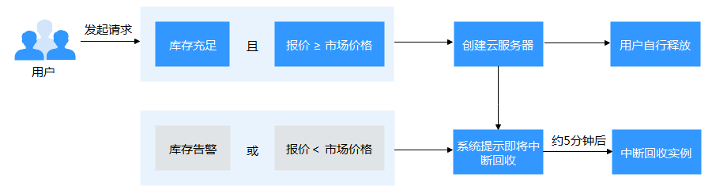

# 竞价计费

## 什么是竞价计费？

华为云将可用的计算资源，按照一定折扣进行售卖，其价格随市场供需关系实时变化，这种打折销售、价格实时变化的计费模式称为“竞价计费”。

采用竞价计费模式购买的弹性云服务器，称之为“竞价计费型实例”。

在该计费模式下，您可以以折扣价购买并使用弹性云服务器，性能与常规云服务器无异。但是当库存资源不足，或市场价格上浮、并超过您的预期价格时，系统会自动释放您的云服务器资源，对这些折扣售卖的弹性云服务器进行中断回收。与“按需计费”和“包年/包月”方式购买的弹性云服务器相比，在提供同等性能的前提下，竞价计费型实例可提供超低折扣，降低用云成本。

## 工作原理

不同时期，市场对某一规格的云服务器供需情况不同，从而引起市场价格的波动。您可以在市场价格较低时，购买并使用竞价计费型实例，降低计算成本。

**购买竞价计费型实例型实例时**，您需要为指定规格的弹性云服务器设定价格上限，即报价。该报价是您愿意为该弹性云服务器支付的最高价格，报价越高，购买成功的机会越大。

-   当“报价 ≥ 市场价格”且库存资源充足时，购买竞价计费型实例成功。系统将按当前市场价格进行计费。
-   当“报价 < 市场价格”时，无法购买竞价计费型实例。

**竞价计费型实例购买成功后**，您可以像使用其他计费模式的云服务器一样，登录并使用弹性云服务器，没有任何差别。但是，系统会定期比价，并检查资源池库存情况：

-   当“报价 ≥ 市场价格”且库存资源充足时，您可以继续持有并使用弹性云服务器。
-   当“报价 < 市场价格”或库存资源不足时，系统发出即将释放云服务器资源的通知，并在约5分钟后自动删除弹性云服务器。

**图 1**  竞价计费型实例生命周期  

## 应用场景

-   适用场景

    如下业务适合使用竞价计费型实例策略：图像渲染、无状态Web服务、基因测序、离线分析、函数计算、批量计算、样本分析、CI/CD与测试等。

    > **说明：**   
    >当市场价格高于您的报价或者库存资源不足时，竞价计费型实例会被中断回收，请务必做好数据备份工作。  

-   不适用场景

    为避免中断回收机制对业务带来影响，对于需要长时间作业、或稳定性要求极高的服务，请勿采用竞价计费型实例策略。

## 使用须知

-   当前仅支持虚拟化类型为KVM的弹性云服务器使用竞价计费型实例策略。具体的规格支持清单，请以控制台显示的资源为准。
-   在不同可用区，同一规格的云服务器市场价格变化可能不同。
-   使用竞价计费型实例策略的弹性云服务器，不支持切换操作系统功能。
-   使用竞价计费型实例策略的弹性云服务器，不支持自动恢复功能。
-   使用竞价计费型实例策略的弹性云服务器，不支持变更规格。
-   不支持使用市场镜像创建竞价计费型实例。
-   竞价计费型实例不支持转“包年/包月”方式。
-   竞价计费型实例在中断回收时：
    -   不允许使用该竞价计费型实例制作系统盘镜像和整机镜像，但允许使用该云服务器的数据盘制作数据盘镜像。
    -   不允许删除。

## 计费规则

请认真阅读竞价计费型实例的计费规则，详情请参见“[计费方式](https://support.huaweicloud.com/price-ecs/zh-cn_topic_0088450534.html)”。

## 购买竞价计费型实例

您可以通过控制台方式或调用API方式，购买竞价计费型实例。

-   控制台方式，请参见“[购买竞价计费型实例](https://support.huaweicloud.com/usermanual-ecs/ecs_03_0115.html)”。
-   API方式，请参见《弹性云服务器API参考》的“[创建云服务器](https://support.huaweicloud.com/api-ecs/zh-cn_topic_0020212668.html)”章节。

## 中断回收

华为云始终可能会中断您的竞价计费型实例，终止实例的使用。竞价计费型实例在中断回收时，不允许使用该竞价计费型实例制作镜像。

中断回收竞价计费型实例的可能原因包括：

-   市场价格高于您的报价
-   库存资源不足

    > **说明：**   
    >-   由于库存资源不足或者用户出价低于市场价导致的首小时内中断，竞价计费型实例不收费。  
    >-   竞价计费型实例的第一个结算周期内（结算周期为自然小时）均按开机计费。  
    >-   如果竞价计费型实例中断回收的5分钟内跨过了整点，那么整点后该竞价计费型实例按照市场价格计费。  
    >-   开机过程中，竞价计费型实例每小时更新一次价格。重启或关机再开机后，竞价计费型实例以开机时的市场价格计费。  

因此，请务必做好数据备份工作。系统会提前发出即将释放云服务器资源的通知，如需设置通知提醒，请根据如下2种方式按需选择：

-   方式一：通过元数据spot，来通知您即将中断回收的实例。元数据spot的使用，请参见[元数据](https://support.huaweicloud.com/usermanual-ecs/ecs_03_0166.html)。
-   方式二：通过公有云提供的“云审计服务”、“消息通知服务”，查看并设置中断回收提醒。具体方法，请参见“[购买竞价计费型实例](https://support.huaweicloud.com/usermanual-ecs/ecs_03_0115.html)”。

## 常见问题

请参见[FAQ](https://support.huaweicloud.com/price-ecs/zh-cn_topic_0088450555.html)。

