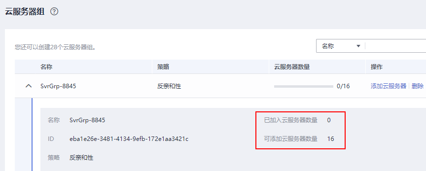

# 管理云服务器组

## 操作场景

云服务器组是对云服务器的一种逻辑划分，云服务器组中的弹性云服务器遵从同一策略。

当前云服务器组支持以下策略：

-   反亲和性：同一云服务器组中的弹性云服务器分散地创建在不同的主机上，提高业务的可靠性。

    使用反亲和性策略可以将业务涉及到的云服务器分散部署在不同的物理服务器上，以此保证业务的高可用性和底层容灾能力。

-   故障域：同一云服务器组中分布多个故障域，指定不同故障域可以实现云服务器的故障隔离，提高业务的可靠性。

    使用故障域策略可以将业务涉及到的云服务器分散部署在不同的故障域中，以此保证业务的高可用性和底层容灾能力。

云服务器组支持以下操作：

-   [创建云服务器组](#section1464061364114)
-   [添加云服务器到云服务器组](#section1447818554481)
    -   在创建弹性云服务器时，将弹性云服务器加入云服务器组。

        详细操作，请参考[步骤三：高级配置](https://support.huaweicloud.com/qs-ecs/ecs_02_0012.html)。

    -   在弹性云服务器创建成功后，添加到云服务器组。

        仅支持添加到反亲和性策略组，不支持添加到故障域策略组。

-   [从云服务器组移出云服务器](#section12553172594918)
-   [删除云服务器组](#section95601058404)

## 约束与限制

-   当前云服务器组支持反亲和性策略和故障域策略。

    “故障域”策略仅在部分区域上线，使用时请以该区域实际支持能力为准。

-   云服务器置放层级：
    -   反亲和性策略云服务器组中，云服务器置放层级为物理机层级。
    -   故障域策略云服务器组中，云服务器置放层级为机架层级。

-   创建的云服务器组个数上限可调整，请联系客服扩大配额。
-   不同区域每个云服务器组最多支持添加的云服务器个数各不相同，请在云服务器组列表页查看可添加的云服务器个数。如[图1](#fig17171162431719)所示。

    **图 1**  查看可添加的云服务器数量  
    

-   同一个云服务器仅支持一种策略。

## 创建云服务器组

您可以申请创建一个云服务器组，同一云服务器组中的弹性云服务器遵从相同策略，云服务器组与云服务器组之间没有关联关系。

1.  登录管理控制台。
2.  单击管理控制台左上角的，选择区域和项目。
3.  单击“”，选择“计算 \> 弹性云服务器”。
4.  在左侧导航树中，选择“弹性云服务器 \> 云服务器组”。
5.  在“云服务器组”页面，单击“创建云服务器组”。
6.  输入云服务器组的名称。
7.  选择云服务器组的策略。

    -   反亲和性：同一云服务器组中的弹性云服务器分散地创建在不同的主机上，提高业务的可靠性。

        使用反亲和性策略可以将业务涉及到的云服务器分散部署在不同的物理服务器上，以此保证业务的高可用性和底层容灾能力。

    -   故障域：同一云服务器组中分布多个故障域，指定不同故障域可以实现云服务器的故障隔离，提高业务的可靠性。

        使用故障域策略可以将业务涉及到的云服务器分散部署在不同的故障域中，以此保证业务的高可用性和底层容灾能力。

    > **说明：** 
    >“故障域”策略仅在部分区域上线，使用时请以该区域实际支持能力为准。

8.  单击“确定”。

## 添加云服务器到云服务器组

为提升业务可靠性，您可以添加弹性云服务器到云服务器组，添加后，该弹性云服务器与云服务器组中的其他云服务器分散地创建在不同主机上。

> **说明：** 
>-   仅反亲和性策略的云服务器组，支持将云服务器添加到云服务器组。
>    对于故障域策略的云服务器组，不支持“添加云服务器”操作，仅支持在创建云服务器时选择“故障域策略”的云服务器组。详细操作，请参考[步骤三：高级配置](https://support.huaweicloud.com/qs-ecs/ecs_02_0012.html)
>-   添加云服务器到云服务器组后，会重新分配该云服务器所在的主机，使其与云服务器组中的其他云服务器分散地创建在不同主机上。那么当弹性云服务器再次开机时，可能会出现由于资源不足引起的启动失败，请将云服务器移出云服务器组后重新启动。
>-   包含本地盘的云服务器无法在创建后加入云服务器组，如需使用云服务器组功能，请在创建时选择云服务器组。
>-   弹性云服务器包含本地盘（如磁盘增强型、H2型、P1型、P2型）、NVMe SSD本地磁盘（如超高I/O型）、GPU卡（如G3型）、FPGA卡（如fp1型、fp1c型），则无法在创建后加入云服务器组，如需使用云服务器组功能，请在创建时选择云服务器组。

1.  登录管理控制台。
2.  单击管理控制台左上角的，选择区域和项目。
3.  单击“”，选择“计算 \> 弹性云服务器”。
4.  在左侧导航树中，选择“弹性云服务器 \> 云服务器组”。
5.  单击“操作”列下的“添加云服务器”。
6.  在“添加云服务器”页面，选择待添加的弹性云服务器。
7.  （可选）根据界面提示，为弹性云服务器执行关机操作。

    部分实例类型的弹性云服务器加入云服务器组之前需要先关机，若“操作”列出现“关机”，则需要执行本操作。

    1.  单击“操作”列的“关机”。
    2.  选择“关机方式”。
        -   关机：正常关机。
        -   强制关机：该操作会导致云服务器中未保存的数据丢失，请谨慎操作。

    3.  单击“是”，完成关机操作。

8.  单击“确定”，将弹性云服务器加入云服务器组。

## 从云服务器组移出云服务器

弹性云服务器从云服务器组移出后，与云服务器组中的其他云服务器不再遵从反亲和策略。

1.  登录管理控制台。
2.  单击管理控制台左上角的，选择区域和项目。
3.  单击“”，选择“计算 \> 弹性云服务器”。
4.  在左侧导航树中，选择“弹性云服务器 \> 云服务器组”。
5.  展开云服务器组，查看云服务器组中包含的弹性云服务器。
6.  单击目标云服务器“操作”列下的“移出云服务器组”。
7.  单击“是”。

    将弹性云服务器从云服务器组中移出。

## 删除云服务器组

删除云服务器组会解除组内云服务器的策略约束。

1.  登录管理控制台。
2.  单击管理控制台左上角的，选择区域和项目。
3.  单击“”，选择“计算 \> 弹性云服务器”。
4.  在左侧导航树中，选择“弹性云服务器 \> 云服务器组”。
5.  单击待删除云服务器组“操作”列下的“删除”。
6.  单击“是”。

