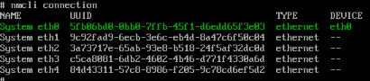
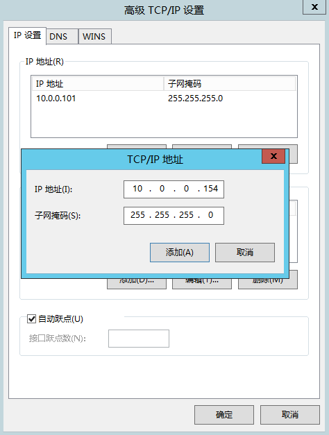
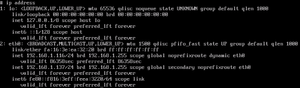
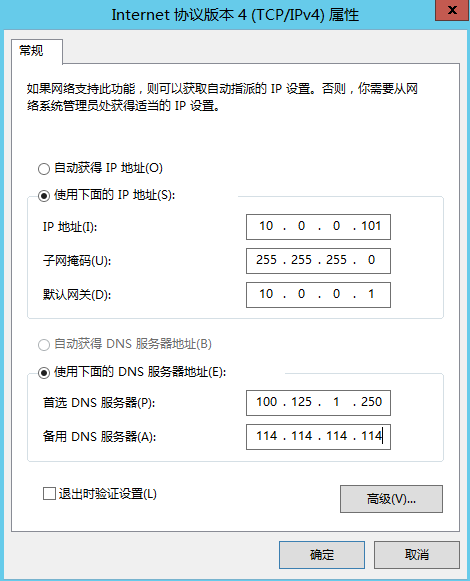
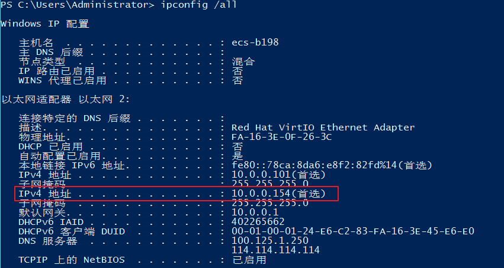

# 管理虚拟IP地址

## 操作场景

虚拟IP地址用于为网卡提供第二个IP地址，同时支持与多个弹性云服务器的网卡绑定，从而实现多个弹性云服务器之间的高可用性。

## 操作步骤

1.  登录管理控制台。
2.  选择“计算 \> 弹性云服务器”。
3.  在弹性云服务器列表中，单击待绑定虚拟IP地址的弹性云服务器名称。

    系统跳转至该弹性云服务器详情页面。

4.  选择“网卡”页签，单击“管理虚拟IP地址”。
5.  选择“IP地址管理”页签，在需要绑定弹性公网IP或者弹性云服务器的虚拟IP地址所在行的操作列下，单击“绑定弹性公网IP”或者“绑定弹性云服务器”。

    多个主备部署的弹性云服务器可以在绑定虚拟IP地址时选择同一个虚拟IP地址，增强容灾性能。

6.  单击“确定”。
7.  为已绑定虚拟IP的弹性云服务器手工配置虚拟IP地址。

    弹性云服务器的网卡绑定虚拟IP地址后，需要在弹性云服务器上手工配置虚拟IP地址。

    **Linux系统**（本文以“CentOS 7.2 64bit”为例）

    1.  执行以下命令查看需要绑定虚拟IP的网卡及其连接。

        **nmcli connection**

        **图 1**  查看网卡及其连接  
        

        上图回显样例中“DEVICE”列的“eth0”为需要绑定虚拟IP的网卡，“NAME”列的“System eth0”为对应的连接。

    2.  执行以下命令修改对应的连接添加虚拟IP。

        **nmcli connection modify "**_CONNECTION_**" ipv4.addresses** _VIP_

        **图 2**  配置虚拟IP地址  
        

    3.  重启弹性云服务器，使用**ip address**命令查看是否已经完成虚拟IP地址的配置。

        **图 3**  查看是否配置虚拟IP地址  
        

        上图回显样例中192.168.1.137为虚拟IP地址。

    **Windows系统**（本文以“Windows 7”为例）

    1.  在“控制面板 \> 网络和Internet \> 网络连接”路径下，右键单击对应的本地连接，选择“属性”。
    2.  在“网络”页签内选择“Internet 协议版本 4 （TCP/IPv4）”。
    3.  单击“属性”。
    4.  选择“使用下面的IP地址”，IP地址配置为弹性云服务器的私有IP地址，例如：192.168.10.41。

        **图 4**  配置私有IP地址  
        

    5.  单击“高级”。
    6.  在“IP设置”页签内“IP地址”区域，单击“添加”。

        添加虚拟IP地址，例如：192.168.10.137。

        **图 5**  配置虚拟IP地址  
        

    7.  单击“确认”，保存更改。
    8.  在“开始”菜单中打开Windows命令行窗口，执行以下命令确认是否配置了虚拟IP地址。

        **ipconfig /all**

        **图 6**  查看是否配置虚拟IP地址  
        

        上图回显样例中IPv4 Address包含虚拟IP地址192.168.10.137，表示弹性云服务器内部网卡的虚拟IP地址配置正常。

