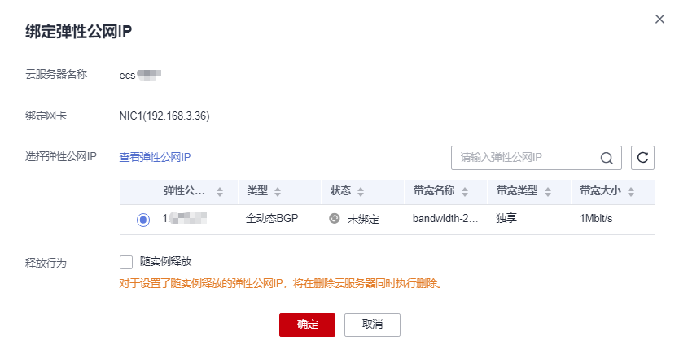

# 绑定弹性公网IP

## 操作场景

可以通过申请弹性公网IP并将弹性公网IP绑定到弹性云服务器上，实现弹性云服务器访问公网的目的。

申请弹性公网IP请参考[为弹性云服务器申请和绑定弹性公网IP](https://support.huaweicloud.com/usermanual-vpc/zh-cn_topic_0013748738.html)。

## 操作步骤

1.  登录管理控制台。
2.  单击管理控制台左上角的，选择区域和项目。
3.  选择“计算 \> 弹性云服务器”。
4.  在弹性云服务器列表中，在待调整带宽的弹性云服务器操作列下，单击“操作”列下的“更多 \> 网络设置 \> 绑定弹性公网IP”。
5.  选择弹性公网IP，单击“确定”。

    > **说明：**   
    >如果当前区域没有可用的弹性公网IP，则弹性公网IP列表为空，请购买弹性公网IP后重新执行绑定操作。  

    **图 1**  绑定弹性公网IP  
    

6.  完成绑定后，可以在云服务器列表页查看已绑定的弹性公网IP。

## 相关操作

-   [Windows云服务器访问公网不通应如何处理？](https://support.huaweicloud.com/ecs_faq/zh-cn_topic_0167429327.html)

