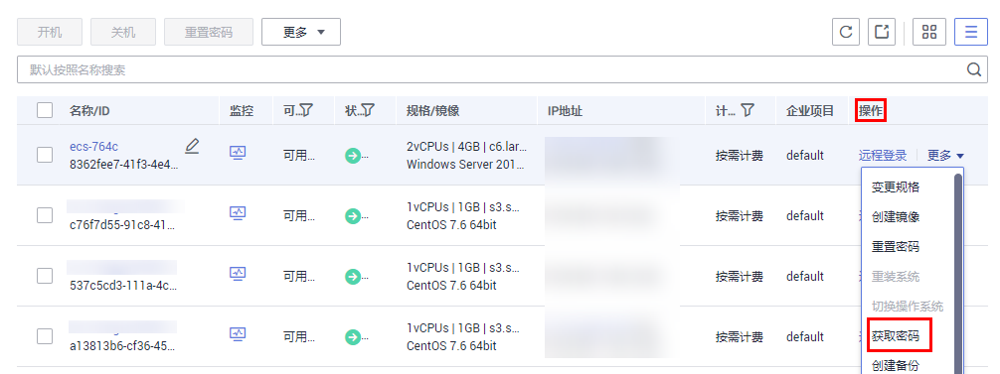

# 获取Windows弹性云服务器的密码

## 操作场景

登录Windows操作系统的弹性云服务器时，需使用密码方式登录。因此，用户需先根据创建弹性云服务器时使用的密钥文件，获取该弹性云服务器初始安装时系统生成的管理员密码（Administrator帐户或Cloudbase-init设置的帐户）。该密码为随机密码，安全性高，请放心使用。

请根据您的个人需求，通过管理控制台或API方式获取Windows弹性云服务器的初始密码，获取方法请参见本节内容。

## 通过管理控制台获取密码

1.  获取创建弹性云服务器时使用的私钥文件（.pem文件）。
2.  登录管理控制台。
3.  单击管理控制台左上角的，选择区域和项目。
4.  单击“”，选择“计算 \> 弹性云服务器”。
5.  在弹性云服务器列表，选择待获取密码的弹性云服务器。
6.  选择“操作 \> 更多”，单击“获取密码”。

    **图 1**  获取密码  
    

    > **说明：** 
    >如果不显示“获取密码”，可能是由于弹性云服务器未安装一键式重置密码插件。
    >您可以参考[重置Windows云服务器密码（未安装重置密码插件）](https://support.huaweicloud.com/ecs_faq/zh-cn_topic_0179487873.html)为弹性云服务器重置密码。

7.  通过密钥文件获取密码，获取方法有如下两种：
    -   单击“选择文件”，从本地上传密钥文件。
    -   将密钥文件内容复制粘贴在空白框中。

8.  单击“获取密码”，获取随机密码。

## 通过API方式获取密码

1.  获取创建弹性云服务器时使用的私钥文件（.pem文件）。
2.  设置调用接口的环境。
3.  具体方法请参见《弹性云服务器接口参考》的“接口调用方法”。
4.  获取密文密码。

    调用获取密码的接口，获取密钥的公钥加密后的密文密码。该密文密码是通过RSA算法加密的。其中，URI格式为“GET /v2/\{tenant\_id\}/servers/\{server\_id\}/os-server-password”。

    > **说明：** 
    >调用接口的具体方法请参见《弹性云服务器接口参考》的“[Windows云服务器获取密码](https://support.huaweicloud.com/api-ecs/ecs_03_1205.html)”章节。

5.  解密密文密码。

    通过创建云服务器时使用的密钥的私钥文件对[4](#li5770130102852)中获取的密文密码进行解密。

    1.  使用OpenSSL工具，执行以下命令，将密文密码转换为.key -nocrypt格式。

        **openssl pkcs8 -topk8 -inform PEM -outform DER -in rsa\_pem.key -out pkcs8\_der.key -nocrypt**

    2.  调用Java类库org.bouncycastle.jce.provider.BouncyCastleProvider，使用密钥文件，编写代码解密密文。

