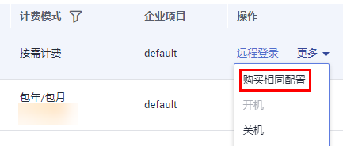

# 购买相同配置云服务器

## 操作场景

对于已购买成功的弹性云服务器，如需再次购买相同配置的，建议您使用公有云平台提供的“购买相同配置”功能，快速购买同一配置的弹性云服务器，节省时间。

## 使用须知

超大内存型弹性云服务器、使用整机镜像购买的弹性云服务器，暂不支持使用“购买相同配置”功能。

## 操作步骤

1.  登录华为云管理控制台。
2.  单击管理控制台左上角的，选择区域和项目。
3.  选择“计算 \> 弹性云服务器”。
4.  选择目标弹性云服务器，并单击“操作”列下的“更多 \> 购买相同配置”。

    **图 1**  购买相同配置  
    

5.  系统将跳转至弹性云服务器购买页，并自动复制已选择云服务器的参数配置。请根据需要调整待购买弹性云服务器的参数配置，确认无误后，单击“立即购买”。

    > **说明：** 
    >为安全起见，当复制的弹性云服务器存在如下场景时，系统不会自动复制相应的参数配置，需用户手动配置：
    >-   数据盘个数超过10个时，需手动添加磁盘数量。
    >-   网卡个数超过5个时，需手动添加其余网卡。
    >-   安全组个数超过5个时，需手动添加其余安全组。
    >-   使用数据盘镜像创建的磁盘，需重新选择数据盘镜像。
    >-   使用磁盘加密功能的云硬盘，需重新勾选“加密”。
    >-   “高级配置”中的相关功能，需重新设置。
    >-   弹性公网IP默认为“暂不购买”，如需购买，请手动设置。

