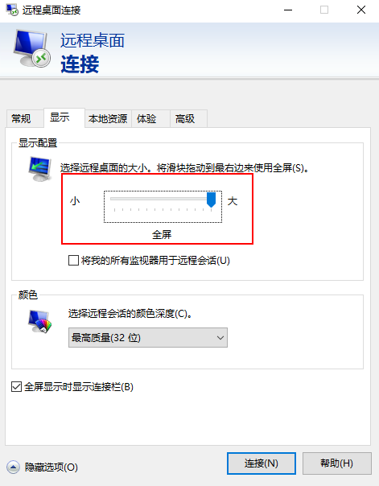

# 远程桌面连接（MSTSC方式）

## 操作场景

本节为您介绍如何在本机使用远程登录工具MSTSC登录Windows弹性云服务器。

## 前提条件

-   弹性云服务器状态为“运行中”。
-   如果弹性云服务器采用密钥方式鉴权，已获取Windows弹性云服务器的密码，获取方式请参见[获取Windows弹性云服务器的密码](获取Windows弹性云服务器的密码.md)。
-   弹性云服务器已经绑定弹性公网IP，绑定方式请参见[绑定弹性公网IP](绑定弹性公网IP.md)。

    使用MSTSC方式通过内网登录云服务器时可以不绑定弹性公网IP，例如VPN、云专线等内网网络连通场景。

-   所在安全组入方向已开放3389端口，配置方式请参见[配置安全组规则](配置安全组规则.md)。
-   使用的登录工具与待登录的弹性云服务器之间网络连通。例如，默认的3389端口没有被防火墙屏蔽。
-   弹性云服务器开启远程桌面协议RDP（Remote Desktop Protocol）。使用公共镜像创建的弹性云服务器默认已打开RDP。打开RDP方法请参考[开启远程桌面协议RDP](#section65216898112059)。

## 使用MSTSC方式登录Windows弹性云服务器

本地主机为Windows操作系统，那么可以使用Windows自带的远程桌面连接工具MSTSC登录Windows云服务器。

以下演示了使用MSTSC方式登录Windows 2012操作系统云服务器的操作步骤。

**图 1**  MSTSC方式登录云服务器  

详细操作步骤如下：

1.  在本地主机单击“开始”菜单。
2.  在“搜索程序和文件”中，输入“mstsc”，单击mstsc打开远程桌面连接工具。
3.  在“远程桌面连接”的对话框中，单击“选项”。

    **图 2**  显示选项  
    

4.  输入待登录的云服务器的弹性公网IP和用户名，默认为Administrator。

    > **说明：** 
    >如需再次登录时不再重复输入用户名和密码，可勾选“允许我保存凭据”。

    **图 3**  远程桌面链接  
    

5.  （可选）如需在远程会话中使用本地主机的资源，请单击“本地资源”选项卡完成如下配置。

    如需从本地主机复制到云服务器中，请勾选“剪贴板”。

    **图 4**  勾选剪贴板  
    

    如需从本地主机复制文件到云服务器中，单击“详细信息”，勾选相应的磁盘。

    **图 5**  勾选驱动器  
    

6.  （可选）如需调整远程桌面窗口的大小，可以选择“显示”选项卡，再调整窗口大小。

    **图 6**  调整窗口大小  
    

7.  单击“确定”，根据提示输入密码，登录云服务器。

    为安全起见，首次登录云服务器，需更改密码。

8.  （可选）通过远程桌面连接（Remote Desktop Protocol, RDP）方式登录云服务器后，如果需要使用RDP提供的“剪切板”功能，将本地的大文件（文件大小超过2GB）复制粘贴至远端的Windows云服务器中，由于Windows系统的限制，会导致操作失败。

    具体的解决方法，请参考[使用远程桌面链接方式复制文件](https://support.microsoft.com/en-us/help/2258090/copying-files-larger-than-2-gb-over-a-remote-desktop-services-or-termi)。

## 开启远程桌面协议RDP

首次登录弹性云服务器时，请先使用VNC方式登录弹性云服务器，打开RDP（Remote Desktop Protocol），然后再使用mstsc方式连接。

> **说明：** 
>使用公共镜像创建的云服务器，默认已打开RDP。

1.  VNC方式登录弹性云服务器。

    登录方法请参见[Windows弹性云服务器管理控制台远程登录（VNC方式）](Windows弹性云服务器管理控制台远程登录（VNC方式）.md)。

2.  单击“开始”菜单，选择“控制面板 \> 系统和安全 \> 系统 \> 远程设置”。

    系统进入“系统属性”页面。

    **图 7**  系统属性  
    

3.  选择“远程”页签，在“远程桌面”栏，选择“允许远程连接到此计算机”。
4.  单击“确定”。

## 相关链接

-   [忘记密码怎么办？](密码使用场景介绍.md)
-   [Windows云服务器如何配置多用户登录？](https://support.huaweicloud.com/trouble-ecs/ecs_trouble_0900.html)
-   [无法登录到Windows云服务器怎么办？](https://support.huaweicloud.com/ecs_faq/zh-cn_topic_0018073217.html)

