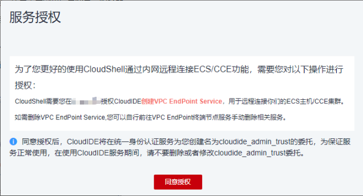
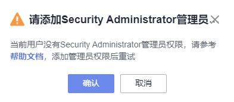
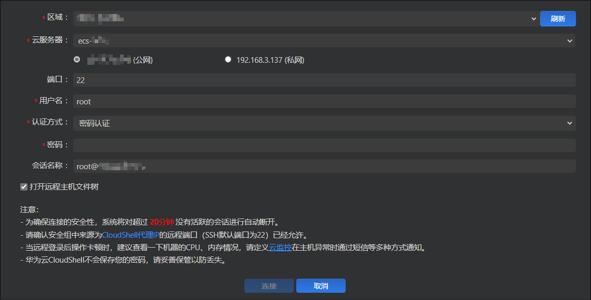
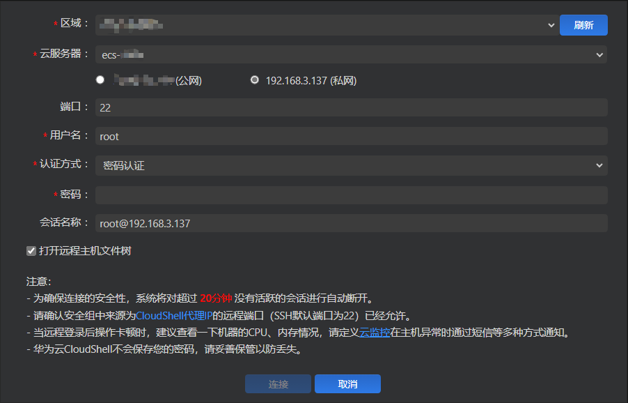

# 远程登录Linux弹性云服务器（CloudShell方式）

## 操作场景

本节为您介绍通过控制台提供的CloudShell登录云服务器的操作步骤。

登录成功后，如需使用CloudShell界面提供的复制、粘贴功能，请参见[CloudShell常用操作](#section1537822813216)。

## 约束限制

支持的区域，请参见[功能总览](https://support.huaweicloud.com/function-ecs/index.html)。

## 前提条件

-   云服务器状态为“运行中”。

-   请确保安全组已开放登录端口，默认使用22端口，如需使用其他端口可登录云服务器后重新设置。

    修改远程登录端口请参考[修改远程登录端口](https://support.huaweicloud.com/ecs_faq/ecs_faq_0530.html)。配置安全组规则请参考[配置安全组规则](配置安全组规则.md)。

-   如果在创建云服务器时未设置密码，请先重置密码后再登录云服务器。
-   使用CloudShell连接云服务器支持公网连接和私网连接两种方式。当使用CloudShell通过私网远程连接云服务器时，需要具有Security Administrator权限的用户进行服务授权。
    -   若用户有Security Administrator权限，在首次使用时，会弹出如下授权页面，单击“同意授权”即可。

        服务授权区域级生效，仅需在每个区域首次使用时执行一次，授权后，用户即可在当前区域使用。

        **图 1**  服务授权  
        

    -   若用户无Security Administrator权限，页面将提示“请添加Security Administrator管理员”，可以联系管理员（具有admin权限的用户）为该用户添加Security Administrator权限后重试。

        **图 2**  无权限  
        

        授权方式为：

        1.  创建用户组，并给用户组授权添加Security Administrator权限，详细操作请参考[创建用户组并授权](https://support.huaweicloud.com/usermanual-iam/iam_03_0001.html)。
        2.  将用户添加到用户组中，详细操作请参考[用户组添加用户](https://support.huaweicloud.com/usermanual-iam/iam_03_0002.html)。

        > **说明：** 
        >使用CloudShell通过公网远程连接云服务器时，无需进行服务授权。

## 操作步骤

1.  登录管理控制台。
2.  单击管理控制台左上角的，选择区域和项目。
3.  单击“”，选择“计算 \> 弹性云服务器”。
4.  选择要登录的云服务器，单击“操作”列下的“远程登录”。
5.  在弹出的“登录Linux云服务器”窗口中，单击“使用CloudShell登录”。
6.  在CloudShell界面配置云服务器信息。

    首次登录，默认会打开CloudShell配置向导，输入云服务器的相关参数进行连接。

    > **说明：** 
    >您可以选择使用云服务器的弹性公网IP或私有IP进行登录。

    -   若勾选云服务器的公网IP（弹性公网IP）。
        1.  在CloudShell配置向导中设置云服务器的端口（默认22）、用户名、认证方式、密码（或密钥）等参数。
        2.  单击“连接”登录云服务器。

            如果单击“连接”没有反应，可能是云服务器未设置登录密码或密码错误，请重置密码后重新登录。

            **图 3**  CloudShell配置向导（公网IP）  
            

            连接成功后，CloudShell界面提示如下。

            **图 4**  操作结果  
            

    -   若勾选云服务器的私网IP（私有IP）。
        1.  单击“跳转”，打开新的CloudShell配置向导页。

            **图 5**  CloudShell配置向导（私网IP）1  
            

        2.  在CloudShell配置向导中设置云服务器的端口（默认22）、用户名、认证方式、密码（或密钥）等参数。
        3.  单击“连接”登录云服务器。

            如果单击“连接”没有反应，可能是云服务器未设置登录密码或密码错误，请重置密码后重新登录。

            **图 6**  CloudShell配置向导（私网IP）2  
            

            连接成功后，CloudShell界面提示如下。

            **图 7**  操作结果  
            

## CloudShell常用操作

-   **新建远程终端**

    单击“终端 \> 新建终端”，即可用当前配置再打开一个终端。

-   **新建会话**

    选择“终端 \> 新建会话”，即可配置新的连接会话。

-   **快捷键**

    您可以使用快捷键编辑输入的命令。

    **表 1**  CloudShell快捷键

    
    <table><thead align="left"><tr id="row36251357193712"><th class="cellrowborder" valign="top" width="32.47%" id="mcps1.2.3.1.1">
快捷键

    </th>
    <th class="cellrowborder" valign="top" width="67.53%" id="mcps1.2.3.1.2">
功能

    </th>
    </tr>
    </thead>
    <tbody><tr id="row4625195733713"><td class="cellrowborder" valign="top" width="32.47%" headers="mcps1.2.3.1.1 ">
Ctrl+L

    </td>
    <td class="cellrowborder" valign="top" width="67.53%" headers="mcps1.2.3.1.2 ">
将当前行移到第一行

    </td>
    </tr>
    <tr id="row06251575375"><td class="cellrowborder" valign="top" width="32.47%" headers="mcps1.2.3.1.1 ">
Ctrl+U

    </td>
    <td class="cellrowborder" valign="top" width="67.53%" headers="mcps1.2.3.1.2 ">
清除当前行

    </td>
    </tr>
    <tr id="row176251574376"><td class="cellrowborder" valign="top" width="32.47%" headers="mcps1.2.3.1.1 ">
Ctrl+H

    </td>
    <td class="cellrowborder" valign="top" width="67.53%" headers="mcps1.2.3.1.2 ">
向前删除一个字符

    </td>
    </tr>
    <tr id="row136251557103717"><td class="cellrowborder" valign="top" width="32.47%" headers="mcps1.2.3.1.1 ">
Ctrl+A

    </td>
    <td class="cellrowborder" valign="top" width="67.53%" headers="mcps1.2.3.1.2 ">
光标移动到句首

    </td>
    </tr>
    <tr id="row462525753711"><td class="cellrowborder" valign="top" width="32.47%" headers="mcps1.2.3.1.1 ">
Ctrl+E

    </td>
    <td class="cellrowborder" valign="top" width="67.53%" headers="mcps1.2.3.1.2 ">
光标移动到句末

    </td>
    </tr>
    </tbody>
    </table>

-   **复制、粘贴**

    CloudShell支持直接在终端中进行复制粘贴。您既可以通过右键来复制粘贴，也可以直接用“Ctrl+C”、“Ctrl+V”等快捷键实现。

-   **浏览输出历史**

    对于跨屏内容，可以滚动终端查看历史输出。默认情况下，终端只会记录最近1000行输出，但是您可以在设置中修改这一值。

-   **多终端分区布局**

    您可以在同一个页面中创建多个CloudShell终端，并可以直接拖动窗口，随意组合成您喜欢的布局。

