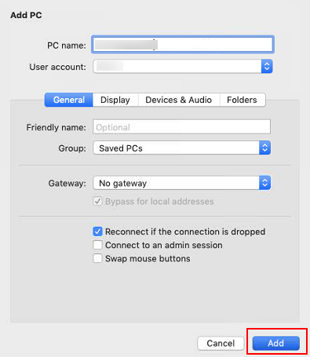
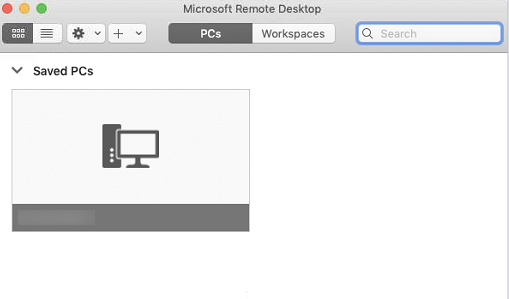
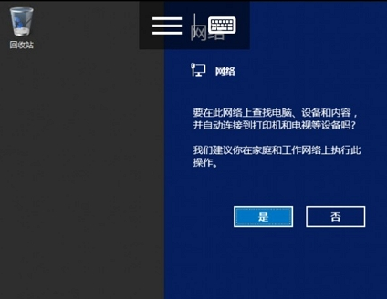

# 远程登录Windows弹性云服务器（通过macOS系统主机）

## 操作场景

本节操作以使用“Microsoft Remote Desktop for Mac”工具远程连接“Windows Server 2012 R2 数据中心版 64位”操作系统云服务器为例，介绍macOS系统登录Windows云服务器的操作步骤。

## 前提条件

-   云服务器状态为“运行中”。
-   已获取Windows云服务器用户名和密码。忘记密码请参考[在控制台重置弹性云服务器密码](在控制台重置弹性云服务器密码.md)重置密码。
-   弹性云服务器已经绑定弹性公网IP，绑定方式请参见[绑定弹性公网IP](绑定弹性公网IP.md)。

-   所在安全组入方向已开放3389端口，配置方式请参见[配置安全组规则](配置安全组规则.md)。
-   已安装Microsoft Remote Desktop for Mac或其他macOS系统适用的远程连接工具。[下载Microsoft Remote Desktop for Mac](https://docs.microsoft.com/zh-cn/windows-server/remote/remote-desktop-services/clients/remote-desktop-mac)。

    微软官方已停止提供Remote Desktop客户端的下载链接，您可单击[Microsoft Remote Desktop Beta](https://install.appcenter.ms/orgs/rdmacios-k2vy/apps/microsoft-remote-desktop-for-mac/distribution_groups/all-users-of-microsoft-remote-desktop-for-mac)下载Beta版本使用。

## 操作步骤

1.  启动Microsoft Remote Desktop。
2.  单击“Add Desktop”。

    **图 1**  Add Desktop  
    

3.  在“Add PC”页面，设置登录信息。
    -   PC name：输入需要登录的Windows实例的弹性公网IP地址。
    -   User account：在下拉列表中选择“Add user account”。

        弹出“Add user account”对话框。

        1.  输入Windows实例账号“administrator”，并输入实例的登录密码，单击“Add”。

            **图 2**  Add user account  
            

            **图 3**  Add PC  
            

4.  在“Remote Desktop”页面，双击需要登录的Windows实例图标。

    **图 4**  双击登录Windows实例  
    

5.  确认信息后，单击“Continue”。

    至此，您已经登录Windows实例。

    **图 5**  登录成功  
    

