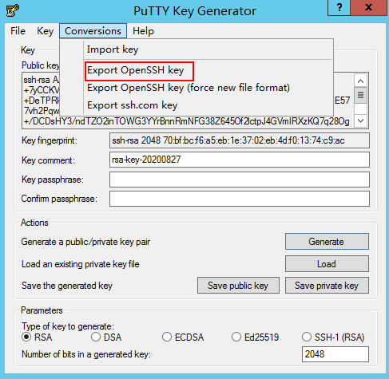

# 通过puttygen.exe工具创建密钥对

## 操作场景

您可以通过puttygen.exe工具创建密钥对，创建完成后，公钥和私钥均保存在用户本地。

> **说明：** 
>通过puttygen.exe工具创建成功的密钥对，还需要执行[导入密钥对](导入密钥对.md)，导入系统才能正常使用密钥对。

## 操作步骤

1.  在以下路径中下载并安装PuTTY和PuTTYgen。

    [https://www.chiark.greenend.org.uk/\~sgtatham/putty/latest.html](https://www.chiark.greenend.org.uk/~sgtatham/putty/latest.html)

    > **说明：** 
    >PuTTYgen是密钥生成器，用于创建密钥对，生成一对公钥和私钥供PuTTY使用。

2.  生成公钥和私钥文件。
    1.  双击“puttygen.exe”，打开“PuTTY Key Generator”。

        **图 1**  PuTTY Key Generator  
        

    2.  单击“Generate”。

        密钥生成器将自动生成一对公钥和私钥，其中，[图2](#zh-cn_topic_0037960038_fig4678746517750)的红框内容为生成的公钥文件。

        **图 2**  生成公钥和私钥文件  
        

3.  复制红框中的公钥内容，并将其粘贴在文本文档中，以.txt格式保存在本地，保存公钥文件。

    > **说明：** 
    >请勿直接单击“Save public key”保存公钥文件。因为通过puttygen.exe工具的“Save public key”按钮保存在本地的公钥文件，公钥内容的格式会发生变化，不能直接导入管理控制台使用。

4.  保存私钥文件。

    根据不同用途，需将私钥文件保存为不同格式。为保证安全，私钥只能下载一次，请妥善保管。

    -   保存私钥文件为“.ppk“格式。

        当用户使用PuTTY工具登录Linux弹性云服务器时，需使用“.ppk“格式的私钥文件。保存方法如下：

        1.  在“PuTTY Key Generator”界面，选择“File \> Save private key”。

            **图 3**  保存私钥文件  
            

        2.  保存转化后的私钥到本地。例如：kp-123.ppk

    -   保存私钥文件为“.pem“格式。

        当用户使用Xshell工具登录Linux弹性云服务器，或者获取Windows弹性云服务器的密码时，需使用“.pem“格式的私钥文件。保存方法如下：

        1.  选择“Conversions \> Export OpenSSH key”。

            > **说明：** 
            >如果该私钥文件用于Windows弹性云服务器的获取密码操作，在选择“Export OpenSSH key”时，请勿填写“Key passphrase”信息，否则会导致获取密码失败。

            **图 4**  保存私钥文件  
            

        2.  保存私钥到本地。例如：kp-123.pem

5.  公钥和私钥文件按照需要正确保存后，请参见[导入密钥对](导入密钥对.md)的“复制公钥文件内容方式”，将公钥导入系统中。

## 相关操作

-   如果私钥文件丢失，您可以通过“[重置密钥对](https://support.huaweicloud.com/usermanual-dew/dew_01_0039.html)”功能重新配置弹性云服务器的密钥对。
-   如果私钥文件泄露，您可以通过“[替换密钥对](https://support.huaweicloud.com/usermanual-dew/dew_01_0040.html)”功能使用新的密钥对替换弹性云服务器内的公钥。

