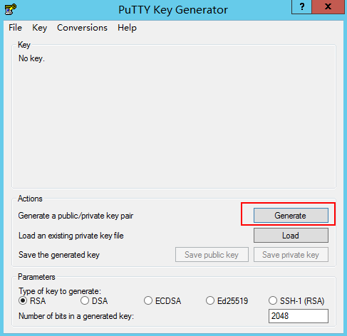

# 通过puttygen.exe工具创建的密钥对，导入管理控制台失败怎么办？

## 问题描述

通过puttygen.exe工具创建的密钥对，在导入管理控制台使用时，系统提示导入公钥文件失败。

## 可能原因

公钥内容的格式不符合系统要求。

当用户使用puttygen.exe工具创建密钥对时，如果使用puttygen.exe工具的“Save public key“按钮保存公钥，公钥内容的格式会发生变化，不能直接导入管理控制台使用。

## 处理方法

使用本地保存的私钥文件，在“PuTTY Key Generator”中恢复内容格式正确的公钥文件，然后再将该公钥文件导入管理控制台。

1.  双击“PUTTYGEN.EXE”，打开“PuTTY Key Generator”。

    **图 1**  PuTTY Key Generator  
    

2.  单击“Load”，并在本地选择该密钥对的私钥文件。

    系统将自动加载该私钥文件，并在“PuTTY Key Generator”中恢复格式正确的公钥文件内容，如[图2](#fig5530274016810)所示，红框中的内容即为符合系统要求的公钥文件。

    **图 2**  恢复公钥文件内容  
    

3.  复制红框中的公钥内容，并将其粘贴在文本文档中，以.txt格式保存在本地，保存公钥文件。
4.  将公钥文件导入管理控制台。
    1.  登录管理控制台。
    2.  选择“计算 \> 弹性云服务器”。
    3.  在左侧导航树中，选择“密钥对”。
    4.  在“密钥对”页面，单击“导入密钥对”。
    5.  将“.txt”格式文本文档中的公钥内容粘贴至“Public Key Content”的空白区域，并单击“OK”，导入公钥文件。

