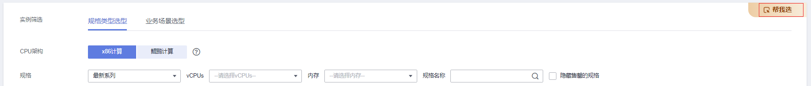
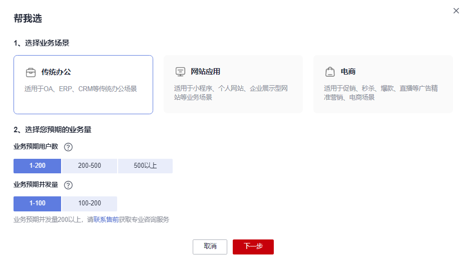
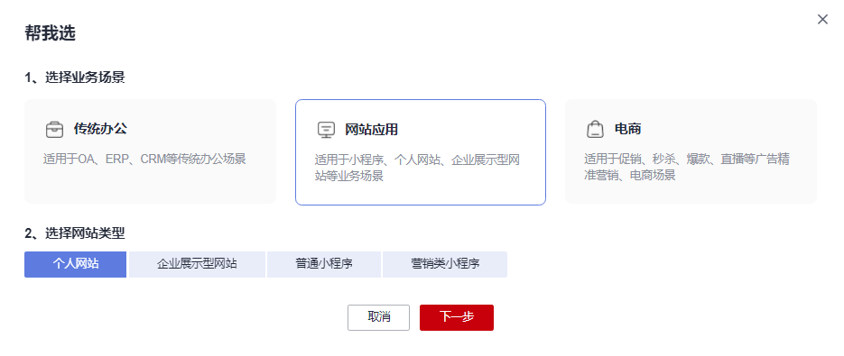
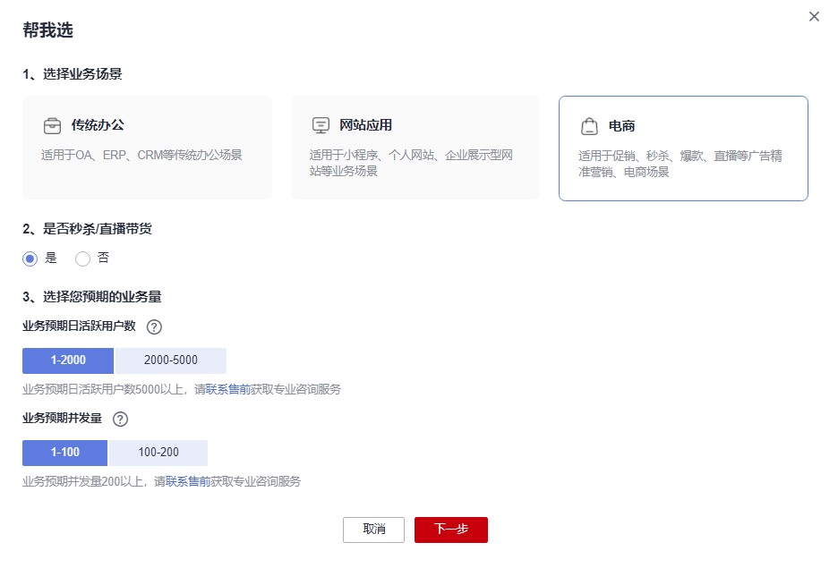

# 通过规格选型引导购买云服务器

## 操作场景

购买弹性云服务器时，您需要根据业务需求指定CPU、内存、规格、操作系统、登录鉴权方式等具体配置。华为云提供了多种实例类型供您选择，不同类型的实例提供不同的计算能力和存储能力。支持的实例类型，请参见[实例类型](https://support.huaweicloud.com/productdesc-ecs/zh-cn_topic_0035470096.html)。

弹性云服务器的“帮我选”功能，提供规格选型引导，针对不同业务场景和预期业务量，进行规格推荐，帮助您快速选择规格。

购买弹性云服务器的详细内容，请参见[自定义购买弹性云服务器](https://support.huaweicloud.com/qs-ecs/ecs_02_0009.html)。本文介绍如何通过“帮我选”的规格选型引导进行规格筛选的操作指导。

## 约束与限制

-   支持传统办公、网站应用、电商等场景的规格选型引导，其他业务场景请在购买页自行选择规格。
-   支持规格选型引导的区域，请参见[功能总览](https://support.huaweicloud.com/function-ecs/index.html)。
-   包年/包月和按需计费的弹性云服务器支持规格选型引导。

## 操作步骤

1.  登录控制台，进入[购买弹性云服务器](https://console.huaweicloud.com/ecm/?locale=zh-cn#/ecs/createVm)页面。
2.  根据业务需要，完成区域、计费模式、可用区等基础配置的设置。
3.  在“实例筛选”区域右上角，单击“帮我选”。

    **图 1**  帮我选  
    

4.  在“帮我选”页面根据业务场景进行设置。
    -   选择“传统办公”业务场景。

        **图 2**  传统办公场景  
        

        1.  设置业务预期用户数：根据登录或使用某软件系统的总用户数量的范围进行设置。
        2.  设置业务预期并发量：根据同一时间，每秒同时访问软件系统的用户数量的范围进行设置。

            如果业务预期并发量达到200以上，请[联系售前](https://www.huaweicloud.com/consultation/?type=ecs)获取专业咨询服务。

        3.  单击“下一步”，在推荐规格中进行选择。
        4.  单击“确认选择”，完成规格设置。

            如果您对推荐规格不满意，还可以在规格列表中直接选择其他规格。

    -   选择“网站应用”业务场景。

        **图 3**  网站应用场景  
        

        1.  根据业务需要，选择对应的网站类型。
        2.  （可选）设置业务预期用户数：根据登录或使用小程序的总用户数量的范围进行设置。

            当“网站类型”选择“营销类小程序”时，该参数可见。

        3.  （可选）设置业务预期并发量：根据同一时间，每秒同时访问小程序的用户数量的范围进行设置。

            当“网站类型”选择“营销类小程序”时，该参数可见。

            如果业务预期并发量达到200以上，请[联系售前](https://www.huaweicloud.com/consultation/?type=ecs)获取专业咨询服务。

        4.  单击“下一步”，在推荐规格中进行选择。
        5.  单击“确认选择”，完成规格设置。

            如果您对推荐规格不满意，还可以在规格列表中直接选择其他规格。

    -   选择“电商”业务场景。

        **图 4**  电商场景  
        

        1.  （可选）若有“秒杀/直播带货”需求，则勾选“是”。
        2.  设置业务预期日活跃用户数：根据日登录或使用电商平台的活跃用户数（去除重复登录的用户）的范围进行设置。

            如果业务预期日活跃用户数达到5000以上，请[联系售前](https://www.huaweicloud.com/consultation/?type=ecs)获取专业咨询服务。

        3.  设置业务预期并发量：根据同一时间，每秒同时访问电商平台的用户数量的范围进行设置。

            如果业务预期并发量达到200以上，请[联系售前](https://www.huaweicloud.com/consultation/?type=ecs)获取专业咨询服务。

        4.  单击“下一步”，在推荐规格中进行选择。
        5.  单击“确认选择”，完成规格设置。

            如果您对推荐规格不满意，还可以在规格列表中直接选择其他规格。

