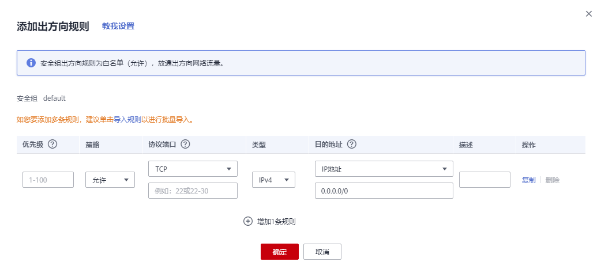
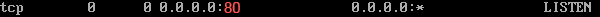

# 配置安全组规则<a name="ZH-CN_TOPIC_0030878383"></a>

## 操作场景<a name="zh-cn_topic_0029320966_section35030493215147"></a>

安全组类似防火墙功能，是一个逻辑上的分组，用于设置网络访问控制。用户可以在安全组中定义各种访问规则，当弹性云服务器加入该安全组后，即受到这些访问规则的保护。

-   入方向：入方向规则放通入方向网络流量，指从外部访问安全组规则下的云服务器。
-   出方向：出方向规则放通出方向网络流量。指安全组规则下的云服务器访问安全组外的实例。

默认安全组规则请参见[默认安全组和规则](https://support.huaweicloud.com/usermanual-vpc/SecurityGroup_0003.html)。常用的安全组规则配置示例请参见[安全组配置示例](安全组配置示例.md)。

## 约束与限制<a name="section15518033133415"></a>

安全组规则目前仅在“华东-上海一”、“华南-广州”、“西南-贵阳一”、“华北-北京四”、“亚太-香港”、“亚太-新加坡”支持拒绝策略、不连续端口号、配置优先级。

## 操作步骤<a name="zh-cn_topic_0029320966_section40712064223843"></a>

1.  登录管理控制台。
2.  单击管理控制台左上角的，选择区域和项目。
3.  选择“计算 \> 弹性云服务器”。
4.  在弹性云服务器列表，单击待变更安全组规则的弹性云服务器名称。

    系统跳转至该弹性云服务器详情页面。

5.  选择“安全组”页签，展开安全组，查看安全组规则。
6.  单击安全组ID。

    系统自动跳转至安全组页面。

7.  在入方向规则页签，单击“添加规则”，添加入方向规则。

    单击“+”可以依次增加多条入方向规则。

    **图 1**  添加入方向规则<a name="zh-cn_topic_0118534005_fig963631116217"></a>  
    

    **表 1**  入方向参数说明

    <a name="zh-cn_topic_0118534005_table111445216564"></a>
    <table><thead align="left"><tr id="zh-cn_topic_0118534005_row1811565205613"><th class="cellrowborder" valign="top" width="12.7%" id="mcps1.2.4.1.1"><p id="zh-cn_topic_0118534005_p51151452125620"><a name="zh-cn_topic_0118534005_p51151452125620"></a><a name="zh-cn_topic_0118534005_p51151452125620"></a>参数</p>
    </th>
    <th class="cellrowborder" valign="top" width="69.3%" id="mcps1.2.4.1.2"><p id="zh-cn_topic_0118534005_p5115552175613"><a name="zh-cn_topic_0118534005_p5115552175613"></a><a name="zh-cn_topic_0118534005_p5115552175613"></a>说明</p>
    </th>
    <th class="cellrowborder" valign="top" width="18%" id="mcps1.2.4.1.3"><p id="zh-cn_topic_0118534005_p711565219563"><a name="zh-cn_topic_0118534005_p711565219563"></a><a name="zh-cn_topic_0118534005_p711565219563"></a>取值样例</p>
    </th>
    </tr>
    </thead>
    <tbody><tr id="zh-cn_topic_0118534005_row194894568113"><td class="cellrowborder" valign="top" width="12.7%" headers="mcps1.2.4.1.1 "><p id="zh-cn_topic_0118534005_p7490135617111"><a name="zh-cn_topic_0118534005_p7490135617111"></a><a name="zh-cn_topic_0118534005_p7490135617111"></a>优先级</p>
    </td>
    <td class="cellrowborder" valign="top" width="69.3%" headers="mcps1.2.4.1.2 "><p id="zh-cn_topic_0118534005_p1395210101245"><a name="zh-cn_topic_0118534005_p1395210101245"></a><a name="zh-cn_topic_0118534005_p1395210101245"></a>安全组规则优先级。目前仅“华东-上海一”、“华南-广州”、“西南-贵阳一”、“华北-北京四”、“亚太-香港”、“亚太-新加坡”支持。</p>
    <p id="zh-cn_topic_0118534005_p94904561715"><a name="zh-cn_topic_0118534005_p94904561715"></a><a name="zh-cn_topic_0118534005_p94904561715"></a>优先级可选范围为1-100，默认值为1，即最高优先级。优先级数字越小，规则优先级级别越高。</p>
    </td>
    <td class="cellrowborder" valign="top" width="18%" headers="mcps1.2.4.1.3 "><p id="zh-cn_topic_0118534005_p849010564113"><a name="zh-cn_topic_0118534005_p849010564113"></a><a name="zh-cn_topic_0118534005_p849010564113"></a>1</p>
    </td>
    </tr>
    <tr id="zh-cn_topic_0118534005_row16943134010710"><td class="cellrowborder" valign="top" width="12.7%" headers="mcps1.2.4.1.1 "><p id="zh-cn_topic_0118534005_p1394314020715"><a name="zh-cn_topic_0118534005_p1394314020715"></a><a name="zh-cn_topic_0118534005_p1394314020715"></a>策略</p>
    </td>
    <td class="cellrowborder" valign="top" width="69.3%" headers="mcps1.2.4.1.2 "><div class="p" id="zh-cn_topic_0118534005_p1194318408718"><a name="zh-cn_topic_0118534005_p1194318408718"></a><a name="zh-cn_topic_0118534005_p1194318408718"></a>安全组规则策略。目前仅“华东-上海一”、“华南-广州”、“西南-贵阳一”、“华北-北京四”、“亚太-香港”、“亚太-新加坡”支持。<a name="zh-cn_topic_0118534005_ul1584517191496"></a><a name="zh-cn_topic_0118534005_ul1584517191496"></a><ul id="zh-cn_topic_0118534005_ul1584517191496"><li>允许：允许该入方向规则访问安全组内云服务器。</li><li>拒绝：拒绝该入方向规则访问安全组内云服务器。</li></ul>
    </div>
    </td>
    <td class="cellrowborder" valign="top" width="18%" headers="mcps1.2.4.1.3 "><p id="zh-cn_topic_0118534005_p149431640575"><a name="zh-cn_topic_0118534005_p149431640575"></a><a name="zh-cn_topic_0118534005_p149431640575"></a>允许</p>
    </td>
    </tr>
    <tr id="zh-cn_topic_0118534005_row9115105219562"><td class="cellrowborder" rowspan="2" valign="top" width="12.7%" headers="mcps1.2.4.1.1 "><p id="zh-cn_topic_0118534005_p151157525565"><a name="zh-cn_topic_0118534005_p151157525565"></a><a name="zh-cn_topic_0118534005_p151157525565"></a>协议端口</p>
    <p id="zh-cn_topic_0118534005_p3510193211510"><a name="zh-cn_topic_0118534005_p3510193211510"></a><a name="zh-cn_topic_0118534005_p3510193211510"></a></p>
    </td>
    <td class="cellrowborder" valign="top" width="69.3%" headers="mcps1.2.4.1.2 "><p id="zh-cn_topic_0118534005_p1711515526562"><a name="zh-cn_topic_0118534005_p1711515526562"></a><a name="zh-cn_topic_0118534005_p1711515526562"></a>网络协议。目前支持“All”、“TCP”、“UDP”、“ICMP”和“GRE”等协议。</p>
    </td>
    <td class="cellrowborder" valign="top" width="18%" headers="mcps1.2.4.1.3 "><p id="zh-cn_topic_0118534005_p193908441914"><a name="zh-cn_topic_0118534005_p193908441914"></a><a name="zh-cn_topic_0118534005_p193908441914"></a>TCP</p>
    </td>
    </tr>
    <tr id="zh-cn_topic_0118534005_row6510532121511"><td class="cellrowborder" valign="top" headers="mcps1.2.4.1.1 "><p id="zh-cn_topic_0118534005_p4115175245613"><a name="zh-cn_topic_0118534005_p4115175245613"></a><a name="zh-cn_topic_0118534005_p4115175245613"></a>端口：允许远端地址访问弹性云服务器指定端口，取值范围为：1～65535。常用端口请参见<a href="https://support.huaweicloud.com/usermanual-vpc/SecurityGroup_0002.html" target="_blank" rel="noopener noreferrer">弹性云服务器常用端口</a>。</p>
    <div class="p" id="zh-cn_topic_0118534005_p099117545530"><a name="zh-cn_topic_0118534005_p099117545530"></a><a name="zh-cn_topic_0118534005_p099117545530"></a>端口填写包括以下形式：<a name="zh-cn_topic_0118534005_ul299114542535"></a><a name="zh-cn_topic_0118534005_ul299114542535"></a><ul id="zh-cn_topic_0118534005_ul299114542535"><li>单个端口：例如22</li><li>连续端口：例如22-30</li><li>多个端口：例如22,23-30，一次最多支持20个不连续端口组， 端口组之间不能重复。目前仅“华东-上海一”、“华南-广州”、“西南-贵阳一”、“华北-北京四”、“亚太-香港”、“亚太-新加坡”支持。</li><li>全部端口：为空或1-65535</li></ul>
    </div>
    </td>
    <td class="cellrowborder" valign="top" headers="mcps1.2.4.1.2 "><p id="zh-cn_topic_0118534005_p1551023251511"><a name="zh-cn_topic_0118534005_p1551023251511"></a><a name="zh-cn_topic_0118534005_p1551023251511"></a>22或22-30或20,22-30</p>
    </td>
    </tr>
    <tr id="zh-cn_topic_0118534005_row1726912412166"><td class="cellrowborder" valign="top" width="12.7%" headers="mcps1.2.4.1.1 "><p id="zh-cn_topic_0118534005_p1826920421620"><a name="zh-cn_topic_0118534005_p1826920421620"></a><a name="zh-cn_topic_0118534005_p1826920421620"></a>类型</p>
    </td>
    <td class="cellrowborder" valign="top" width="69.3%" headers="mcps1.2.4.1.2 "><div class="p" id="zh-cn_topic_0118534005_p1426910441613"><a name="zh-cn_topic_0118534005_p1426910441613"></a><a name="zh-cn_topic_0118534005_p1426910441613"></a>IP地址类型。开通IPv6功能后可见。<a name="zh-cn_topic_0118534005_ul15119151171711"></a><a name="zh-cn_topic_0118534005_ul15119151171711"></a><ul id="zh-cn_topic_0118534005_ul15119151171711"><li>IPv4</li><li>IPv6</li></ul>
    </div>
    </td>
    <td class="cellrowborder" valign="top" width="18%" headers="mcps1.2.4.1.3 "><p id="zh-cn_topic_0118534005_p848952751718"><a name="zh-cn_topic_0118534005_p848952751718"></a><a name="zh-cn_topic_0118534005_p848952751718"></a>IPv4</p>
    </td>
    </tr>
    <tr id="zh-cn_topic_0118534005_row511615528561"><td class="cellrowborder" valign="top" width="12.7%" headers="mcps1.2.4.1.1 "><p id="zh-cn_topic_0118534005_p86899991813"><a name="zh-cn_topic_0118534005_p86899991813"></a><a name="zh-cn_topic_0118534005_p86899991813"></a>源地址</p>
    </td>
    <td class="cellrowborder" valign="top" width="69.3%" headers="mcps1.2.4.1.2 "><div class="p" id="zh-cn_topic_0118534005_p18116175212564"><a name="zh-cn_topic_0118534005_p18116175212564"></a><a name="zh-cn_topic_0118534005_p18116175212564"></a>源地址：可以是IP地址、安全组、IP地址组。用于放通来自IP地址或另一安全组内的实例的访问。例如：<a name="zh-cn_topic_0118534005_ul12116352195619"></a><a name="zh-cn_topic_0118534005_ul12116352195619"></a><ul id="zh-cn_topic_0118534005_ul12116352195619"><li>单个IP地址：192.168.10.10/32（IPv4地址）；2002:50::44/127（IPv6地址）</li><li>IP地址段：192.168.1.0/24（IPv4地址段）；2407:c080:802:469::/64（IPv6地址段）</li><li>所有IP地址：0.0.0.0/0（IPv4任意地址）；::/0（IPv6任意地址）</li><li>安全组：sg-abc</li><li>IP地址组：ipGroup-test</li></ul>
    </div>
    <p id="zh-cn_topic_0118534005_p19481656542"><a name="zh-cn_topic_0118534005_p19481656542"></a><a name="zh-cn_topic_0118534005_p19481656542"></a>更多IP地址组信息，请参见<a href="https://support.huaweicloud.com/usermanual-vpc/vpc_IPAddressGroup_0002.html" target="_blank" rel="noopener noreferrer">IP地址组</a>。</p>
    </td>
    <td class="cellrowborder" valign="top" width="18%" headers="mcps1.2.4.1.3 "><p id="zh-cn_topic_0118534005_p611613524569"><a name="zh-cn_topic_0118534005_p611613524569"></a><a name="zh-cn_topic_0118534005_p611613524569"></a>0.0.0.0/0</p>
    </td>
    </tr>
    <tr id="zh-cn_topic_0118534005_row111615525565"><td class="cellrowborder" valign="top" width="12.7%" headers="mcps1.2.4.1.1 "><p id="zh-cn_topic_0118534005_p1711655217565"><a name="zh-cn_topic_0118534005_p1711655217565"></a><a name="zh-cn_topic_0118534005_p1711655217565"></a>描述</p>
    </td>
    <td class="cellrowborder" valign="top" width="69.3%" headers="mcps1.2.4.1.2 "><p id="zh-cn_topic_0118534005_p1211611525564"><a name="zh-cn_topic_0118534005_p1211611525564"></a><a name="zh-cn_topic_0118534005_p1211611525564"></a>安全组规则的描述信息，非必填项。</p>
    <p id="zh-cn_topic_0118534005_p6116175225613"><a name="zh-cn_topic_0118534005_p6116175225613"></a><a name="zh-cn_topic_0118534005_p6116175225613"></a>描述信息内容不能超过255个字符，且不能包含“&lt;”和“&gt;”。</p>
    </td>
    <td class="cellrowborder" valign="top" width="18%" headers="mcps1.2.4.1.3 "><p id="zh-cn_topic_0118534005_p3116115216568"><a name="zh-cn_topic_0118534005_p3116115216568"></a><a name="zh-cn_topic_0118534005_p3116115216568"></a>-</p>
    </td>
    </tr>
    </tbody>
    </table>

8.  在出方向规则页签，单击“添加规则”，添加出方向规则。

    单击“+”可以依次增加多条出方向规则。

    **图 2**  添加出方向规则<a name="zh-cn_topic_0118534005_fig4319183518281"></a>  
    

    **表 2**  出方向参数说明

    <a name="zh-cn_topic_0118534005_table0614192319232"></a>
    <table><thead align="left"><tr id="zh-cn_topic_0118534005_row19614623202312"><th class="cellrowborder" valign="top" width="12.6%" id="mcps1.2.4.1.1"><p id="zh-cn_topic_0118534005_p361592319230"><a name="zh-cn_topic_0118534005_p361592319230"></a><a name="zh-cn_topic_0118534005_p361592319230"></a>参数</p>
    </th>
    <th class="cellrowborder" valign="top" width="69.39999999999999%" id="mcps1.2.4.1.2"><p id="zh-cn_topic_0118534005_p1961514231232"><a name="zh-cn_topic_0118534005_p1961514231232"></a><a name="zh-cn_topic_0118534005_p1961514231232"></a>说明</p>
    </th>
    <th class="cellrowborder" valign="top" width="18%" id="mcps1.2.4.1.3"><p id="zh-cn_topic_0118534005_p1061552372311"><a name="zh-cn_topic_0118534005_p1061552372311"></a><a name="zh-cn_topic_0118534005_p1061552372311"></a>取值样例</p>
    </th>
    </tr>
    </thead>
    <tbody><tr id="zh-cn_topic_0118534005_row176159232238"><td class="cellrowborder" valign="top" width="12.6%" headers="mcps1.2.4.1.1 "><p id="zh-cn_topic_0118534005_p461592313236"><a name="zh-cn_topic_0118534005_p461592313236"></a><a name="zh-cn_topic_0118534005_p461592313236"></a>优先级</p>
    </td>
    <td class="cellrowborder" valign="top" width="69.39999999999999%" headers="mcps1.2.4.1.2 "><p id="zh-cn_topic_0118534005_p56151523172318"><a name="zh-cn_topic_0118534005_p56151523172318"></a><a name="zh-cn_topic_0118534005_p56151523172318"></a>安全组规则优先级。目前仅“华东-上海一”、“华南-广州”、“西南-贵阳一”、“华北-北京四”、“亚太-香港”、“亚太-新加坡”支持。</p>
    <p id="zh-cn_topic_0118534005_p206155235231"><a name="zh-cn_topic_0118534005_p206155235231"></a><a name="zh-cn_topic_0118534005_p206155235231"></a>优先级可选范围为1-100，默认值为1，即最高优先级。优先级数字越小，规则优先级级别越高。</p>
    </td>
    <td class="cellrowborder" valign="top" width="18%" headers="mcps1.2.4.1.3 "><p id="zh-cn_topic_0118534005_p1361515237237"><a name="zh-cn_topic_0118534005_p1361515237237"></a><a name="zh-cn_topic_0118534005_p1361515237237"></a>1</p>
    </td>
    </tr>
    <tr id="zh-cn_topic_0118534005_row96151423132318"><td class="cellrowborder" valign="top" width="12.6%" headers="mcps1.2.4.1.1 "><p id="zh-cn_topic_0118534005_p186151423182317"><a name="zh-cn_topic_0118534005_p186151423182317"></a><a name="zh-cn_topic_0118534005_p186151423182317"></a>策略</p>
    </td>
    <td class="cellrowborder" valign="top" width="69.39999999999999%" headers="mcps1.2.4.1.2 "><div class="p" id="zh-cn_topic_0118534005_p11615132310232"><a name="zh-cn_topic_0118534005_p11615132310232"></a><a name="zh-cn_topic_0118534005_p11615132310232"></a>安全组规则策略。目前仅“华东-上海一”、“华南-广州”、“西南-贵阳一”、“华北-北京四”、“亚太-香港”、“亚太-新加坡”支持。<a name="zh-cn_topic_0118534005_ul06151723202313"></a><a name="zh-cn_topic_0118534005_ul06151723202313"></a><ul id="zh-cn_topic_0118534005_ul06151723202313"><li>允许：允许安全组内的服务器按照该出方向规则进行出网访问</li><li>拒绝：拒绝安全组内的服务器按照该出方向规则进行出网访问。</li></ul>
    </div>
    </td>
    <td class="cellrowborder" valign="top" width="18%" headers="mcps1.2.4.1.3 "><p id="zh-cn_topic_0118534005_p196161230233"><a name="zh-cn_topic_0118534005_p196161230233"></a><a name="zh-cn_topic_0118534005_p196161230233"></a>允许</p>
    </td>
    </tr>
    <tr id="zh-cn_topic_0118534005_row76161523132311"><td class="cellrowborder" rowspan="2" valign="top" width="12.6%" headers="mcps1.2.4.1.1 "><p id="zh-cn_topic_0118534005_p1761652313238"><a name="zh-cn_topic_0118534005_p1761652313238"></a><a name="zh-cn_topic_0118534005_p1761652313238"></a>协议端口</p>
    <p id="zh-cn_topic_0118534005_p4616323182310"><a name="zh-cn_topic_0118534005_p4616323182310"></a><a name="zh-cn_topic_0118534005_p4616323182310"></a></p>
    </td>
    <td class="cellrowborder" valign="top" width="69.39999999999999%" headers="mcps1.2.4.1.2 "><p id="zh-cn_topic_0118534005_p1461632352313"><a name="zh-cn_topic_0118534005_p1461632352313"></a><a name="zh-cn_topic_0118534005_p1461632352313"></a>网络协议。目前支持“All”、“TCP”、“UDP”、“ICMP”和“GRE”等协议。</p>
    </td>
    <td class="cellrowborder" valign="top" width="18%" headers="mcps1.2.4.1.3 "><p id="zh-cn_topic_0118534005_p157082238193"><a name="zh-cn_topic_0118534005_p157082238193"></a><a name="zh-cn_topic_0118534005_p157082238193"></a>TCP</p>
    </td>
    </tr>
    <tr id="zh-cn_topic_0118534005_row5616723112313"><td class="cellrowborder" valign="top" headers="mcps1.2.4.1.1 "><p id="zh-cn_topic_0118534005_p761613239235"><a name="zh-cn_topic_0118534005_p761613239235"></a><a name="zh-cn_topic_0118534005_p761613239235"></a>端口：允许弹性云服务器访问远端地址的指定端口，取值范围为：1～65535。常用端口请参见<a href="https://support.huaweicloud.com/usermanual-vpc/SecurityGroup_0002.html" target="_blank" rel="noopener noreferrer">弹性云服务器常用端口</a>。</p>
    <div class="p" id="zh-cn_topic_0118534005_p13146251369"><a name="zh-cn_topic_0118534005_p13146251369"></a><a name="zh-cn_topic_0118534005_p13146251369"></a>端口填写包括以下形式：<a name="zh-cn_topic_0118534005_zh-cn_topic_0118534005_ul299114542535"></a><a name="zh-cn_topic_0118534005_zh-cn_topic_0118534005_ul299114542535"></a><ul id="zh-cn_topic_0118534005_zh-cn_topic_0118534005_ul299114542535"><li>单个端口：例如22</li><li>连续端口：例如22-30</li><li>多个端口：例如22,23-30，一次最多支持20个不连续端口组， 端口组之间不能重复。目前仅“华东-上海一”、“华南-广州”、“西南-贵阳一”、“华北-北京四”、“亚太-香港”、“亚太-新加坡”支持。</li><li>全部端口：为空或1-65535</li></ul>
    </div>
    </td>
    <td class="cellrowborder" valign="top" headers="mcps1.2.4.1.2 "><p id="zh-cn_topic_0118534005_p12616182311235"><a name="zh-cn_topic_0118534005_p12616182311235"></a><a name="zh-cn_topic_0118534005_p12616182311235"></a>22或22-30或20,22-30</p>
    </td>
    </tr>
    <tr id="zh-cn_topic_0118534005_row86161423202313"><td class="cellrowborder" valign="top" width="12.6%" headers="mcps1.2.4.1.1 "><p id="zh-cn_topic_0118534005_p12616122316237"><a name="zh-cn_topic_0118534005_p12616122316237"></a><a name="zh-cn_topic_0118534005_p12616122316237"></a>类型</p>
    </td>
    <td class="cellrowborder" valign="top" width="69.39999999999999%" headers="mcps1.2.4.1.2 "><div class="p" id="zh-cn_topic_0118534005_p1261622319232"><a name="zh-cn_topic_0118534005_p1261622319232"></a><a name="zh-cn_topic_0118534005_p1261622319232"></a>IP地址类型。开通IPv6功能后可见。<a name="zh-cn_topic_0118534005_ul3617202310239"></a><a name="zh-cn_topic_0118534005_ul3617202310239"></a><ul id="zh-cn_topic_0118534005_ul3617202310239"><li>IPv4</li><li>IPv6</li></ul>
    </div>
    </td>
    <td class="cellrowborder" valign="top" width="18%" headers="mcps1.2.4.1.3 "><p id="zh-cn_topic_0118534005_p186177239234"><a name="zh-cn_topic_0118534005_p186177239234"></a><a name="zh-cn_topic_0118534005_p186177239234"></a>IPv4</p>
    </td>
    </tr>
    <tr id="zh-cn_topic_0118534005_row2617112315232"><td class="cellrowborder" valign="top" width="12.6%" headers="mcps1.2.4.1.1 "><p id="zh-cn_topic_0118534005_p15617623172315"><a name="zh-cn_topic_0118534005_p15617623172315"></a><a name="zh-cn_topic_0118534005_p15617623172315"></a>目的地址</p>
    </td>
    <td class="cellrowborder" valign="top" width="69.39999999999999%" headers="mcps1.2.4.1.2 "><div class="p" id="zh-cn_topic_0118534005_p196171823152315"><a name="zh-cn_topic_0118534005_p196171823152315"></a><a name="zh-cn_topic_0118534005_p196171823152315"></a>目的地址：可以是IP地址、安全组、IP地址组。允许访问目的IP地址或另一安全组内的实例。例如：<a name="zh-cn_topic_0118534005_ul16177237233"></a><a name="zh-cn_topic_0118534005_ul16177237233"></a><ul id="zh-cn_topic_0118534005_ul16177237233"><li>单个IP地址：192.168.10.10/32（IPv4地址）；2002:50::44/127（IPv6地址）</li><li>IP地址段：192.168.1.0/24（IPv4地址段）；2407:c080:802:469::/64（IPv6地址段）</li><li>所有IP地址：0.0.0.0/0（IPv4任意地址）；::/0（IPv6任意地址）</li><li>安全组：sg-abc</li><li>IP地址组：ipGroup-test</li></ul>
    </div>
    <p id="zh-cn_topic_0118534005_p8286143314117"><a name="zh-cn_topic_0118534005_p8286143314117"></a><a name="zh-cn_topic_0118534005_p8286143314117"></a>更多IP地址组信息，请参见<a href="https://support.huaweicloud.com/usermanual-vpc/vpc_IPAddressGroup_0002.html" target="_blank" rel="noopener noreferrer">IP地址组</a>。</p>
    </td>
    <td class="cellrowborder" valign="top" width="18%" headers="mcps1.2.4.1.3 "><p id="zh-cn_topic_0118534005_p4617102352310"><a name="zh-cn_topic_0118534005_p4617102352310"></a><a name="zh-cn_topic_0118534005_p4617102352310"></a>0.0.0.0/0</p>
    </td>
    </tr>
    <tr id="zh-cn_topic_0118534005_row196181723162317"><td class="cellrowborder" valign="top" width="12.6%" headers="mcps1.2.4.1.1 "><p id="zh-cn_topic_0118534005_p2061811237237"><a name="zh-cn_topic_0118534005_p2061811237237"></a><a name="zh-cn_topic_0118534005_p2061811237237"></a>描述</p>
    </td>
    <td class="cellrowborder" valign="top" width="69.39999999999999%" headers="mcps1.2.4.1.2 "><p id="zh-cn_topic_0118534005_p0618182392312"><a name="zh-cn_topic_0118534005_p0618182392312"></a><a name="zh-cn_topic_0118534005_p0618182392312"></a>安全组规则的描述信息，非必填项。</p>
    <p id="zh-cn_topic_0118534005_p16618823192317"><a name="zh-cn_topic_0118534005_p16618823192317"></a><a name="zh-cn_topic_0118534005_p16618823192317"></a>描述信息内容不能超过255个字符，且不能包含“&lt;”和“&gt;”。</p>
    </td>
    <td class="cellrowborder" valign="top" width="18%" headers="mcps1.2.4.1.3 "><p id="zh-cn_topic_0118534005_p20618623202311"><a name="zh-cn_topic_0118534005_p20618623202311"></a><a name="zh-cn_topic_0118534005_p20618623202311"></a>-</p>
    </td>
    </tr>
    </tbody>
    </table>

9.  单击“确定”，完成安全组规则配置。

## 结果验证<a name="section9615121151715"></a>

安全组规则配置完成后，我们需要验证对应的规则是否生效。假设您在弹性云服务器上部署了网站，希望用户能通过TCP（80端口）访问到您的网站，您添加了一条入方向规则，如[表3](#zh-cn_topic_0118534005_table30323767195135)所示。

**表 3**  安全组规则

<a name="zh-cn_topic_0118534005_table30323767195135"></a>
<table><thead align="left"><tr id="zh-cn_topic_0118534005_row15770184195135"><th class="cellrowborder" valign="top" width="14.821482148214821%" id="mcps1.2.5.1.1"><p id="zh-cn_topic_0118534005_p53423553195135"><a name="zh-cn_topic_0118534005_p53423553195135"></a><a name="zh-cn_topic_0118534005_p53423553195135"></a>方向</p>
</th>
<th class="cellrowborder" valign="top" width="25.962596259625965%" id="mcps1.2.5.1.2"><p id="zh-cn_topic_0118534005_p2316559195135"><a name="zh-cn_topic_0118534005_p2316559195135"></a><a name="zh-cn_topic_0118534005_p2316559195135"></a>协议/应用</p>
</th>
<th class="cellrowborder" valign="top" width="31.203120312031203%" id="mcps1.2.5.1.3"><p id="zh-cn_topic_0118534005_p32340552195135"><a name="zh-cn_topic_0118534005_p32340552195135"></a><a name="zh-cn_topic_0118534005_p32340552195135"></a>端口</p>
</th>
<th class="cellrowborder" valign="top" width="28.012801280128013%" id="mcps1.2.5.1.4"><p id="zh-cn_topic_0118534005_p2339084195135"><a name="zh-cn_topic_0118534005_p2339084195135"></a><a name="zh-cn_topic_0118534005_p2339084195135"></a>源地址</p>
</th>
</tr>
</thead>
<tbody><tr id="zh-cn_topic_0118534005_row55248116195135"><td class="cellrowborder" valign="top" width="14.821482148214821%" headers="mcps1.2.5.1.1 "><p id="zh-cn_topic_0118534005_p27918930195135"><a name="zh-cn_topic_0118534005_p27918930195135"></a><a name="zh-cn_topic_0118534005_p27918930195135"></a>入方向</p>
</td>
<td class="cellrowborder" valign="top" width="25.962596259625965%" headers="mcps1.2.5.1.2 "><p id="zh-cn_topic_0118534005_p45912425195135"><a name="zh-cn_topic_0118534005_p45912425195135"></a><a name="zh-cn_topic_0118534005_p45912425195135"></a>TCP</p>
</td>
<td class="cellrowborder" valign="top" width="31.203120312031203%" headers="mcps1.2.5.1.3 "><p id="zh-cn_topic_0118534005_p46840856195135"><a name="zh-cn_topic_0118534005_p46840856195135"></a><a name="zh-cn_topic_0118534005_p46840856195135"></a>80</p>
</td>
<td class="cellrowborder" valign="top" width="28.012801280128013%" headers="mcps1.2.5.1.4 "><p id="zh-cn_topic_0118534005_p36012962195135"><a name="zh-cn_topic_0118534005_p36012962195135"></a><a name="zh-cn_topic_0118534005_p36012962195135"></a>0.0.0.0/0</p>
</td>
</tr>
</tbody>
</table>

**Linux弹性云服务器**

Linux弹性云服务器上验证该安全组规则是否生效的步骤如下所示。

1.  登录弹性云服务器。
2.  运行如下命令查看TCP 80端口是否被监听。

    ```
    netstat -an | grep 80
    ```

    如果返回结果如[图3](#zh-cn_topic_0118534005_fig783561113312)所示，说明TCP 80端口已开通。

    **图 3**  Linux TCP 80端口验证结果<a name="zh-cn_topic_0118534005_fig783561113312"></a>  
    

3.  在浏览器地址栏里输入“http://弹性云服务器的弹性公网IP地址”。

    如果访问成功，说明安全组规则已经生效。


**Windows**弹性云服务器

Windows弹性云服务器上验证该安全组规则是否生效的步骤如下所示。

1.  登录弹性云服务器。
2.  选择“开始 \> 附件 \> 命令提示符”。
3.  运行如下命令查看TCP 80端口是否被监听。

    ```
    netstat -an | findstr 80
    ```

    如果返回结果如[图4](#zh-cn_topic_0118534005_fig937451791814)所示，说明TCP 80端口已开通。

    **图 4**  Windows TCP 80端口验证结果<a name="zh-cn_topic_0118534005_fig937451791814"></a>  
    

4.  在浏览器地址栏里输入“http://弹性云服务器的弹性公网IP地址”。

    如果访问成功，说明安全组规则已经生效。


