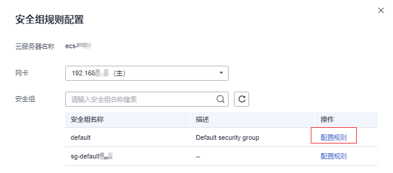
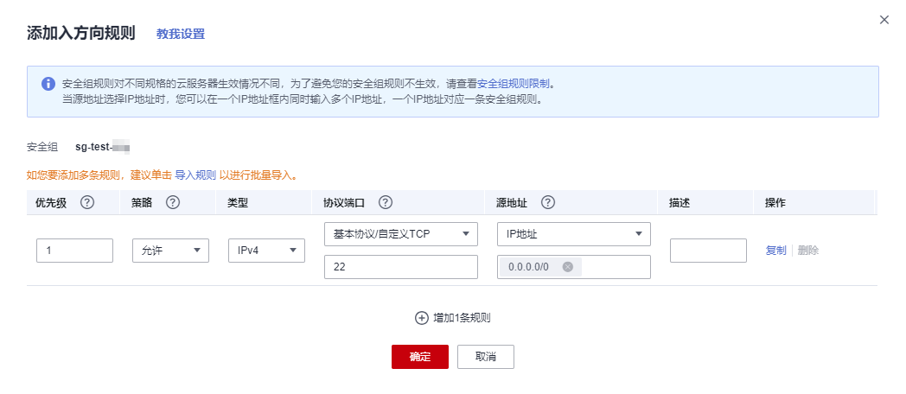

# 配置安全组规则

## 操作场景

安全组类似防火墙功能，是一个逻辑上的分组，用于设置网络访问控制。用户可以在安全组中定义各种访问规则，当弹性云服务器加入该安全组后，即受到这些访问规则的保护。

-   入方向规则：放通入方向网络流量，指从外部访问安全组规则下的云服务器。
-   出方向规则：放通出方向网络流量。指安全组规则下的云服务器访问安全组外的实例。

默认安全组规则请参见[默认安全组和规则](https://support.huaweicloud.com/usermanual-vpc/SecurityGroup_0003.html)。常用的安全组规则配置示例请参见[安全组配置示例](安全组配置示例.md)。

## 操作步骤

1.  登录管理控制台。
2.  单击管理控制台左上角的，选择区域和项目。
3.  单击“”，选择“计算 \> 弹性云服务器”。
4.  在待配置安全组规则的弹性云服务器的“操作”列，单击“网络/安全组 \> 安全组规则配置”。
5.  在“安全组规则配置”页面的安全组列表中，单击待配置安全组规则的安全组“操作”列的“配置规则”。

    **图 1**  配置规则  
    

6.  根据界面提示，设置入方向规则参数。

    单击“+”按钮，可以依次增加多条入方向规则。

    **图 2**  添加安全组入方向规则  
    

    **表 1**  入方向规则参数说明

    
    <table><thead align="left"><tr id="zh-cn_topic_0118534005_row1811565205613"><th class="cellrowborder" valign="top" width="12.67%" id="mcps1.2.4.1.1">
参数

    </th>
    <th class="cellrowborder" valign="top" width="69.33%" id="mcps1.2.4.1.2">
说明

    </th>
    <th class="cellrowborder" valign="top" width="18%" id="mcps1.2.4.1.3">
取值样例

    </th>
    </tr>
    </thead>
    <tbody><tr id="zh-cn_topic_0118534005_row194894568113"><td class="cellrowborder" valign="top" width="12.67%" headers="mcps1.2.4.1.1 ">
优先级

    </td>
    <td class="cellrowborder" valign="top" width="69.33%" headers="mcps1.2.4.1.2 ">
安全组规则优先级。

    
优先级可选范围为1-100，默认值为1，即最高优先级。优先级数字越小，规则优先级级别越高。

    </td>
    <td class="cellrowborder" valign="top" width="18%" headers="mcps1.2.4.1.3 ">
1

    </td>
    </tr>
    <tr id="zh-cn_topic_0118534005_row16943134010710"><td class="cellrowborder" valign="top" width="12.67%" headers="mcps1.2.4.1.1 ">
策略

    </td>
    <td class="cellrowborder" valign="top" width="69.33%" headers="mcps1.2.4.1.2 ">
安全组规则策略，支持的策略如下：<ul id="zh-cn_topic_0118534005_ul490721712116"><li>如果“策略”设置为允许，表示允许源地址访问安全组内云服务器的指定端口。</li><li>如果“策略”设置为拒绝，表示拒绝源地址访问安全组内云服务器的指定端口。</li></ul>
    

    
安全组规则匹配流量时，首先按照优先级进行排序，其次按照策略排序，拒绝策略高于允许策略，更多信息请参见<a href="https://support.huaweicloud.com/usermanual-vpc/zh-cn_topic_0073379079.html#zh-cn_topic_0073379079__section1642813131307" target="_blank" rel="noopener noreferrer">流量匹配安全组规则的顺序</a>。

    </td>
    <td class="cellrowborder" valign="top" width="18%" headers="mcps1.2.4.1.3 ">
允许

    </td>
    </tr>
    <tr id="zh-cn_topic_0118534005_row204071594597"><td class="cellrowborder" valign="top" width="12.67%" headers="mcps1.2.4.1.1 ">
类型

    </td>
    <td class="cellrowborder" valign="top" width="69.33%" headers="mcps1.2.4.1.2 ">
源地址支持的IP地址类型，如下：<ul id="zh-cn_topic_0118534005_ul15119151171711"><li>IPv4</li><li>IPv6</li></ul>
    

    </td>
    <td class="cellrowborder" valign="top" width="18%" headers="mcps1.2.4.1.3 ">
IPv4

    </td>
    </tr>
    <tr id="zh-cn_topic_0118534005_row9115105219562"><td class="cellrowborder" rowspan="2" valign="top" width="12.67%" headers="mcps1.2.4.1.1 ">
协议端口

    </td>
    <td class="cellrowborder" valign="top" width="69.33%" headers="mcps1.2.4.1.2 ">
安全组规则中用来匹配流量的网络协议类型，目前支持TCP、UDP、ICMP和GRE协议。

    </td>
    <td class="cellrowborder" valign="top" width="18%" headers="mcps1.2.4.1.3 ">
TCP

    </td>
    </tr>
    <tr id="zh-cn_topic_0118534005_row6510532121511"><td class="cellrowborder" valign="top" headers="mcps1.2.4.1.1 ">
安全组规则中用来匹配流量的目的端口，取值范围为：1～65535。

    
在入方向规则中，表示外部访问安全组内实例的指定端口。

    
端口填写支持下格式：<ul id="zh-cn_topic_0118534005_ul299114542535"><li>单个端口：例如22</li><li>连续端口：例如22-30</li><li>多个端口：例如22,23-30，一次最多支持20个不连续端口组， 端口组之间不能重复。</li><li>全部端口：为空或1-65535</li></ul>
    

    </td>
    <td class="cellrowborder" valign="top" headers="mcps1.2.4.1.2 ">
22或22-30或20,22-30

    </td>
    </tr>
    <tr id="zh-cn_topic_0118534005_row46951748825"><td class="cellrowborder" valign="top" width="12.67%" headers="mcps1.2.4.1.1 ">
源地址

    </td>
    <td class="cellrowborder" valign="top" width="69.33%" headers="mcps1.2.4.1.2 ">
在入方向规则中，用来匹配外部请求的源地址，支持以下格式：<ul id="zh-cn_topic_0118534005_ul14767152702818"><li>IP地址：表示源地址为某个固定的IP地址。当源地址选择IP地址时，您可以在一个IP地址框内同时输入多个IP地址，一个IP地址对应一条安全组规则。<ul id="zh-cn_topic_0118534005_ul878112011314"><li>单个IP地址：IP地址/掩码。
单个IPv4地址示例为192.168.10.10/32。

    
单个IPv6地址示例为2002:50::44/128。

    </li><li>IP网段：IP地址/掩码。
IPv4网段示例为192.168.52.0/24。

    
IPv6网段示例为2407:c080:802:469::/64。

    </li><li>所有IP地址：
0.0.0.0/0表示匹配所有IPv4地址。

    
::/0表示匹配所有IPv6地址。

    </li></ul>
    </li><li>安全组：表示源地址为另外一个安全组，您可以在下拉列表中，选择同一个区域内的其他安全组。当安全组A内有实例a，安全组B内有实例b，在安全组A的入方向规则中，放通源地址为安全组B的流量，则来自实例b的内网访问请求被允许进入实例a。</li><li>IP地址组：表示源地址为一个IP地址组，IP地址组是一个或者多个IP地址的集合。您可以在下拉列表中，选择可用的IP地址组。对于安全策略相同的IP网段和IP地址，此处建议您使用IP地址组简化管理。</li></ul>
    

    </td>
    <td class="cellrowborder" valign="top" width="18%" headers="mcps1.2.4.1.3 ">
IP地址：0.0.0.0/0

    </td>
    </tr>
    <tr id="zh-cn_topic_0118534005_row111615525565"><td class="cellrowborder" valign="top" width="12.67%" headers="mcps1.2.4.1.1 ">
描述

    </td>
    <td class="cellrowborder" valign="top" width="69.33%" headers="mcps1.2.4.1.2 ">
安全组规则的描述信息，非必填项。

    
描述信息内容不能超过255个字符，且不能包含“&lt;”和“&gt;”。

    </td>
    <td class="cellrowborder" valign="top" width="18%" headers="mcps1.2.4.1.3 ">
-

    </td>
    </tr>
    </tbody>
    </table>

7.  根据界面提示，设置出方向规则参数。

    单击“+”按钮，可以依次增加多条出方向规则。

    **图 3**  添加安全组出方向规则  
    

    **表 2**  出方向规则参数说明

    
    <table><thead align="left"><tr id="zh-cn_topic_0118534005_row19614623202312"><th class="cellrowborder" valign="top" width="12.33%" id="mcps1.2.4.1.1">
参数

    </th>
    <th class="cellrowborder" valign="top" width="69.67%" id="mcps1.2.4.1.2">
说明

    </th>
    <th class="cellrowborder" valign="top" width="18%" id="mcps1.2.4.1.3">
取值样例

    </th>
    </tr>
    </thead>
    <tbody><tr id="zh-cn_topic_0118534005_row176159232238"><td class="cellrowborder" valign="top" width="12.33%" headers="mcps1.2.4.1.1 ">
优先级

    </td>
    <td class="cellrowborder" valign="top" width="69.67%" headers="mcps1.2.4.1.2 ">
安全组规则优先级。

    
优先级可选范围为1-100，默认值为1，即最高优先级。优先级数字越小，规则优先级级别越高。

    </td>
    <td class="cellrowborder" valign="top" width="18%" headers="mcps1.2.4.1.3 ">
1

    </td>
    </tr>
    <tr id="zh-cn_topic_0118534005_row96151423132318"><td class="cellrowborder" valign="top" width="12.33%" headers="mcps1.2.4.1.1 ">
策略

    </td>
    <td class="cellrowborder" valign="top" width="69.67%" headers="mcps1.2.4.1.2 ">
安全组规则策略，支持的策略如下：<ul id="zh-cn_topic_0118534005_ul1357316358171"><li>如果“策略”设置为允许，表示允许安全组内的云服务器访问目的地址的指定端口。</li><li>如果“策略”设置为拒绝，表示拒绝安全组内的云服务器访问目的地址的指定端口。</li></ul>
    

    
安全组规则匹配流量时，首先按照优先级进行排序，其次按照策略排序，拒绝策略高于允许策略，更多信息请参见<a href="https://support.huaweicloud.com/usermanual-vpc/zh-cn_topic_0073379079.html#zh-cn_topic_0073379079__section1642813131307" target="_blank" rel="noopener noreferrer">流量匹配安全组规则的顺序</a>。

    </td>
    <td class="cellrowborder" valign="top" width="18%" headers="mcps1.2.4.1.3 ">
允许

    </td>
    </tr>
    <tr id="zh-cn_topic_0118534005_row104061251445"><td class="cellrowborder" valign="top" width="12.33%" headers="mcps1.2.4.1.1 ">
类型

    </td>
    <td class="cellrowborder" valign="top" width="69.67%" headers="mcps1.2.4.1.2 ">
目的地址支持的IP地址类型，如下：<ul id="zh-cn_topic_0118534005_ul55664554418"><li>IPv4</li><li>IPv6</li></ul>
    

    </td>
    <td class="cellrowborder" valign="top" width="18%" headers="mcps1.2.4.1.3 ">
IPv4

    </td>
    </tr>
    <tr id="zh-cn_topic_0118534005_row76161523132311"><td class="cellrowborder" rowspan="2" valign="top" width="12.33%" headers="mcps1.2.4.1.1 ">
协议端口

    

    </td>
    <td class="cellrowborder" valign="top" width="69.67%" headers="mcps1.2.4.1.2 ">
安全组规则中用来匹配流量的网络协议类型，目前支持TCP、UDP、ICMP和GRE协议。

    </td>
    <td class="cellrowborder" valign="top" width="18%" headers="mcps1.2.4.1.3 ">
TCP

    </td>
    </tr>
    <tr id="zh-cn_topic_0118534005_row5616723112313"><td class="cellrowborder" valign="top" headers="mcps1.2.4.1.1 ">
安全组规则中用来匹配流量的目的端口，取值范围为：1～65535。

    
在出方向规则中，表示安全组内实例访问外部地址的指定端口。

    
端口填写支持下格式：<ul id="zh-cn_topic_0118534005_zh-cn_topic_0118534005_ul299114542535"><li>单个端口：例如22</li><li>连续端口：例如22-30</li><li>多个端口：例如22,23-30，一次最多支持20个不连续端口组， 端口组之间不能重复。</li><li>全部端口：为空或1-65535</li></ul>
    

    </td>
    <td class="cellrowborder" valign="top" headers="mcps1.2.4.1.2 ">
22或22-30或20,22-30

    </td>
    </tr>
    <tr id="zh-cn_topic_0118534005_row15702123318456"><td class="cellrowborder" valign="top" width="12.33%" headers="mcps1.2.4.1.1 ">
目的地址

    </td>
    <td class="cellrowborder" valign="top" width="69.67%" headers="mcps1.2.4.1.2 ">
在出方向规则中，用来匹配内部请求的目的地址。支持以下格式：<ul id="zh-cn_topic_0118534005_ul16898144344515"><li>IP地址：表示目的地址为某个固定的IP地址。当目的地址选择IP地址时，您可以在一个IP地址框内同时输入多个IP地址，一个IP地址对应一条安全组规则。<ul id="zh-cn_topic_0118534005_ul178981243184520"><li>单个IP地址：IP地址/掩码。
单个IPv4地址示例为192.168.10.10/32。

    
单个IPv6地址示例为2002:50::44/128。

    </li><li>IP网段：IP地址/掩码。
IPv4网段示例为192.168.52.0/24。

    
IPv6网段示例为2407:c080:802:469::/64。

    </li><li>所有IP地址：
0.0.0.0/0表示匹配所有IPv4地址。

    
::/0表示匹配所有IPv6地址。

    </li></ul>
    </li><li>安全组：表示目的地址为另外一个安全组，您可以在下拉列表中，选择当前账号下，同一个区域内的其他安全组。当安全组A内有实例a，安全组B内有实例b，在安全组A的出方向规则放通目的地址为安全组B的流量，则实例a访问实例b的内网请求被允许流出。</li><li>IP地址组：表示目的地址为一个IP地址组，IP地址组是一个或者多个IP地址的集合。您可以在下拉列表中，选择可用的IP地址组。对于安全策略相同的IP网段和IP地址，此处建议您使用IP地址组简化管理。</li></ul>
    

    </td>
    <td class="cellrowborder" valign="top" width="18%" headers="mcps1.2.4.1.3 ">
IP地址：0.0.0.0/0

    </td>
    </tr>
    <tr id="zh-cn_topic_0118534005_row196181723162317"><td class="cellrowborder" valign="top" width="12.33%" headers="mcps1.2.4.1.1 ">
描述

    </td>
    <td class="cellrowborder" valign="top" width="69.67%" headers="mcps1.2.4.1.2 ">
安全组规则的描述信息，非必填项。

    
描述信息内容不能超过255个字符，且不能包含“&lt;”和“&gt;”。

    </td>
    <td class="cellrowborder" valign="top" width="18%" headers="mcps1.2.4.1.3 ">
-

    </td>
    </tr>
    </tbody>
    </table>

8.  单击“确定”，完成安全组规则配置。

## 检查安全组规则是否生效

在安全组规则中放开某个端口后，您还需要确保实例内对应的端口也已经放通，安全组规则才会对实例生效。

假设您在某台ECS上部署了网站，希望用户能通过HTTP\(80\)端口访问到您的网站，则您需要先在ECS所在安全组的入方向中，添加[表3](#zh-cn_topic_0118534005_table30323767195135)中的规则，放通HTTP\(80\)端口。

**表 3**  安全组规则示例

<table><thead align="left"><tr id="zh-cn_topic_0118534005_row15770184195135"><th class="cellrowborder" valign="top" width="12.938706129387059%" id="mcps1.2.7.1.1">
方向

</th>
<th class="cellrowborder" valign="top" width="13.298670132986704%" id="mcps1.2.7.1.2">
优先级

</th>
<th class="cellrowborder" valign="top" width="15.508449155084492%" id="mcps1.2.7.1.3">
策略

</th>
<th class="cellrowborder" valign="top" width="11.70882911708829%" id="mcps1.2.7.1.4">
类型

</th>
<th class="cellrowborder" valign="top" width="20.64793520647935%" id="mcps1.2.7.1.5">
协议端口

</th>
<th class="cellrowborder" valign="top" width="25.8974102589741%" id="mcps1.2.7.1.6">
源地址

</th>
</tr>
</thead>
<tbody><tr id="zh-cn_topic_0118534005_row55248116195135"><td class="cellrowborder" valign="top" width="12.938706129387059%" headers="mcps1.2.7.1.1 ">
入方向

</td>
<td class="cellrowborder" valign="top" width="13.298670132986704%" headers="mcps1.2.7.1.2 ">
1

</td>
<td class="cellrowborder" valign="top" width="15.508449155084492%" headers="mcps1.2.7.1.3 ">
允许

</td>
<td class="cellrowborder" valign="top" width="11.70882911708829%" headers="mcps1.2.7.1.4 ">
IPv4

</td>
<td class="cellrowborder" valign="top" width="20.64793520647935%" headers="mcps1.2.7.1.5 ">
自定义TCP: 80

</td>
<td class="cellrowborder" valign="top" width="25.8974102589741%" headers="mcps1.2.7.1.6 ">
IP地址：0.0.0.0/0

</td>
</tr>
</tbody>
</table>

安全组规则添加完成后，您需要执行以下操作，检查云服务器内端口开放情况，并验证配置是否生效。

1.  登录云服务器，检查云服务器端口开放情况。
    -   **检查Linux云服务器端口**

        执行以下命令，查看TCP 80端口是否被监听。

        **netstat -an | grep 80**

        若回显类似[图4](#zh-cn_topic_0118534005_fig783561113312)，说明80端口已开通。

        **图 4**  Linux TCP 80端口验证结果  
        

    -   **检查Windows云服务器端口**
        1.  通过“开始菜单 \> 运行 \> cmd”，打开命令执行窗口。
        2.  执行以下命令，查看TCP 80端口是否被监听。

            **netstat -an | findstr 80**

            若回显类似[图5](#zh-cn_topic_0118534005_fig937451791814)，说明TCP 80端口已开通。

            **图 5**  Windows TCP 80端口验证结果  
            

2.  打开浏览器，在地址栏里输入“http://云服务器的弹性公网IP地址”。

    如果访问成功，说明安全组规则已经生效。

