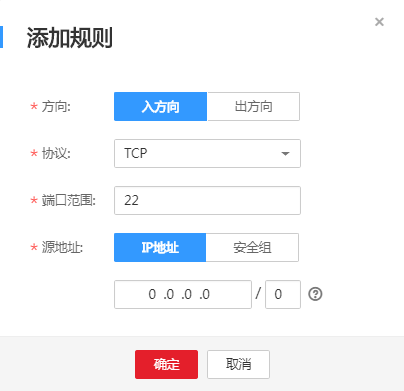

# 配置安全组规则

## 操作场景

首次创建弹性云服务器时，如果用户未配置过VPC，系统将会创建默认VPC。由于默认VPC的安全组策略为组内互通、禁止外部访问，即外部网络无法访问弹性云服务器，因此如果需要使用远程方式访问安全组内的弹性云服务器，就需要配置安全组入方向的访问规则。本节介绍了配置安全组规则的方法。

## 操作步骤

1.  登录管理控制台。
2.  选择“计算 \> 弹性云服务器”。
3.  在弹性云服务器列表，单击待变更安全组规则的弹性云服务器名称。

    系统跳转至该弹性云服务器详情页面。

4.  选择“安全组”页签，并单击，查看安全组规则。
5.  单击安全组ID。

    系统自动跳转至安全组页面。

6.  在“入方向”页签下，单击“操作”列下的“删除”，删除“入方向”规则。
7.  单击“添加规则”，配置安全组入方向的访问规则。
    -   Windows系统的弹性云服务器，“协议”项的参数值为“TCP”，需要开放**3389**端口。

        **图 1**  Windows云服务器安全组规则  
        

    -   Linux系统的弹性云服务器，“协议”项的参数值为“TCP”，需要开放**22**端口。

        **图 2**  Linux云服务器安全组规则  
        

    -   根据业务需要，将源地址设置为允许已知IP地址所在的网段访问该安全组。

        > **说明：**   
        >如果将源地址设置为默认的0.0.0.0/0，指允许所有IP地址访问安全组内的弹性云服务器。  

8.  单击“确定”，完成安全组规则配置。

