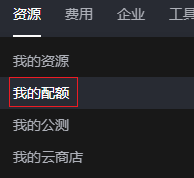

# 配额

## 操作场景

为防止资源滥用，平台限定了各服务资源的配额，如不同的规格最多支持创建的弹性云服务器数量可能不同。如果有需要，您可以申请扩大配额。

本节指导您如何查询指定区域下，弹性云服务器各资源的使用情况，以及总配额。

## 操作步骤

1.  登录管理控制台。
2.  单击管理控制台左上角的，选择区域和项目。
3.  在页面右上角，选择“资源 \> 我的配额”。

    系统进入“服务配额”页面。

    **图 1**  我的配额  
    

4.  您可以在“服务配额”页面，查看弹性云服务器各项资源的总配额、及使用情况。

    如果当前配额不能满足业务要求，请单击“申请扩大配额”，根据指导进行调整。

