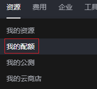

# 配额调整

## 操作场景

为防止资源滥用，平台限定了各服务资源的配额，如不同的规格最多支持创建的云服务器数量可能不同。如果有需要，您可以申请扩大配额。

本节指导您如何查询指定区域下，云服务器各资源的使用情况，以及总配额。

## 操作步骤

1.  登录管理控制台。
2.  单击管理控制台左上角的，选择区域和项目。
3.  在页面右上角，选择“资源 \> 我的配额”。

    系统进入“服务配额”页面。

    **图 1**  我的配额  
    

4.  您可以在“服务配额”页面，查看各项资源的总配额、及使用情况。

    如果当前配额不能满足业务要求，请单击“申请扩大配额”。

## 如何申请扩大配额？

1.  登录管理控制台。
2.  在页面右上角，选择“资源 \> 我的配额”。

    系统进入“服务配额”页面。

    **图 2**  我的配额  
    

3.  单击“申请扩大配额”。
4.  在“新建工单”页面，根据您的需求，填写相关参数。

    其中，“问题描述”项请填写需要调整的内容和申请原因。

5.  填写完毕后，勾选协议并单击“提交”。

