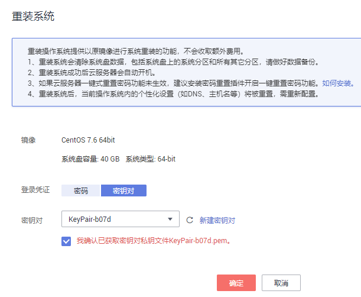

# 重装操作系统

## 操作场景

弹性云服务器操作系统无法正常启动时，或云服务器系统运行正常，但需要对系统进行优化，使其在最优状态下工作时，用户可以使用重装弹性云服务器的操作系统功能。

## 约束与限制

-   云硬盘的配额需大于0。
-   如果是通过私有镜像创建的弹性云服务器，请确保原有镜像仍存在。
-   如果原有云服务器计费方式为按需模式，请确认账户余额充足。
-   H2型弹性云服务器不支持操作系统的重装功能。

## 前提条件

-   待重装操作系统的弹性云服务器处于“关机”状态或“重装失败”状态。
-   待重装操作系统的弹性云服务器挂载有系统盘。
-   重装操作系统会清除系统盘数据，包括系统盘上的系统分区和所有其它分区，请做好数据备份。

## 操作步骤

1.  登录管理控制台。
2.  单击管理控制台左上角的，选择区域和项目。
3.  选择“计算 \> 弹性云服务器”。
4.  在待重装操作系统的弹性云服务器的“操作”列下，单击“更多 \> 重装系统”。

    只有关机状态的弹性云服务器才能重装系统。如果弹性云服务器不是关机状态，请先关机。

5.  设置登录方式。

    如果待重装操作系统的弹性云服务器是使用密钥登录方式创建的，此时可以更换使用新密钥。

    **图 1**  重装操作系统  
    

6.  单击“确定”。
7.  在“弹性云服务器重装系统”页面，确认重装的操作系统规格无误后，阅读并勾选“我已经阅读并同意《华为弹性云服务器服务协议》”，单击“提交申请”。

    提交重装系统的申请后，弹性云服务器的状态变为“重装中”，当该状态消失后，表示重装结束。

    > **说明：**   
    >重装系统过程中，会创建一台临时弹性云服务器，重装系统结束后会自动删除。在重装操作系统过程中请不要对该弹性云服务器进行任何操作。  

## 后续处理

如果操作系统重装失败，页面会提示重装操作系统失败。公有云平台支持重试功能，用户可重新执行[3](#li20776247143354)-[7](#li31062819143541)，重装弹性云服务器的操作系统。

重试后，如果仍未成功，可直接联系客服，客服会在后台进行人工恢复。

