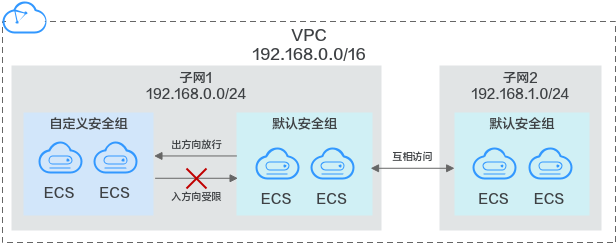

# 默认安全组和规则

系统会为每个用户创建一个默认安全组，默认安全组规则说明如下：

-   出方向报文放行：默认安全组内的实例可以对其他安全组内的实例发起请求，并收到响应。
-   入方向报文受限：来自其他安全组内实例的请求会被默认安全组拦截。

如[图1](#fig11890174421819)所示。

**图 1**  默认安全组  

默认安全组Sys-default规则如[表1](#table1580115155277)所示：

**表 1**  默认安全组规则

<table><thead align="left"><tr id="zh-cn_topic_0118534003_row15801415182713"><th class="cellrowborder" valign="top" width="9.629999999999999%" id="mcps1.2.8.1.1">
方向

</th>
<th class="cellrowborder" valign="top" width="9.74%" id="mcps1.2.8.1.2">
优先级

</th>
<th class="cellrowborder" valign="top" width="8.85%" id="mcps1.2.8.1.3">
策略

</th>
<th class="cellrowborder" valign="top" width="9.74%" id="mcps1.2.8.1.4">
协议

</th>
<th class="cellrowborder" valign="top" width="12.21%" id="mcps1.2.8.1.5">
端口范围

</th>
<th class="cellrowborder" valign="top" width="20.53%" id="mcps1.2.8.1.6">
目的地址/源地址

</th>
<th class="cellrowborder" valign="top" width="29.299999999999997%" id="mcps1.2.8.1.7">
说明

</th>
</tr>
</thead>
<tbody><tr id="zh-cn_topic_0118534003_row1280251562712"><td class="cellrowborder" valign="top" width="9.629999999999999%" headers="mcps1.2.8.1.1 ">
出方向

</td>
<td class="cellrowborder" valign="top" width="9.74%" headers="mcps1.2.8.1.2 ">
100

</td>
<td class="cellrowborder" valign="top" width="8.85%" headers="mcps1.2.8.1.3 ">
允许

</td>
<td class="cellrowborder" valign="top" width="9.74%" headers="mcps1.2.8.1.4 ">
全部

</td>
<td class="cellrowborder" valign="top" width="12.21%" headers="mcps1.2.8.1.5 ">
全部

</td>
<td class="cellrowborder" valign="top" width="20.53%" headers="mcps1.2.8.1.6 ">
目的地址：0.0.0.0/0

</td>
<td class="cellrowborder" valign="top" width="29.299999999999997%" headers="mcps1.2.8.1.7 ">
允许所有出站流量的数据报文通过。

</td>
</tr>
<tr id="zh-cn_topic_0118534003_row1980261512714"><td class="cellrowborder" valign="top" width="9.629999999999999%" headers="mcps1.2.8.1.1 ">
入方向

</td>
<td class="cellrowborder" valign="top" width="9.74%" headers="mcps1.2.8.1.2 ">
100

</td>
<td class="cellrowborder" valign="top" width="8.85%" headers="mcps1.2.8.1.3 ">
允许

</td>
<td class="cellrowborder" valign="top" width="9.74%" headers="mcps1.2.8.1.4 ">
全部

</td>
<td class="cellrowborder" valign="top" width="12.21%" headers="mcps1.2.8.1.5 ">
全部

</td>
<td class="cellrowborder" valign="top" width="20.53%" headers="mcps1.2.8.1.6 ">
源地址：当前安全组名称

</td>
<td class="cellrowborder" valign="top" width="29.299999999999997%" headers="mcps1.2.8.1.7 ">
允许同样使用当前安全组的云服务器之间通过任意端口和规则互访。

</td>
</tr>
<tr id="zh-cn_topic_0118534003_row1680231514278"><td class="cellrowborder" valign="top" width="9.629999999999999%" headers="mcps1.2.8.1.1 ">
入方向

</td>
<td class="cellrowborder" valign="top" width="9.74%" headers="mcps1.2.8.1.2 ">
100

</td>
<td class="cellrowborder" valign="top" width="8.85%" headers="mcps1.2.8.1.3 ">
允许

</td>
<td class="cellrowborder" valign="top" width="9.74%" headers="mcps1.2.8.1.4 ">
TCP

</td>
<td class="cellrowborder" valign="top" width="12.21%" headers="mcps1.2.8.1.5 ">
22

</td>
<td class="cellrowborder" valign="top" width="20.53%" headers="mcps1.2.8.1.6 ">
源地址：0.0.0.0/0

</td>
<td class="cellrowborder" valign="top" width="29.299999999999997%" headers="mcps1.2.8.1.7 ">
允许所有IP地址通过SSH远程连接到Linux云服务器。

</td>
</tr>
<tr id="zh-cn_topic_0118534003_row0011153117"><td class="cellrowborder" valign="top" width="9.629999999999999%" headers="mcps1.2.8.1.1 ">
入方向

</td>
<td class="cellrowborder" valign="top" width="9.74%" headers="mcps1.2.8.1.2 ">
100

</td>
<td class="cellrowborder" valign="top" width="8.85%" headers="mcps1.2.8.1.3 ">
允许

</td>
<td class="cellrowborder" valign="top" width="9.74%" headers="mcps1.2.8.1.4 ">
TCP

</td>
<td class="cellrowborder" valign="top" width="12.21%" headers="mcps1.2.8.1.5 ">
3389

</td>
<td class="cellrowborder" valign="top" width="20.53%" headers="mcps1.2.8.1.6 ">
源地址：0.0.0.0/0

</td>
<td class="cellrowborder" valign="top" width="29.299999999999997%" headers="mcps1.2.8.1.7 ">
允许所有IP地址通过RDP远程连接到Windows云服务器。

</td>
</tr>
</tbody>
</table>

首次创建弹性云服务器，系统新建虚拟私有云vpc-default时会默认新建两个Sys-WebServer和Sys-FullAccess的安全组，对应开放的安全组规则如下所示。

**表 2**  Sys-WebServer安全组规则

<table><thead align="left"><tr id="row4595112010541"><th class="cellrowborder" valign="top" width="10.639999999999999%" id="mcps1.2.6.1.1">
方向

</th>
<th class="cellrowborder" valign="top" width="9.370000000000001%" id="mcps1.2.6.1.2">
协议

</th>
<th class="cellrowborder" valign="top" width="11.05%" id="mcps1.2.6.1.3">
端口范围

</th>
<th class="cellrowborder" valign="top" width="30.409999999999997%" id="mcps1.2.6.1.4">
目的地址/源地址

</th>
<th class="cellrowborder" valign="top" width="38.53%" id="mcps1.2.6.1.5">
说明

</th>
</tr>
</thead>
<tbody><tr id="row95972205543"><td class="cellrowborder" valign="top" width="10.639999999999999%" headers="mcps1.2.6.1.1 ">
出方向

</td>
<td class="cellrowborder" valign="top" width="9.370000000000001%" headers="mcps1.2.6.1.2 ">
全部

</td>
<td class="cellrowborder" valign="top" width="11.05%" headers="mcps1.2.6.1.3 ">
全部

</td>
<td class="cellrowborder" valign="top" width="30.409999999999997%" headers="mcps1.2.6.1.4 ">
目的地址：0.0.0.0/0

</td>
<td class="cellrowborder" valign="top" width="38.53%" headers="mcps1.2.6.1.5 ">
允许所有出站流量的数据报文通过。

</td>
</tr>
<tr id="row145981920115413"><td class="cellrowborder" valign="top" width="10.639999999999999%" headers="mcps1.2.6.1.1 ">
入方向

</td>
<td class="cellrowborder" valign="top" width="9.370000000000001%" headers="mcps1.2.6.1.2 ">
全部

</td>
<td class="cellrowborder" valign="top" width="11.05%" headers="mcps1.2.6.1.3 ">
全部

</td>
<td class="cellrowborder" valign="top" width="30.409999999999997%" headers="mcps1.2.6.1.4 ">
源地址：当前安全组(例如：sg-<em id="i1659813209542">xxxxx</em>)

</td>
<td class="cellrowborder" valign="top" width="38.53%" headers="mcps1.2.6.1.5 ">
仅允许安全组内的云服务器彼此通信，丢弃其他入站流量的全部数据报文。

</td>
</tr>
<tr id="row135981620195410"><td class="cellrowborder" valign="top" width="10.639999999999999%" headers="mcps1.2.6.1.1 ">
入方向

</td>
<td class="cellrowborder" valign="top" width="9.370000000000001%" headers="mcps1.2.6.1.2 ">
TCP

</td>
<td class="cellrowborder" valign="top" width="11.05%" headers="mcps1.2.6.1.3 ">
22

</td>
<td class="cellrowborder" valign="top" width="30.409999999999997%" headers="mcps1.2.6.1.4 ">
源地址：0.0.0.0/0

</td>
<td class="cellrowborder" valign="top" width="38.53%" headers="mcps1.2.6.1.5 ">
允许所有IP地址通过SSH远程连接到Linux云服务器。

</td>
</tr>
<tr id="row2598122016542"><td class="cellrowborder" valign="top" width="10.639999999999999%" headers="mcps1.2.6.1.1 ">
入方向

</td>
<td class="cellrowborder" valign="top" width="9.370000000000001%" headers="mcps1.2.6.1.2 ">
TCP

</td>
<td class="cellrowborder" valign="top" width="11.05%" headers="mcps1.2.6.1.3 ">
3389

</td>
<td class="cellrowborder" valign="top" width="30.409999999999997%" headers="mcps1.2.6.1.4 ">
源地址：0.0.0.0/0

</td>
<td class="cellrowborder" valign="top" width="38.53%" headers="mcps1.2.6.1.5 ">
允许所有IP地址通过RDP远程连接到Windows云服务器。

</td>
</tr>
<tr id="row1349285055516"><td class="cellrowborder" valign="top" width="10.639999999999999%" headers="mcps1.2.6.1.1 ">
入方向

</td>
<td class="cellrowborder" valign="top" width="9.370000000000001%" headers="mcps1.2.6.1.2 ">
ICMP

</td>
<td class="cellrowborder" valign="top" width="11.05%" headers="mcps1.2.6.1.3 ">
全部

</td>
<td class="cellrowborder" valign="top" width="30.409999999999997%" headers="mcps1.2.6.1.4 ">
源地址：0.0.0.0/0

</td>
<td class="cellrowborder" valign="top" width="38.53%" headers="mcps1.2.6.1.5 ">
允许Ping命令。

</td>
</tr>
<tr id="row5675212561"><td class="cellrowborder" valign="top" width="10.639999999999999%" headers="mcps1.2.6.1.1 ">
入方向

</td>
<td class="cellrowborder" valign="top" width="9.370000000000001%" headers="mcps1.2.6.1.2 ">
TCP

</td>
<td class="cellrowborder" valign="top" width="11.05%" headers="mcps1.2.6.1.3 ">
443

</td>
<td class="cellrowborder" valign="top" width="30.409999999999997%" headers="mcps1.2.6.1.4 ">
源地址：0.0.0.0/0

</td>
<td class="cellrowborder" valign="top" width="38.53%" headers="mcps1.2.6.1.5 ">
网页浏览端口,主要是用于HTTPS服务。

</td>
</tr>
</tbody>
</table>

**表 3**  Sys-FullAccess安全组规则

<table><thead align="left"><tr id="row1742863485420"><th class="cellrowborder" valign="top" width="10.77%" id="mcps1.2.6.1.1">
方向

</th>
<th class="cellrowborder" valign="top" width="8.94%" id="mcps1.2.6.1.2">
协议

</th>
<th class="cellrowborder" valign="top" width="11.35%" id="mcps1.2.6.1.3">
端口范围

</th>
<th class="cellrowborder" valign="top" width="30.580000000000002%" id="mcps1.2.6.1.4">
目的地址/源地址

</th>
<th class="cellrowborder" valign="top" width="38.36%" id="mcps1.2.6.1.5">
说明

</th>
</tr>
</thead>
<tbody><tr id="row9428334185418"><td class="cellrowborder" valign="top" width="10.77%" headers="mcps1.2.6.1.1 ">
出方向

</td>
<td class="cellrowborder" valign="top" width="8.94%" headers="mcps1.2.6.1.2 ">
全部

</td>
<td class="cellrowborder" valign="top" width="11.35%" headers="mcps1.2.6.1.3 ">
全部

</td>
<td class="cellrowborder" valign="top" width="30.580000000000002%" headers="mcps1.2.6.1.4 ">
目的地址：0.0.0.0/0

</td>
<td class="cellrowborder" valign="top" width="38.36%" headers="mcps1.2.6.1.5 ">
允许所有出站流量的数据报文通过。

</td>
</tr>
<tr id="row24281034185416"><td class="cellrowborder" valign="top" width="10.77%" headers="mcps1.2.6.1.1 ">
入方向

</td>
<td class="cellrowborder" valign="top" width="8.94%" headers="mcps1.2.6.1.2 ">
全部

</td>
<td class="cellrowborder" valign="top" width="11.35%" headers="mcps1.2.6.1.3 ">
全部

</td>
<td class="cellrowborder" valign="top" width="30.580000000000002%" headers="mcps1.2.6.1.4 ">
源地址：当前安全组(例如：sg-<em id="i942812343544">xxxxx</em>)

</td>
<td class="cellrowborder" valign="top" width="38.36%" headers="mcps1.2.6.1.5 ">
仅允许安全组内的云服务器彼此通信，丢弃其他入站流量的全部数据报文。

</td>
</tr>
<tr id="row13428934175416"><td class="cellrowborder" valign="top" width="10.77%" headers="mcps1.2.6.1.1 ">
入方向

</td>
<td class="cellrowborder" valign="top" width="8.94%" headers="mcps1.2.6.1.2 ">
全部

</td>
<td class="cellrowborder" valign="top" width="11.35%" headers="mcps1.2.6.1.3 ">
全部

</td>
<td class="cellrowborder" valign="top" width="30.580000000000002%" headers="mcps1.2.6.1.4 ">
源地址：0.0.0.0/0

</td>
<td class="cellrowborder" valign="top" width="38.36%" headers="mcps1.2.6.1.5 ">
允许所有入站流量的数据报文通过。

</td>
</tr>
</tbody>
</table>

