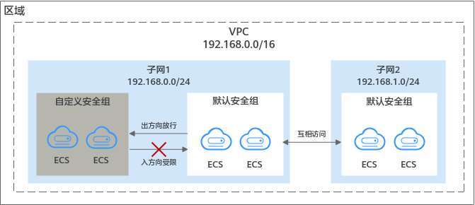

# 默认安全组和规则

默认安全组规则说明如下：

-   入方向规则：入方向流量受限，只允许安全组内实例互通，拒绝来自安全组外部的所有请求进入实例。
-   出方向规则：出方向流量放行，允许所有请求从安全组内实例流出。

如[图1](#fig11890174421819)所示。

**图 1**  默认安全组  

> **说明：** 
>-   默认安全组名称为default，默认安全组和您创建的自定义安全组均不收取费用。
>-   您无法删除默认安全组，可以在默认安全组内修改已有规则或者添加新的规则。
>-   默认安全组是为了简化您初次创建实例的流程，系统为您自动创建的。默认安全组拒绝所有外部请求，如果您需要登录实例，请参见[通过本地服务器远程登录云服务器](安全组配置示例.md#zh-cn_topic_0118534011_section14933617154810)添加安全组规则。

默认安全组规则如[表1](#table1580115155277)所示：

**表 1**  默认安全组规则

<table><thead align="left"><tr id="zh-cn_topic_0118534003_row422689223"><th class="cellrowborder" valign="top" width="11.17%" id="mcps1.2.7.1.1">
规则方向

</th>
<th class="cellrowborder" valign="top" width="6.83%" id="mcps1.2.7.1.2">
策略

</th>
<th class="cellrowborder" valign="top" width="7.51%" id="mcps1.2.7.1.3">
类型

</th>
<th class="cellrowborder" valign="top" width="9.969999999999999%" id="mcps1.2.7.1.4">
协议端口

</th>
<th class="cellrowborder" valign="top" width="18.69%" id="mcps1.2.7.1.5">
源地址/目的地址

</th>
<th class="cellrowborder" valign="top" width="45.83%" id="mcps1.2.7.1.6">
描述

</th>
</tr>
</thead>
<tbody><tr id="zh-cn_topic_0118534003_row17226899214"><td class="cellrowborder" valign="top" width="11.17%" headers="mcps1.2.7.1.1 ">
入方向规则

</td>
<td class="cellrowborder" valign="top" width="6.83%" headers="mcps1.2.7.1.2 ">
允许

</td>
<td class="cellrowborder" valign="top" width="7.51%" headers="mcps1.2.7.1.3 ">
IPv4

</td>
<td class="cellrowborder" valign="top" width="9.969999999999999%" headers="mcps1.2.7.1.4 ">
全部

</td>
<td class="cellrowborder" valign="top" width="18.69%" headers="mcps1.2.7.1.5 ">
源地址：默认安全组（default）

</td>
<td class="cellrowborder" valign="top" width="45.83%" headers="mcps1.2.7.1.6 ">
针对全部IPv4协议，允许安全组内的实例可使用任何协议和端口互相通信，确保安全组内实例网络互通。

</td>
</tr>
<tr id="zh-cn_topic_0118534003_row152581149173415"><td class="cellrowborder" valign="top" width="11.17%" headers="mcps1.2.7.1.1 ">
入方向规则

</td>
<td class="cellrowborder" valign="top" width="6.83%" headers="mcps1.2.7.1.2 ">
允许

</td>
<td class="cellrowborder" valign="top" width="7.51%" headers="mcps1.2.7.1.3 ">
IPv6

</td>
<td class="cellrowborder" valign="top" width="9.969999999999999%" headers="mcps1.2.7.1.4 ">
全部

</td>
<td class="cellrowborder" valign="top" width="18.69%" headers="mcps1.2.7.1.5 ">
源地址：默认安全组（default）

</td>
<td class="cellrowborder" valign="top" width="45.83%" headers="mcps1.2.7.1.6 ">
针对全部IPv6协议，允许安全组内的实例可使用任何协议和端口互相通信，确保安全组内实例网络互通。

</td>
</tr>
<tr id="zh-cn_topic_0118534003_row1622669025"><td class="cellrowborder" valign="top" width="11.17%" headers="mcps1.2.7.1.1 ">
出方向规则

</td>
<td class="cellrowborder" valign="top" width="6.83%" headers="mcps1.2.7.1.2 ">
允许

</td>
<td class="cellrowborder" valign="top" width="7.51%" headers="mcps1.2.7.1.3 ">
IPv4

</td>
<td class="cellrowborder" valign="top" width="9.969999999999999%" headers="mcps1.2.7.1.4 ">
全部

</td>
<td class="cellrowborder" valign="top" width="18.69%" headers="mcps1.2.7.1.5 ">
目的地址：0.0.0.0/0

</td>
<td class="cellrowborder" valign="top" width="45.83%" headers="mcps1.2.7.1.6 ">
针对全部IPv4协议，允许所有流量从安全组内实例流出，即实例可访问外部任意IP和端口。

</td>
</tr>
<tr id="zh-cn_topic_0118534003_row1974265394319"><td class="cellrowborder" valign="top" width="11.17%" headers="mcps1.2.7.1.1 ">
出方向规则

</td>
<td class="cellrowborder" valign="top" width="6.83%" headers="mcps1.2.7.1.2 ">
允许

</td>
<td class="cellrowborder" valign="top" width="7.51%" headers="mcps1.2.7.1.3 ">
IPv6

</td>
<td class="cellrowborder" valign="top" width="9.969999999999999%" headers="mcps1.2.7.1.4 ">
全部

</td>
<td class="cellrowborder" valign="top" width="18.69%" headers="mcps1.2.7.1.5 ">
目的地址：::/0

</td>
<td class="cellrowborder" valign="top" width="45.83%" headers="mcps1.2.7.1.6 ">
针对全部IPv6协议，允许所有流量从安全组内实例流出，即实例可访问外部任意IP和端口。

</td>
</tr>
</tbody>
</table>

首次创建弹性云服务器时，系统会自动新建虚拟私有云vpc-default，同时对安全组进行如下操作：

-   新增Sys-WebServer安全组
-   新增Sys-FullAccess安全组
-   在默认安全组default中新增安全组规则

**表 2**  默认default安全组规则

<table><thead align="left"><tr id="row720581611463"><th class="cellrowborder" valign="top" width="11.17%" id="mcps1.2.7.1.1">
规则方向

</th>
<th class="cellrowborder" valign="top" width="6.83%" id="mcps1.2.7.1.2">
策略

</th>
<th class="cellrowborder" valign="top" width="7.51%" id="mcps1.2.7.1.3">
类型

</th>
<th class="cellrowborder" valign="top" width="9.969999999999999%" id="mcps1.2.7.1.4">
协议端口

</th>
<th class="cellrowborder" valign="top" width="18.67%" id="mcps1.2.7.1.5">
源地址/目的地址

</th>
<th class="cellrowborder" valign="top" width="45.85%" id="mcps1.2.7.1.6">
描述

</th>
</tr>
</thead>
<tbody><tr id="row6506644113519"><td class="cellrowborder" valign="top" width="11.17%" headers="mcps1.2.7.1.1 ">
入方向规则

</td>
<td class="cellrowborder" valign="top" width="6.83%" headers="mcps1.2.7.1.2 ">
允许

</td>
<td class="cellrowborder" valign="top" width="7.51%" headers="mcps1.2.7.1.3 ">
IPv4

</td>
<td class="cellrowborder" valign="top" width="9.969999999999999%" headers="mcps1.2.7.1.4 ">
TCP: 3389

</td>
<td class="cellrowborder" valign="top" width="18.67%" headers="mcps1.2.7.1.5 ">
源地址：0.0.0.0/0

</td>
<td class="cellrowborder" valign="top" width="45.85%" headers="mcps1.2.7.1.6 ">
针对全部IPv4协议，允许所有IP地址通过默认Windows远程桌面连接到Windows云服务器。

</td>
</tr>
<tr id="row9747164011351"><td class="cellrowborder" valign="top" width="11.17%" headers="mcps1.2.7.1.1 ">
入方向规则

</td>
<td class="cellrowborder" valign="top" width="6.83%" headers="mcps1.2.7.1.2 ">
允许

</td>
<td class="cellrowborder" valign="top" width="7.51%" headers="mcps1.2.7.1.3 ">
IPv4

</td>
<td class="cellrowborder" valign="top" width="9.969999999999999%" headers="mcps1.2.7.1.4 ">
TCP: 22

</td>
<td class="cellrowborder" valign="top" width="18.67%" headers="mcps1.2.7.1.5 ">
源地址：0.0.0.0/0

</td>
<td class="cellrowborder" valign="top" width="45.85%" headers="mcps1.2.7.1.6 ">
针对全部IPv4协议，允许所有IP地址通过SSH远程连接到Linux云服务器。

</td>
</tr>
<tr id="row62180167463"><td class="cellrowborder" valign="top" width="11.17%" headers="mcps1.2.7.1.1 ">
入方向规则

</td>
<td class="cellrowborder" valign="top" width="6.83%" headers="mcps1.2.7.1.2 ">
允许

</td>
<td class="cellrowborder" valign="top" width="7.51%" headers="mcps1.2.7.1.3 ">
IPv4

</td>
<td class="cellrowborder" valign="top" width="9.969999999999999%" headers="mcps1.2.7.1.4 ">
全部

</td>
<td class="cellrowborder" valign="top" width="18.67%" headers="mcps1.2.7.1.5 ">
源地址：默认安全组（default）

</td>
<td class="cellrowborder" valign="top" width="45.85%" headers="mcps1.2.7.1.6 ">
针对全部IPv4协议，允许本安全组内实例的请求进入，即该条规则确保安全组内的实例网络互通。

</td>
</tr>
<tr id="row1121851610467"><td class="cellrowborder" valign="top" width="11.17%" headers="mcps1.2.7.1.1 ">
入方向规则

</td>
<td class="cellrowborder" valign="top" width="6.83%" headers="mcps1.2.7.1.2 ">
允许

</td>
<td class="cellrowborder" valign="top" width="7.51%" headers="mcps1.2.7.1.3 ">
IPv6

</td>
<td class="cellrowborder" valign="top" width="9.969999999999999%" headers="mcps1.2.7.1.4 ">
全部

</td>
<td class="cellrowborder" valign="top" width="18.67%" headers="mcps1.2.7.1.5 ">
源地址：默认安全组（default）

</td>
<td class="cellrowborder" valign="top" width="45.85%" headers="mcps1.2.7.1.6 ">
针对全部IPv6协议，允许本安全组内实例的请求进入，即该条规则确保安全组内的实例网络互通。

</td>
</tr>
<tr id="row15219151616467"><td class="cellrowborder" valign="top" width="11.17%" headers="mcps1.2.7.1.1 ">
出方向规则

</td>
<td class="cellrowborder" valign="top" width="6.83%" headers="mcps1.2.7.1.2 ">
允许

</td>
<td class="cellrowborder" valign="top" width="7.51%" headers="mcps1.2.7.1.3 ">
IPv4

</td>
<td class="cellrowborder" valign="top" width="9.969999999999999%" headers="mcps1.2.7.1.4 ">
全部

</td>
<td class="cellrowborder" valign="top" width="18.67%" headers="mcps1.2.7.1.5 ">
目的地址：0.0.0.0/0

</td>
<td class="cellrowborder" valign="top" width="45.85%" headers="mcps1.2.7.1.6 ">
针对全部IPv4协议，允许安全组内的实例可访问外部IP的所有端口。

</td>
</tr>
<tr id="row32191416164614"><td class="cellrowborder" valign="top" width="11.17%" headers="mcps1.2.7.1.1 ">
出方向规则

</td>
<td class="cellrowborder" valign="top" width="6.83%" headers="mcps1.2.7.1.2 ">
允许

</td>
<td class="cellrowborder" valign="top" width="7.51%" headers="mcps1.2.7.1.3 ">
IPv6

</td>
<td class="cellrowborder" valign="top" width="9.969999999999999%" headers="mcps1.2.7.1.4 ">
全部

</td>
<td class="cellrowborder" valign="top" width="18.67%" headers="mcps1.2.7.1.5 ">
目的地址：::/0

</td>
<td class="cellrowborder" valign="top" width="45.85%" headers="mcps1.2.7.1.6 ">
针对全部IPv6协议，允许安全组内的实例可访问外部IP的所有端口。

</td>
</tr>
</tbody>
</table>

**表 3**  Sys-WebServer安全组规则

<table><thead align="left"><tr id="row4595112010541"><th class="cellrowborder" valign="top" width="11.020000000000001%" id="mcps1.2.7.1.1">
规则方向

</th>
<th class="cellrowborder" valign="top" width="7.06%" id="mcps1.2.7.1.2">
策略

</th>
<th class="cellrowborder" valign="top" width="7.37%" id="mcps1.2.7.1.3">
类型

</th>
<th class="cellrowborder" valign="top" width="9.82%" id="mcps1.2.7.1.4">
协议端口

</th>
<th class="cellrowborder" valign="top" width="18.970000000000002%" id="mcps1.2.7.1.5">
目的地址/源地址

</th>
<th class="cellrowborder" valign="top" width="45.76%" id="mcps1.2.7.1.6">
描述

</th>
</tr>
</thead>
<tbody><tr id="row95972205543"><td class="cellrowborder" valign="top" width="11.020000000000001%" headers="mcps1.2.7.1.1 ">
入方向规则

</td>
<td class="cellrowborder" valign="top" width="7.06%" headers="mcps1.2.7.1.2 ">
允许

</td>
<td class="cellrowborder" valign="top" width="7.37%" headers="mcps1.2.7.1.3 ">
IPv4

</td>
<td class="cellrowborder" valign="top" width="9.82%" headers="mcps1.2.7.1.4 ">
ICMP: 全部

</td>
<td class="cellrowborder" valign="top" width="18.970000000000002%" headers="mcps1.2.7.1.5 ">
源地址：0.0.0.0/0

</td>
<td class="cellrowborder" valign="top" width="45.76%" headers="mcps1.2.7.1.6 ">
针对全部IPv4协议，允许在云服务器上使用<strong id="zh-cn_topic_0118534011_b9141153872413">ping</strong>命令验证网络的连通性。

</td>
</tr>
<tr id="row145981920115413"><td class="cellrowborder" valign="top" width="11.020000000000001%" headers="mcps1.2.7.1.1 ">
入方向规则

</td>
<td class="cellrowborder" valign="top" width="7.06%" headers="mcps1.2.7.1.2 ">
允许

</td>
<td class="cellrowborder" valign="top" width="7.37%" headers="mcps1.2.7.1.3 ">
IPv4

</td>
<td class="cellrowborder" valign="top" width="9.82%" headers="mcps1.2.7.1.4 ">
全部

</td>
<td class="cellrowborder" valign="top" width="18.970000000000002%" headers="mcps1.2.7.1.5 ">
源地址：当前安全组(Sys-WebServer)

</td>
<td class="cellrowborder" valign="top" width="45.76%" headers="mcps1.2.7.1.6 ">
针对全部IPv4协议，允许本安全组内实例的请求进入，即该条规则确保安全组内的实例网络互通。

</td>
</tr>
<tr id="row8777184564819"><td class="cellrowborder" valign="top" width="11.020000000000001%" headers="mcps1.2.7.1.1 ">
入方向规则

</td>
<td class="cellrowborder" valign="top" width="7.06%" headers="mcps1.2.7.1.2 ">
允许

</td>
<td class="cellrowborder" valign="top" width="7.37%" headers="mcps1.2.7.1.3 ">
IPv4

</td>
<td class="cellrowborder" valign="top" width="9.82%" headers="mcps1.2.7.1.4 ">
TCP: 443

</td>
<td class="cellrowborder" valign="top" width="18.970000000000002%" headers="mcps1.2.7.1.5 ">
源地址：0.0.0.0/0

</td>
<td class="cellrowborder" valign="top" width="45.76%" headers="mcps1.2.7.1.6 ">
针对全部IPv4协议，允许所有IP地址通过HTTPS协议访问云服务器上搭建的网站。

</td>
</tr>
<tr id="row2097664814481"><td class="cellrowborder" valign="top" width="11.020000000000001%" headers="mcps1.2.7.1.1 ">
入方向规则

</td>
<td class="cellrowborder" valign="top" width="7.06%" headers="mcps1.2.7.1.2 ">
允许

</td>
<td class="cellrowborder" valign="top" width="7.37%" headers="mcps1.2.7.1.3 ">
IPv4

</td>
<td class="cellrowborder" valign="top" width="9.82%" headers="mcps1.2.7.1.4 ">
TCP: 80

</td>
<td class="cellrowborder" valign="top" width="18.970000000000002%" headers="mcps1.2.7.1.5 ">
源地址：0.0.0.0/0

</td>
<td class="cellrowborder" valign="top" width="45.76%" headers="mcps1.2.7.1.6 ">
针对全部IPv4协议，允许所有IP地址通过HTTP协议访问云服务器上搭建的网站。

</td>
</tr>
<tr id="row135981620195410"><td class="cellrowborder" valign="top" width="11.020000000000001%" headers="mcps1.2.7.1.1 ">
入方向规则

</td>
<td class="cellrowborder" valign="top" width="7.06%" headers="mcps1.2.7.1.2 ">
允许

</td>
<td class="cellrowborder" valign="top" width="7.37%" headers="mcps1.2.7.1.3 ">
IPv4

</td>
<td class="cellrowborder" valign="top" width="9.82%" headers="mcps1.2.7.1.4 ">
TCP: 22

</td>
<td class="cellrowborder" valign="top" width="18.970000000000002%" headers="mcps1.2.7.1.5 ">
源地址：0.0.0.0/0

</td>
<td class="cellrowborder" valign="top" width="45.76%" headers="mcps1.2.7.1.6 ">
针对全部IPv4协议，允许所有IP地址通过SSH远程连接到Linux云服务器。

</td>
</tr>
<tr id="row2598122016542"><td class="cellrowborder" valign="top" width="11.020000000000001%" headers="mcps1.2.7.1.1 ">
入方向规则

</td>
<td class="cellrowborder" valign="top" width="7.06%" headers="mcps1.2.7.1.2 ">
允许

</td>
<td class="cellrowborder" valign="top" width="7.37%" headers="mcps1.2.7.1.3 ">
IPv4

</td>
<td class="cellrowborder" valign="top" width="9.82%" headers="mcps1.2.7.1.4 ">
TCP: 3389

</td>
<td class="cellrowborder" valign="top" width="18.970000000000002%" headers="mcps1.2.7.1.5 ">
源地址：0.0.0.0/0

</td>
<td class="cellrowborder" valign="top" width="45.76%" headers="mcps1.2.7.1.6 ">
针对全部IPv4协议，允许所有IP地址通过默认Windows远程桌面连接到Windows云服务器。

</td>
</tr>
<tr id="row1349285055516"><td class="cellrowborder" valign="top" width="11.020000000000001%" headers="mcps1.2.7.1.1 ">
入方向规则

</td>
<td class="cellrowborder" valign="top" width="7.06%" headers="mcps1.2.7.1.2 ">
允许

</td>
<td class="cellrowborder" valign="top" width="7.37%" headers="mcps1.2.7.1.3 ">
IPv6

</td>
<td class="cellrowborder" valign="top" width="9.82%" headers="mcps1.2.7.1.4 ">
全部

</td>
<td class="cellrowborder" valign="top" width="18.970000000000002%" headers="mcps1.2.7.1.5 ">
源地址：当前安全组(Sys-WebServer)

</td>
<td class="cellrowborder" valign="top" width="45.76%" headers="mcps1.2.7.1.6 ">
针对全部IPv6协议，允许本安全组内实例的请求进入，即该条规则确保安全组内的实例网络互通。

</td>
</tr>
<tr id="row16146115016439"><td class="cellrowborder" valign="top" width="11.020000000000001%" headers="mcps1.2.7.1.1 ">
出方向规则

</td>
<td class="cellrowborder" valign="top" width="7.06%" headers="mcps1.2.7.1.2 ">
允许

</td>
<td class="cellrowborder" valign="top" width="7.37%" headers="mcps1.2.7.1.3 ">
IPv4

</td>
<td class="cellrowborder" valign="top" width="9.82%" headers="mcps1.2.7.1.4 ">
全部

</td>
<td class="cellrowborder" valign="top" width="18.970000000000002%" headers="mcps1.2.7.1.5 ">
目的地址：0.0.0.0/0

</td>
<td class="cellrowborder" valign="top" width="45.76%" headers="mcps1.2.7.1.6 ">
针对全部IPv4协议，允许安全组内的实例可访问外部IP的所有端口。

</td>
</tr>
<tr id="row1924135234314"><td class="cellrowborder" valign="top" width="11.020000000000001%" headers="mcps1.2.7.1.1 ">
出方向规则

</td>
<td class="cellrowborder" valign="top" width="7.06%" headers="mcps1.2.7.1.2 ">
允许

</td>
<td class="cellrowborder" valign="top" width="7.37%" headers="mcps1.2.7.1.3 ">
IPv6

</td>
<td class="cellrowborder" valign="top" width="9.82%" headers="mcps1.2.7.1.4 ">
全部

</td>
<td class="cellrowborder" valign="top" width="18.970000000000002%" headers="mcps1.2.7.1.5 ">
目的地址：::/0

</td>
<td class="cellrowborder" valign="top" width="45.76%" headers="mcps1.2.7.1.6 ">
针对全部IPv6协议，允许安全组内的实例可访问外部IP的所有端口。

</td>
</tr>
</tbody>
</table>

**表 4**  Sys-FullAccess安全组规则

<table><thead align="left"><tr id="row1742863485420"><th class="cellrowborder" valign="top" width="11.07%" id="mcps1.2.7.1.1">
规则方向

</th>
<th class="cellrowborder" valign="top" width="6.819999999999999%" id="mcps1.2.7.1.2">
策略

</th>
<th class="cellrowborder" valign="top" width="7.539999999999999%" id="mcps1.2.7.1.3">
类型

</th>
<th class="cellrowborder" valign="top" width="9.87%" id="mcps1.2.7.1.4">
协议端口

</th>
<th class="cellrowborder" valign="top" width="19.03%" id="mcps1.2.7.1.5">
目的地址/源地址

</th>
<th class="cellrowborder" valign="top" width="45.67%" id="mcps1.2.7.1.6">
说明

</th>
</tr>
</thead>
<tbody><tr id="row62975213312"><td class="cellrowborder" valign="top" width="11.07%" headers="mcps1.2.7.1.1 ">
入方向规则

</td>
<td class="cellrowborder" valign="top" width="6.819999999999999%" headers="mcps1.2.7.1.2 ">
允许

</td>
<td class="cellrowborder" valign="top" width="7.539999999999999%" headers="mcps1.2.7.1.3 ">
IPv4

</td>
<td class="cellrowborder" valign="top" width="9.87%" headers="mcps1.2.7.1.4 ">
全部

</td>
<td class="cellrowborder" valign="top" width="19.03%" headers="mcps1.2.7.1.5 ">
源地址：当前安全组(Sys-FullAccess)

</td>
<td class="cellrowborder" valign="top" width="45.67%" headers="mcps1.2.7.1.6 ">
针对全部IPv4协议，允许本安全组内实例的请求进入，即该条规则确保安全组内的实例网络互通。

</td>
</tr>
<tr id="row24281034185416"><td class="cellrowborder" valign="top" width="11.07%" headers="mcps1.2.7.1.1 ">
入方向规则

</td>
<td class="cellrowborder" valign="top" width="6.819999999999999%" headers="mcps1.2.7.1.2 ">
允许

</td>
<td class="cellrowborder" valign="top" width="7.539999999999999%" headers="mcps1.2.7.1.3 ">
IPv6

</td>
<td class="cellrowborder" valign="top" width="9.87%" headers="mcps1.2.7.1.4 ">
全部

</td>
<td class="cellrowborder" valign="top" width="19.03%" headers="mcps1.2.7.1.5 ">
源地址：当前安全组(Sys-FullAccess)

</td>
<td class="cellrowborder" valign="top" width="45.67%" headers="mcps1.2.7.1.6 ">
针对全部IPv6协议，允许本安全组内实例的请求进入，即该条规则确保安全组内的实例网络互通。

</td>
</tr>
<tr id="row1690971519311"><td class="cellrowborder" valign="top" width="11.07%" headers="mcps1.2.7.1.1 ">
入方向规则

</td>
<td class="cellrowborder" valign="top" width="6.819999999999999%" headers="mcps1.2.7.1.2 ">
允许

</td>
<td class="cellrowborder" valign="top" width="7.539999999999999%" headers="mcps1.2.7.1.3 ">
IPv4

</td>
<td class="cellrowborder" valign="top" width="9.87%" headers="mcps1.2.7.1.4 ">
全部

</td>
<td class="cellrowborder" valign="top" width="19.03%" headers="mcps1.2.7.1.5 ">
源地址：0.0.0.0/0

</td>
<td class="cellrowborder" valign="top" width="45.67%" headers="mcps1.2.7.1.6 ">
针对全部IPv4协议，允许所有入站流量的数据报文通过。

</td>
</tr>
<tr id="row12381312195613"><td class="cellrowborder" valign="top" width="11.07%" headers="mcps1.2.7.1.1 ">
入方向规则

</td>
<td class="cellrowborder" valign="top" width="6.819999999999999%" headers="mcps1.2.7.1.2 ">
允许

</td>
<td class="cellrowborder" valign="top" width="7.539999999999999%" headers="mcps1.2.7.1.3 ">
IPv6

</td>
<td class="cellrowborder" valign="top" width="9.87%" headers="mcps1.2.7.1.4 ">
全部

</td>
<td class="cellrowborder" valign="top" width="19.03%" headers="mcps1.2.7.1.5 ">
源地址：::/0

</td>
<td class="cellrowborder" valign="top" width="45.67%" headers="mcps1.2.7.1.6 ">
针对全部IPv6协议，允许所有入站流量的数据报文通过。

</td>
</tr>
<tr id="row87451217155610"><td class="cellrowborder" valign="top" width="11.07%" headers="mcps1.2.7.1.1 ">
出方向规则

</td>
<td class="cellrowborder" valign="top" width="6.819999999999999%" headers="mcps1.2.7.1.2 ">
允许

</td>
<td class="cellrowborder" valign="top" width="7.539999999999999%" headers="mcps1.2.7.1.3 ">
IPv4

</td>
<td class="cellrowborder" valign="top" width="9.87%" headers="mcps1.2.7.1.4 ">
全部

</td>
<td class="cellrowborder" valign="top" width="19.03%" headers="mcps1.2.7.1.5 ">
目的地址：0.0.0.0/0

</td>
<td class="cellrowborder" valign="top" width="45.67%" headers="mcps1.2.7.1.6 ">
针对全部IPv4协议，允许安全组内的实例可访问外部IP的所有端口。

</td>
</tr>
<tr id="row1820017206564"><td class="cellrowborder" valign="top" width="11.07%" headers="mcps1.2.7.1.1 ">
出方向规则

</td>
<td class="cellrowborder" valign="top" width="6.819999999999999%" headers="mcps1.2.7.1.2 ">
允许

</td>
<td class="cellrowborder" valign="top" width="7.539999999999999%" headers="mcps1.2.7.1.3 ">
IPv6

</td>
<td class="cellrowborder" valign="top" width="9.87%" headers="mcps1.2.7.1.4 ">
全部

</td>
<td class="cellrowborder" valign="top" width="19.03%" headers="mcps1.2.7.1.5 ">
目的地址：::/0

</td>
<td class="cellrowborder" valign="top" width="45.67%" headers="mcps1.2.7.1.6 ">
针对全部IPv6协议，允许安全组内的实例可访问外部IP的所有端口。

</td>
</tr>
</tbody>
</table>

